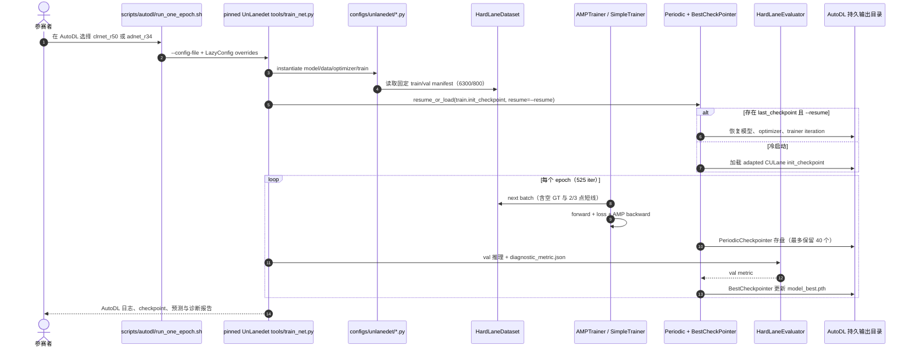
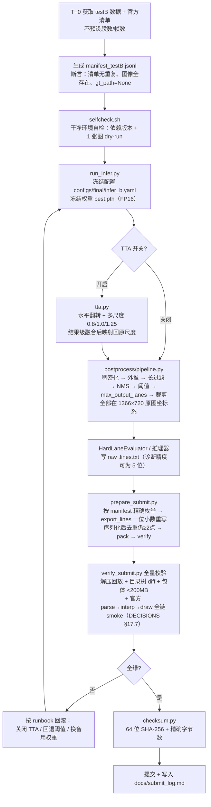
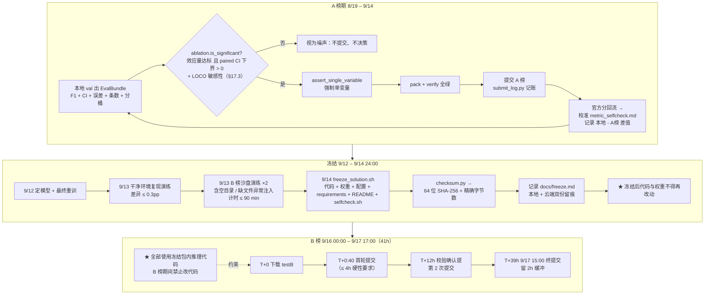
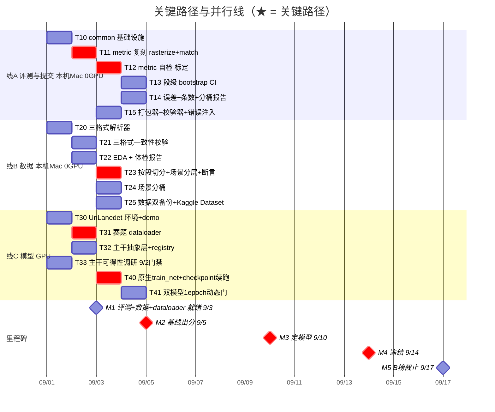

# 恶劣场景下的车道线检测挑战赛 · 系统架构设计（ARCHITECTURE）

| 项 | 内容 |
|---|---|
| 文档版本 | **v2.2** |
| 状态 | **active**（现行架构基线） |
| 版本链 | v1.0 → … → v2.1（§25 AutoDL 全种子 + 历史最优回放 + 交接包）→ **v2.2**（§26 LVO/A 榜重估与压 FP 路线） |
| 撰写人 | 高见远（架构师） |
| 修订人 | 齐活林（交付总监）——在 v1.1 上落地 AR-1..AR-5 五处修正 + W/T 编号衔接说明（§6.2）+ §6.5 单人版重排 |
| 汇报对象 | 齐活林（交付总监） |
| 上游输入 | `docs/PRD.md`（v2，15 条 P0）、`docs/PRD_v1_目标84.md`（v1，19 条 P0）；目标/预算/范围以 `docs/DECISIONS.md`（§1/§12/§13）为准，常量唯一取值点 `configs/default.yaml` |
| 下游交付 | 全组开发实施 |
| 日期 | 2026-09-01（v1.0 撰写）｜2026-09-01（v1.1–v1.3 修订）｜2026-09-02（v1.4–v2.1 传导 §18–§25）｜2026-09-05（v2.2 传导 §26） |
| 赛事 | 2026 iFLYTEK AI 开发者大赛 · 恶劣场景下的车道线检测挑战赛 |

> **v1.1 变更记录**（相对 v1.0）：① 分层 5→6 层，任务编号 W0–W7 → T00–T72（45 任务）；② 新增「推测→开关→证伪」矩阵；③ 三线并行 Gantt 解决 W1/W2 串行拖到 9/7 的问题；④ 齐活林落地 5 处修正——AR-1 目标常量 0.84 不下调（头部导语 + §0 目标表）、AR-2 答辩模型「仅前三受邀、不翻盘」（§0 Q6 行 + §9.1 Q-B1）、AR-3 预算口径「100 覆盖/200 冗余/300 缓冲」（§9.1 Q-A2 + §9.3 建议#2）、AR-4 CPU 路径标注【未实测】（§5 推理预算表）、AR-5 检对价值 2.40×（§4.6）；⑤ 新增 §6.5 单人版范围重排（DECISIONS §13 拍板后）。
> **v1.2 变更记录**（2026-09-01 晚，DECISIONS §15.2/§16 传导）：① 主干线全改——`clrnet_dla34`（UnLanedet 无权重无 config）与 `rvld`/`alpha_simadnet`（未收录）除名，主干改由**双路 15ep 筛选（CLRNet-R50 vs ADNet-R34，CULane 预训练 fine-tune）**实测定，`clrnet_convnext_t` 为 9/10 升级备选；涉及 §0.2/§0.3、§1.1–1.3、§2 mermaid、§3 文件清单、§4.5 ModelConfig、§6.2 任务表、§6.5 单人路径、§8.4/8.5 示例、§9.1 Q-A1；② `fallback_chain` 收口为 `(clrnet_r50, adnet_r34, clrnet_convnext_t)`；③ 版本头同步升级（执行 DECISIONS §14.1）。
> **v1.3 变更记录**（2026-09-01 晚，DECISIONS §17 四轮审计传导，全部改动均有官方数据实测支撑）：① 评测层改**双层结构**——官方 score.py 冻结为裁决 Oracle（`src/eval/official_oracle/`，SHA-256 存证 + 独立 py3.12 环境），本地 metric 降为诊断层、须过差分测试套件（§2 mermaid EVAL、§3.1、§4.3）；② **manifest 有序清单**（从官方清单逐行构造 + 无重复/存在性/每段 100 帧断言，image_id=clip/frame；§2、§3.1、§4.2、§8.4）；③ 场景单标签改**多维多标签**（weather/illumination/artifact/geometry + 置信度 + 抽查帧号；人工标签只用于切分与诊断，不支撑测试集条件化推理；§4.2、§4.4 RestoreConfig、§4.6 S6）；④ **max_lanes 拆三常量**（模型容量 8 / 推理保留 12 / 输出扫描 {7,8,10,12}；§4.4）；⑤ **cut_height 与输入比例联合裁决**（旧先验 330 作废，方案组合 A/B + round-trip 验收；§4.5）；⑥ **paired bootstrap + 双门槛闸门**（效应量 + paired CI 下界 > 0 + LOCO，取代 CI 下界 +2.0pp；§0.2、§4.6、§5.3、§8.5）；⑦ verify_submit 补强（≤64 条/≤2048 点断言 + 官方 parse→interp→draw 全链 smoke；§3.1、§5.2）；⑧ Q-A3 / Q-A4 关闭（§9.1）；⑨ T11/T12 重开、新增 T17（§6.2、§6.5）。
> **v1.4 变更记录**（2026-09-02，DECISIONS §18 五轮审计传导）：① Oracle 哈希断言落地（`tests/test_official_oracle_hash.py` 校验三份冻结文件；冻结文件**不可变**，官方新版须新增版本目录）；② 新增 **oracle_runner 适配层契约**（运行前哈希校验、结构化 JSON 输出全局 + 逐 clip TP/FP/FN/F1、子进程调用不改写官方算法）；③ manifest 契约修正——`ManifestRecord.gt_path` Optional，labeled split 才强制 GT 存在，「每段 100 帧」仅限已核实 train/testA；④ 场景分层改为多标签二元特征 + 分布偏差最小化 + 稀有标签保护；⑤ max_lanes 三常量改框架中性名 `max_gt_lanes / candidate_topk / max_output_lanes`；⑥ 清理旧关键路径与反演标定口径，评测插值参数改名固定 `interp_n=5`；⑦ 增加零车道样本、训练随机性、网格选择偏差与预处理归因边界验收。
> **v1.5 变更记录**（2026-09-02，DECISIONS §19）：① 1034 渲染 + 576 图非 identity 跨环境差分为本地诊断层补足判别力；② 明确全局 F1 唯一成绩口径，per-clip 禁止平均；③ 提交导出+最终校验双防线，补序列化退化/逗号/资源上限/严格边界/全链 smoke；④ manifest image/GT 路径闭环；⑤ 数组插值异常语义与 Oracle 对齐、常量收口；⑥ T15 提前完成。
> **v1.6 变更记录**（2026-09-02，DECISIONS §20）：① 71 段五帧人工标注落盘，low-confidence 与稀有特征（持有段≤5）全部密集二审；② `split_by_clip.py` 落地二元特征、none 桶、singleton 硬保护、真实 spot-frame 与质控断言；③ seed=42 的 100k 搜索+单交换下降固化 63/8 段，标签/manifest SHA 与逐桶计数写入 split；④ 当前测试总数更新为 74。
> **v1.7 变更记录**（2026-09-02，DECISIONS §21）：① T20 对齐真实 `annotations.lane[]` 与跨目录标签布局；② palette PNG 按非零 union 读取，实例诊断按完整 BGR 色码，禁止单通道丢实例；③ 横向误差对 y 点序方向无关；④ T21 定义为 text↔JSON 精确点比对 + PNG 10px union IoU≥0.75；⑤ 全量 badlist=1/7100（0.0141%），T20/T21 完成，当时测试 76。
> **v1.8 变更记录**（2026-09-02，DECISIONS §22）：① T22 全量 EDA 落地 `eda.py`/结构化报告/8 类固定 overlay；② 量化 330 crop 触及 16.08% 线、clip 空图率 0–56%、weather/illumination 完全混杂；③ 修复 scene-only 同分候选令 val 空 GT=0 的漏洞，以车道条数直方图作次级 tie-break，scene 主目标逐位不变，新 val 空 GT=35/800；④ split 二次固化，当前测试 80。
> **v1.9 变更记录**（2026-09-02，DECISIONS §23）：① GPU 模型验收环境明确为 AutoDL，本地仅做 CPU 契约/静态验证；② manifest-backed `HardLaneDataset` 保留空图、2/3 点线与 palette 索引；③ 两套 LazyConfig 与 pinned UnLanedet patch 落地，CLRNet GT 容量和候选 top-k 解耦；④ 权重入口修正为 `train.init_checkpoint`；⑤ 三权重 shape/load、双模型空/非空 loss+backward、demo 与 1 epoch 均以 AutoDL 证据为完成门。
> **v2.0 变更记录**（2026-09-02，DECISIONS §24）：① 增加 `prepare_submit.py`，将 evaluator 的任意精度原始预测统一经一位小数导出器重写后才允许打包；② 以非 identity 合成预测贯通 canonicalize→pack→verify→Oracle；③ T40 从未实现的自研 trainer/checkpoint 方案收口为 pinned UnLanedet `tools/train_net.py` + LazyConfig + 原生 AMP/PeriodicCheckpointer/BestCheckpointer，训练与续跑动态验收只在 AutoDL。
> **v2.1 变更记录**（2026-09-02，DECISIONS §25）：① 两套 config 显式锁定全局 seed=42/cudnn benchmark off；② 不再盲信 resume 后的 `model_best.pth`，保留 40 个周期权重并以 metrics 历史 best iteration + checkpoint 内部 iteration + eval-only 回放三重裁决；③ `run_pipeline.sh` 编排 gate/screen/baseline 可恢复执行，并生成带 SHA 的关机交接包。
> **v2.2 变更记录**（2026-09-05，DECISIONS §26）：① 目标与路线同步为稳前十/冲前五；② v1 clip-level val 降级为训练内监控，LVO/A 榜作为当前跨域证据；③ 结合弱域归因将压 FP 的几何与 raw/conf-aware 扫描置于训练型增强之前。
> **注**：本文曾顶着 v1.0 的版本头承载 v1.1 内容（2026-09-01 下午审计发现并修正，版本治理失效案例，见 DECISIONS §11/§14）。

> **本架构不裁决目标分数，只登记裁决结果。** 目标采用 DECISIONS §1/§15.1/§26 双轨滚动机制；当前工作目标 **0.77（稳前十）**、冲刺线 **0.79（冲前五）**、能力预测 **0.75**，具体数值一律以 `configs/default.yaml::target` 为唯一代码侧事实源。本架构的唯一使命是：
> **口径提醒（2026-09-05）**：`v1_seed42` 是 clip-level hold-out，但 8 个 val clip 分属 5 个 video，且这 5 个 video 的其他 clip 同时出现在 train；它只能作训练内监控。跨 video 泛化结论以 LVO/A 榜证据为准。R1–R4 的 video bootstrap 规则仍是 memory 草案，未改写 §17.3 的生效文本。
> **让两版 PRD 中的每一条【推测】都变成一个可被一次实验证伪或证实、且互不干扰的配置开关。**
> 因此本文档中「可配置 / 可开关 / 可单变量 A/B / 可回退」是最高设计约束，优先级高于任何单点性能。

---

## 0. 两版 PRD 的合并口径（架构师裁决部分）

两版 PRD 在**目标分数**上冲突，但在**工程事实**上高度互补。本架构采取「**并集吸收 + 冲突项取严**」策略。

### 0.1 v1 独有、v2 未覆盖的洞察（已全部纳入本架构）

| v1 独有洞察 | 架构落地位置 | 设计动作 |
|---|---|---|
| **D6 输入分辨率是隐性天花板**（800 宽下 10px 容差只剩 5.9px；320 高使纵向端点误差放大 2.25×） | `configs/default.yaml::data.input_size` + `configs/preset/res_*.yaml` | 分辨率升为**一等公民配置**，预置 4 档 preset；**后处理与输出一律在 1366×720 原图坐标系完成**，网络内部才用低分辨率（见 §4.5） |
| **§1.4 把目标翻译成「多少条线」**（+0.8pp = 多检对 24 条 + 少画 18 条） | `src/postprocess/`（少画）与 `src/data/degrade.py` + `src/data/sampler.py`（多检对） | 两个战场**拆成两条独立链路**，各自独立开关、各自独立度量（`count_report.py` 与 `scene_report.py` 分别读数） |
| **Q6 决赛答辩能否出席/形式（线下/线上）**（v2 Q2 / v1 Q6） | `docs/ablation.md` + `docs/runbook_b_phase.md` | 台账与答辩素材**同源自动化产出**，不额外投入人力 | *已核实赛题原文（DECISIONS.md §5）：只有 B 榜**作品分前三**受邀答辩，答辩 30% 只在前三内部排一二三等奖，**不构成翻盘通道**；故「出席与否」影响能否拿奖，而非能否进前三。* |
| **D7 A 榜提交节奏**（总 ≤12 次，每次只改 1 个变量） | `src/exp/ablation.py::assert_single_variable` + `src/submit/submit_log.py` | 单变量约束**代码级强制**，不止是纪律 |
| **过程指标体系**（F1@0.7 ≥ 62.0、平均横向误差 ≤ 6.0px、>10px 占比 ≤ 12%、条数正确率 ≥ 88%、最低非 N/A 桶 ≥ 72.0） | `src/eval/evaluate.py` 一次跑全，输出 `EvalBundle` | 全部指标**每次实验自动重算**，不靠手工 |
| **COMPUTE-P0-01/02**（算力台账、AutoDL 持久化） | `src/exp/compute_ledger.py` + `scripts/autodl/` | 算力是硬约束，必须有账本；GPU 动态证据只来自 AutoDL |
| **FINAL-P0-03 全流程 ≤ 90 分钟** | `scripts/drill/drill_b_phase.sh` | 比 v2 的 ≤6h 更严，**取严者**：内部演练按 90 分钟验收，对外承诺 6 小时 |
| **DATA-P0-04 数据双备份** | `scripts/kaggle/kaggle_sync_dataset.py` + `data/raw/RAW_SHA256.txt` | 数据丢失 = 比赛结束 |

### 0.2 v2 独有、v1 未覆盖的洞察

| v2 独有洞察 | 架构落地位置 |
|---|---|
| 每图多/漏 0.1 条 ≈ F1 掉 1.0pp | `src/postprocess/count_calib.py` 以 F1 为直接优化目标做阈值 / NMS / `max_output_lanes` 网格扫描 |
| P50 横向误差需 ≤ 5px | `src/eval/lateral_error.py` 输出 P50/P90/达标率（v1 的「平均 ≤6.0px」同时保留，两个都出） |
| 主干排序 α-SimADNet > RVLD > CLRNet-DLA34 | **已作废（v1.2）**：weight scout 核实 UnLanedet 未收录 α-SimADNet/RVLD、无 DLA-34 权重（DECISIONS §15.2）；registry 改注册 `clrnet_r50` / `adnet_r34` / `clrnet_convnext_t`，主干由双路 15ep 筛选实测定 |
| A 榜段级 bootstrap 标准误 1.67pp，差异 <2pp 视为噪声 | **v1.3 重定义（DECISIONS §17.3）**：`src/eval/bootstrap.py` 改 **paired 段级**（成对重采样同一批 clip、TP/FP/FN 全局汇总后算 F1、对 ΔF1 做 paired CI）+ `src/exp/ablation.py::is_significant` 改**双门槛**（效应量门槛 + paired CI 下界 > 0 + LOCO 敏感性） |
| 跨帧时序：不做 | **架构上不提供该扩展点**（避免诱惑）；理由 = 合规不确定 + 实现成本 + 缺少收益证据（原「1s 间隔 ×16.7m」测算已作废——帧步长 3 但源 FPS 未知，DECISIONS §6/§17.8） |

### 0.3 冲突项：取严者 / 双轨保留

| 冲突点 | v1 | v2 | 架构处置 |
|---|---|---|---|
| 起步框架 | UnLanedet（全家桶） | 论文原版 α-SimADNet/RVLD/ADNet | **冲突消解（v1.2）**：论文原版经核实不可得（DECISIONS §15.2），改为 UnLanedet 内置双主干 15ep 筛选（CLRNet-R50 vs ADNet-R34），配置一行切换不变 |
| 验证集规模 | 固定 8 段 | 8–10 段 | 默认 8 段，可改；按 DECISIONS §15.4 断言区间 [6, 10] |
| 冻结截止 | 9/14 前 | 9/15 24:00 前 | **取严者：9/14 24:00 完成冻结**，9/15 全天做复现演练 |
| B 榜流程耗时 | ≤ 90 分钟 | ≤ 6 小时 | 内部验收 90 分钟，对外承诺 6 小时 |
| 目标分 | 84.0（历史工作性目标） | 83.0（历史 PRD 目标） | **历史设计口径，已由 DECISIONS §26 supersede**；当前常量为 0.77 / 0.79 / 0.75 / 4.0pp |

---

## 1. 实现方案与框架选型

### 1.1 我的倾向（明确表态）

> **以 UnLanedet 作为工程底座；双路 15ep 筛选已完成，CLRNet-R50 获选并完成 36ep baseline（DECISIONS §15.2/§26）。** CLRNet-ConvNeXt-T 仍只是 9/10（T60）升级备选；在此之前先完成 video-disjoint 口径下的压 FP 后处理与 raw/conf-aware 推理扫描。

即：**工程上用 UnLanedet，主干选择交给一次 12h 的实证筛选，二者通过 `BaseLaneDetector` 抽象层解耦。**

### 1.2 理由

| # | 理由 | 类型 |
|---|---|---|
| 1 | **赛程不允许「先完美选型再动手」。** 今天 9/1，9/3 要数据与评测就绪、9/5 要基线出分。UnLanedet 已内置 CLRNet / CLRerNet / ADNet / CondLaneNet / UFLD / RESA / GANet 且单卡验证过，**clone 到跑通 1 epoch 预计 6 小时内**，是唯一能在 9/4 前拿到真实数据点的路径 | 【事实】 |
| 2 | **UnLanedet 内置 ADNet 与 CLRNet（R50/R34/ConvNeXt-T 权重均可得），正是双路筛选的两个候选与升级备选。** 两条筛选路共享 HardLane adapter、manifest、评测、后处理与提交链，只切换一份 `configs/unlanedet/*.py` | 【事实】+【推测】 |
| 3 | **α-SimADNet / RVLD 可得性已于 9/1 晚核实（DECISIONS §15.2）：UnLanedet 未收录，原版接入线关闭。** 「CLRNet-DLA34 CULane 80.47」为原版仓库数字，UnLanedet 无 DLA-34 权重与 config——**100% 可跑通的下限路径 = CLRNet-R50 / ADNet-R34（CULane 权重均可得，见 `docs/weight_scout_report.md`）** | 【事实】 |
| 4 | **评测与后处理才是本赛题的主要增量来源，且与主干完全正交。** 零训练成本项合计 +1.5~3.5pp，主干从 CLRNet 换到 α-SimADNet 是 +2.7pp。**评测/后处理代码与主干无关** —— 选成熟工程底座不会损失任何主干升级空间 | 【测算】 |
| 5 | **复现要求（TOP3 必查）偏好成熟框架。** UnLanedet 有标准 `requirements.txt` 与社区验证；论文原版 repo 常有隐式依赖与脏提交。底座越标准，R3/R5 风险越低 | 【事实】 |
| 6 | **反对「纯论文原版起步」**：原版 repo 常绑定特定 torch 版本与自研 CUDA 算子，在 AutoDL 4090 环境编译通过与复现的调试时间不可控。我们只有 16 天，**不可控时间是最大的敌人** | 【推测】 |

### 1.3 主干切换设计（核心）

主干切换复用 pinned UnLanedet 的注册与构建机制，不再另造尚未实现的 `BaseLaneDetector` / `src/models/registry.py`。两条筛选路分别由 `configs/unlanedet/clrnet_r50_hardlane.py` 与 `adnet_r34_hardlane.py` 定义；共同的数据边界集中在 `src/integrations/unlanedet_hardlane.py`。切换主干只换 `--config-file`，manifest、Oracle、后处理和提交链不变。

训练配置必须显式提供 `train.init_checkpoint / output_dir / max_iter / amp / checkpointer / eval_period`；训练入口固定为 pinned commit 的 `tools/train_net.py`。若候选不可用，调度层明确失败并切换另一份已验证 config，禁止运行时静默 fallback 后仍沿用原实验名。

| 主干 | 桥接方式 | 定位 | 水位 | 时间点 |
|---|---|---|---|---|
| `clrnet_r50` | `clrnet_r50_hardlane.py` + CULane adapted checkpoint | **筛选路 A**（先验：同框架 CULane 最强 ResNet 系） | CULane 复现 79.30 | 双路筛选 9/3 晚 |
| `adnet_r34` | `adnet_r34_hardlane.py` + CULane adapted checkpoint | **筛选路 B**（恶劣场景架构假设待 HardLane 实证） | CULane 复现 77.88（HardLane 论文 80.5 为原版实现，非本生态水位） | 双路筛选 9/3 晚 |
| `clrnet_convnext_t` | UnLanedet 内置 + CULane 权重 | 9/10（T60）升级备选（训练更慢，不进筛选） | CULane 复现 80.21 | T60 后 |
| ~~`clrnet_dla34` / `rvld` / `alpha_simadnet`~~ | — | **已除名（v1.2）**：DLA-34 无权重无 config；RVLD/α-SimADNet 未被 UnLanedet 收录（DECISIONS §15.2，`docs/weight_scout_report.md`） | — | — |

> **门禁状态（2026-09-05 更新）**：gate/screen/baseline 已在 AutoDL 完成；winner=`clrnet_r50`，selected checkpoint 的独立回放与 handoff evidence 齐全。后续新训练仍须绑定新 run 目录、空间治理和当前实验协议，不能覆盖既有完成产物。

### 1.4 技术栈与版本锁定策略

**为什么必须锁死版本**：TOP3 需官方复核可复现（R3/R5，致命级）。版本漂移会导致「干净环境重跑差异 > 0.3pp」被判定复现失败、取消名次。

**锁定策略（三层）**

| 层 | 文件 | 用途 | 约束 |
|---|---|---|---|
| 精确锁 | `requirements.txt` | `pip freeze` 产出，**逐包 `==`**，进 `solution.zip` | 复现环境只用这个 |
| 范围锁 | `requirements-range.txt` | `>=x.y,<a.b` | AutoDL 环境搭建时的容错 |
| 环境指纹 | `outputs/runs/<exp_id>/env_fingerprint.txt` | 记录 python / torch / torch.version.cuda / cv2 / nvidia-smi / git commit | 每次实验自动落盘，进台账 |

**核心版本（本地 CPU 契约环境与 AutoDL 分责）**

| 包 | 锁定版本 | 理由 |
|---|---|---|
| Python | **3.10.13（AutoDL 训练）** | GPU 实验环境锁定；本地 CPU 契约检查当前为 3.13.12，不参与模型验收，差异记入 fingerprint |
| PyTorch | **2.1.2+cu118** | AutoDL 4090（sm_89）训练环境；本地不安装/加载训练权重作验收 |
| torchvision | **0.16.2+cu118** | 与 torch 严格配套 |
| CUDA runtime | **11.8** | T4 与 4090 双兼容的最大公约数 |
| numpy | **1.26.4** | 支持 Py3.10 且避开 2.0 ABI 破坏 |
| opencv-python-headless | **4.9.0.80** | `cv2.line(lineType=8)` 无抗锯齿是所有 IoU 的地基，**必须锁死** |
| scipy | **1.11.4** | B 样条实现；**评测端与后处理端必须同版本**，消除系统性偏差 |
| albumentations | **1.4.0** | 几何变换与标注（keypoints）同步 |
| 其余 | 见 §7 | |

**跨环境一致性硬要求**

- 环境变量：`CUBLAS_WORKSPACE_CONFIG=:4096:8`
- 代码：`torch.use_deterministic_algorithms(True)`、`cudnn.benchmark = False`、`cudnn.deterministic = True`
- 最终产出推理时强制 `DataLoader(num_workers=0)`（消除多线程顺序不确定性）；训练期可设 4，但必须 `worker_init_fn` 固定种子
- `src/exp/repro_check.py` 对同一权重连跑两次推理并逐字节比对，不一致即红灯

---

## 2. 系统分层架构

```mermaid
flowchart TB
    subgraph DATA["1. 数据层 DATA —— 原始数据 到 可训练样本"]
        direction TB
        D1["data/raw/<br/>官方包只读 + SHA-256 存证"]
        D0["manifest.py<br/>官方清单 → 有序任务清单<br/>无重复/存在性/每段100帧断言"]
        D2["parse_labels.py<br/>三格式统一解析"]
        D3["check_label_consistency.py<br/>7100 张全量一致性校验"]
        D4["split_by_clip.py<br/>按段 hold-out + 多维场景分层 + 交集断言"]
        D5["scene_bucket.py<br/>多维场景标签分桶"]
        D6["dataset.py + transforms.py<br/>坐标同步的几何与光度变换"]
        D7["degrade.py 退化增强<br/>restore.py 复原前置<br/>sampler.py 短板桶过采样"]
        D1 --> D0 --> D2 --> D3 --> D4 --> D6
        D4 --> D5 --> D6
        D6 --> D7
    end

    subgraph MODEL["2. 模型层 MODEL —— pinned UnLanedet + AutoDL 原生训练引擎"]
        direction TB
        M1["integrations/unlanedet_hardlane.py<br/>manifest Dataset + evaluator"]
        M2["configs/unlanedet/<br/>CLRNet-R50 / ADNet-R34 LazyConfig"]
        M3["UnLanedet tools/train_net.py<br/>SimpleTrainer / AMPTrainer"]
        M4["原生 PeriodicCheckpointer + BestCheckpointer<br/>AutoDL 持久目录 + --resume"]
        M1 --> M2 --> M3 --> M4
    end

    subgraph POST["3. 后处理层 POST —— 几何质量 + 条数准确（零训练成本主战场）"]
        direction TB
        P1["postprocess/pipeline.py<br/>各步骤独立开关编排"]
        P2["resample 稠密化 / extrapolate 端点外推<br/>filter 长过滤+裁剪 / nms 横向去重"]
        P3["count_calib.py<br/>阈值 / max_output_lanes / NMS 网格扫描<br/>直接以 F1 为优化目标"]
        P4["infer/tta.py<br/>水平翻转 + 多尺度结果级融合"]
        P1 --> P2 --> P3
        P4 --> P1
    end

    subgraph EVAL["4. 评测层 EVAL —— 双层结构：Oracle 裁决 + 本地诊断（唯一事实来源）"]
        direction TB
        E0["eval/official_oracle/score.py<br/>★ 冻结官方脚本 = 最终裁决唯一入口<br/>SHA-256 存证 + 独立 py3.12 环境"]
        E1["eval/rasterize.py<br/>B样条稠密化 + 30px 无抗锯齿绘制"]
        E2["eval/matching.py<br/>IoU 矩阵 + 匈牙利一对一"]
        E3["eval/official_metric.py<br/>本地快速 metric（诊断/扫描层）"]
        E4["bootstrap paired段级CI / lateral_error 横向误差<br/>count_report 条数 / scene_report 分桶F1"]
        E5["eval/diff_test.py<br/>差分套件：全集/边界/线数/空缺文件/<br/>重复点/折返/越界/匈牙利反例"]
        E1 --> E2 --> E3 --> E4
        E5 -.->|每次改动后必跑| E3
        E5 -.->|对齐基准| E0
    end

    subgraph EXP["5. 实验管理层 EXP —— 单变量纪律 + 可复现存证"]
        direction TB
        X1["exp/ablation.py<br/>单变量断言 + 配置 diff"]
        X2["exp/ledger.py 实验台账<br/>exp/compute_ledger.py 算力台账"]
        X3["exp/repro_check.py<br/>两次推理逐字节一致"]
        X4["common/config.py<br/>配置 hash / diff / 快照"]
        X4 --> X1 --> X2
        X3 --> X2
    end

    subgraph DELIV["6. 交付层 DELIV —— 把预测变成合法且不可逆的提交"]
        direction TB
        V0["submit/prepare_submit.py<br/>任意精度 raw → 一位小数 canonical"]
        V1["submit/pack_submit.py<br/>submit.zip + 根目录 submit/"]
        V2["submit/verify_submit.py<br/>全量断言 + 解包回放 + 错误注入"]
        V3["submit/submit_log.py<br/>A 榜额度账本"]
        V4["scripts/freeze_solution.sh<br/>冻结 + SHA-256 + 字节数"]
        V5["common/checksum.py<br/>64 位 SHA-256 + 精确字节数"]
        V0 --> V1 --> V2 --> V4 --> V5
        V3 --> V4
    end

    DATA -->|batch 原图坐标| MODEL
    MODEL -->|list of Lane 1366x720 原图坐标| POST
    POST -->|outputs/preds/exp_id/split/| EVAL
    POST -->|导出 lines.txt| DELIV
    EVAL -->|F1 与 CI 与 误差 与 条数 与 分桶| EXP
    EXP -->|闸门：效应量达标 且 paired CI 下界 > 0（+LOCO，§17.3）| DELIV
    DELIV -.->|A 榜分回流校准| EVAL

    style EVAL fill:#ffe8e8
    style EXP fill:#e8f0ff
    style DELIV fill:#fff4e0
```



### 2.1 各层职责与边界（严格单向依赖，禁止反向引用）

| 层 | 职责 | **不负责** | 对外唯一出口 | 允许依赖 |
|---|---|---|---|---|
| ① 数据层 | 解析、切分、分桶、增强、复原；**保证坐标始终是 1366×720 原图绝对像素** | 不做评测、不写提交 | `torch Dataset` + 有序 `manifest_*.jsonl` | common |
| ② 模型层 | 可插拔主干构建、训练循环、checkpoint 续跑 | 不做后处理、不打包 | `list[list[Lane]]`（原图坐标）+ ckpt | common, data |
| ③ 后处理层 | 几何质量（重采样/外推/去重）与条数准确（阈值/NMS/`max_output_lanes`）—— **两个独立战场** | 不训练、不评测 | `outputs/preds/**/*.lines.txt` | common, models |
| ④ 评测层 | **唯一事实来源**：F1、段级 CI、横向误差、条数准确率、分桶 F1 | 不做任何决策（只出数） | `EvalBundle` | common |
| ⑤ 实验管理层 | 单变量纪律强制、台账、算力账、复现验证 | 不改模型 | `experiments.csv` / `ablation.md` | common |
| ⑥ 交付层 | 打包、全量校验、冻结、哈希存证 | 不做任何算法决策 | `submit.zip` + `freeze.md` | common |

**边界铁律**

1. **评测层不得 import 模型层或后处理层** —— 防止「我的评测配合我的后处理」的自证循环。
2. **后处理层不得 import 评测层** —— 阈值标定是唯一例外，必须显式走 `count_calib.py` 接口，并在台账中标注「该参数在 val 上标定」。
3. **所有层共用 `common/types.py::Lane`**，禁止任何层自定义折线表示。

---

## 3. 完整文件清单

### 3.1 目录树

```
lane-competition/
├── README.md                                # 从原始数据到 submit.zip 的完整命令序列（TOP3 复核入口）
├── requirements.txt                         # pip freeze 精确版本（复现唯一来源）
├── requirements-range.txt                   # 宽松范围，供环境搭建容错
├── Makefile                                 # make data/train/infer/eval/pack/submit/freeze/drill
├── .gitignore                               # 禁止提交数据与权重
│
├── data/                                    # 【不入 git】
│   ├── raw/                                 # 官方原始包，只读
│   │   ├── train/  testA/  testB/
│   │   └── RAW_SHA256.txt                   # 原始包哈希存证
│   ├── interim/                             # 中间产物
│   │   ├── labels_cache/                    # 三格式解析缓存
│   │   └── consistency_badlist.txt          # 三格式不一致样本清单
│   └── processed/                           # 切分与索引产物
│       ├── manifest_train.jsonl             # ★ 有序任务清单（由 train.txt 逐行构造 + 无重复/存在性/每段100帧断言）
│       ├── manifest_testA.jsonl             # 同上（由 testA.txt 构造）；一切聚合/分桶的唯一派生源
│       ├── manifest_testB.jsonl             # B 榜发布后由官方清单构造；不预设段数/帧数，gt_path=None
│       ├── split_train.jsonl                # manifest_train 的有序子集（由固定 split config 派生）
│       ├── split_val.jsonl                  # 同上；不得另行扫描目录或用 set/dict 重建顺序
│       ├── scene_labels.json                # 段 ID -> 多维场景标签（weather/illumination/artifact/geometry+置信度+抽查帧号）
│       └── data_report.md                   # 体检报告（由 eda.py 生成）
│
├── src/
│   ├── common/
│   │   ├── types.py                         # Lane / ImagePrediction / EvalBundle —— 全项目唯一表示
│   │   ├── geo.py                           # 重采样 / B样条 / 端点外推 / 裁剪 / 横向误差
│   │   ├── io_utils.py                      # .lines.txt / .json / 实例 .png 读写，统一 1 位小数
│   │   ├── seed.py                          # 全种子固定 + deterministic 开关
│   │   ├── paths.py                         # 本地 CPU / AutoDL 路径契约；GPU 仅 AutoDL
│   │   ├── config.py                        # 配置 dataclass + load/dump/hash/diff/单变量断言
│   │   ├── logging_setup.py                 # 统一日志格式（含 exp_id 前缀）
│   │   └── checksum.py                      # 64 位 SHA-256 + 精确字节数
│   │
│   ├── data/
│   │   ├── manifest.py                      # ★ 官方清单 → 有序任务清单（无重复/存在性/每段100帧断言；一切聚合的派生源）
│   │   ├── parse_labels.py                  # 三格式统一解析器 -> list[Lane]
│   │   ├── check_label_consistency.py       # 7100 张全量三格式线数一致性校验
│   │   ├── eda.py                           # EDA + 分布体检报告
│   │   ├── split_by_clip.py                 # 按段 hold-out + 多维场景分层 + 段 ID 交集断言
│   │   ├── scene_bucket.py                  # 多维场景标签分桶（人工标注 scene_labels.json 驱动）
│   │   ├── dataset.py                       # torch Dataset，输出原图坐标标注
│   │   ├── transforms.py                    # 几何 / 光度变换，标注同步
│   │   ├── degrade.py                       # 退化增强各算子（独立开关）
│   │   ├── restore.py                       # 复原前置 CLAHE / 自适应gamma / 暗通道去雾（独立开关；条件化仅限可部署自动判别）
│   │   └── sampler.py                       # 短板桶定向过采样
│   │
│   ├── integrations/
│   │   └── unlanedet_hardlane.py            # manifest Dataset + evaluator；保留空图/短线/palette id
│   │
│   ├── postprocess/
│   │   ├── pipeline.py                      # 后处理编排，每步独立开关
│   │   ├── resample.py                      # B样条稠密化 + 等距重采样（间距 ≤10px）
│   │   ├── extrapolate.py                   # 端点外推到图像底边
│   │   ├── filter.py                        # 线长过滤（<图高20%）+ 坐标裁剪
│   │   ├── nms.py                           # 横向 NMS 去重（横距<15px 且纵重叠>50%）
│   │   └── count_calib.py                   # 阈值 / NMS / max_output_lanes 网格扫描，直接以 F1 为目标
│   │
│   ├── infer/
│   │   ├── predictor.py                     # 单图推理 -> list[Lane]（原图坐标），GPU / CPU 双路径
│   │   ├── tta.py                           # 水平翻转 + 多尺度 0.8/1.0/1.25 结果级融合
│   │   └── run_infer.py                     # 批量推理入口；输出可保留诊断精度
│   │
│   ├── eval/
│   │   ├── official_oracle/                 # ★ 冻结官方脚本（score.py / check_submission.py / requirements_official.txt + SHA-256，禁改）
│   │   ├── rasterize.py                     # B样条(k<=3)稠密化 -> 1366x720 画布 -> cv2.line(thickness=30, lineType=8)【诊断层】
│   │   ├── matching.py                      # IoU 矩阵 + 匈牙利一对一 + IoU>0.5 判 TP【诊断层】
│   │   ├── official_metric.py               # 本地快速 compute_f1（诊断/扫描层；参与过程判断前须过差分套件）
│   │   ├── diff_test.py                     # ★ 本地 vs Oracle 差分套件（全集/边界/线数/空缺文件/重复点/折返/越界/匈牙利反例）
│   │   ├── bootstrap.py                     # paired 段级 bootstrap（1000 次）95% CI（TP/FP/FN 全局汇总口径）
│   │   ├── lateral_error.py                 # 单线平均横向误差 P50 / P90 / 大于10px 占比
│   │   ├── count_report.py                  # 预测条数等于真值条数 的图占比
│   │   ├── scene_report.py                  # 多维场景标签分桶 F1
│   │   ├── selfcheck.py                     # metric 自检：GT对GT / 横移 5 10 15px 理论值标定
│   │   └── evaluate.py                      # 一次跑全 -> EvalBundle
│   │
│   ├── submit/
│   │   ├── export_lines.py                  # list[Lane] -> 官方一位小数文本；序列化塌缩保护
│   │   ├── prepare_submit.py                # raw 预测精度归一化 → pack → verify → 可选 Oracle
│   │   ├── pack_submit.py                   # 生成 submit.zip（根目录 submit/）
│   │   ├── verify_submit.py                 # 全量断言 + 解包回放 + 5 类错误注入拦截
│   │   └── submit_log.py                    # A 榜提交额度账本
│   │
│   └── exp/
│       ├── ledger.py                        # experiments.csv 台账自动写入
│       ├── ablation.py                      # 单变量断言 + 配置 diff + 显著性闸门
│       ├── compute_ledger.py                # AutoDL GPU 小时与费用台账
│       └── repro_check.py                   # 同一权重两次推理逐字节一致验证
│
├── configs/
│   ├── default.yaml                         # 全量默认值（唯一事实源）
│   ├── unlanedet/{clrnet_r50_hardlane,adnet_r34_hardlane}.py # AutoDL LazyConfig
│   ├── splits/v1_seed42.yaml                # 8 段验证集的显式段 ID 列表
│   ├── preset/
│   │   ├── res_800x320.yaml                 # D6 基线档
│   │   ├── res_960x480.yaml                 # D6 推荐折中档（宽>=960、高>=480）
│   │   ├── res_1366x720.yaml                # D6 全分辨率档（显存上限测试）
│   │   └── res_1600x320.yaml                # CLRNet 常规档，作对照
│   ├── exp/
│   │   ├── 000_smoke_clrnet_r50_800x320.yaml # T0 冒烟
│   │   ├── 001_screen_dual_15ep.yaml        # 双路筛选（CLRNet-R50 vs ADNet-R34，兼任 shakedown）
│   │   ├── 001b_baseline_winner_36ep.yaml   # 基线：筛选赢家 36ep（所有 ablation 的对照组）
│   │   ├── 002_res_960x480.yaml             # 证伪：分辨率是隐性天花板？
│   │   ├── 003_restore_clahe.yaml           # 证伪：CLAHE 有效？（分桶判定）
│   │   ├── 004_degrade_rain_fog.yaml        # 证伪：退化增强 +0.5~1.5pp？
│   │   ├── 005_post_resample.yaml           # 证伪：B样条稠密化收益？
│   │   ├── 006_post_extrapolate.yaml        # 证伪：端点外推收益？
│   │   ├── 007_post_nms.yaml                # 证伪：横向 NMS 收益？
│   │   ├── 008_tta_flip.yaml                # 证伪：水平翻转 TTA 有益还是有害？
│   │   ├── 009_main_convnext_t.yaml         # 主干升级备选（T60 定模型后，DECISIONS §15.2）
│   │   └── 0xx_*.yaml                       # 后续按序追加
│   └── final/infer_b.yaml                   # B 榜冻结推理配置（冻结后只读）
│
├── outputs/
│   ├── runs/<exp_id>/                       # 权重 / 日志 / env_fingerprint / config_snapshot.yaml
│   ├── preds/<exp_id>/<split>/              # 预测 .lines.txt（与测试集目录树同构）
│   ├── reports/<exp_id>/                    # EvalBundle 全量报告
│   └── submits/submit_<ts>.zip
│
├── scripts/
│   ├── setup_env.sh                         # 本地 CPU 契约环境；CUDA 环境走 scripts/autodl/
│   ├── prep_data.sh                         # 解析 -> 校验 -> EDA -> 切分 -> 索引
│   ├── autodl/run_one_epoch.sh              # pinned tools/train_net.py 的动态验收入口
│   ├── autodl/smoke_dataloader_and_loss.py  # 双模型空/非空 forward-loss-backward
│   ├── eval.sh                              # 评测 + 全量诊断报告
│   ├── pack_submit.sh                       # 调 prepare_submit：精度归一化 + 打包 + 校验 + 哈希
│   ├── freeze_solution.sh                   # 冻结 solution.zip + SHA-256 + 字节数
│   ├── selfcheck.sh                         # 干净环境自检（进 solution.zip）
│   ├── autodl/setup_unlanedet.sh             # 固定 commit、应用 patch、环境与数据盘契约
│   └── drill/drill_b_phase.sh               # B 榜沙盘演练（含空目录/缺文件异常注入）
│
├── docs/
│   ├── ARCHITECTURE.md                      # 本文档
│   ├── PRD.md / PRD_v1_目标84.md / PRD_双版对照.md
│   ├── conventions.md                       # 共享约定（坐标系/种子/命名/路径）——开发前必读
│   ├── decisions.md                         # 决策记录（目标分最终结果、主干定档）
│   ├── eda.md                               # EDA 与数据体检报告
│   ├── metric_selfcheck.md                  # metric 自检 + 与 A 榜差值校准序列
│   ├── ablation.md                          # 【P0-D12】消融台账（可直贴答辩 PPT）
│   ├── experiments.csv                      # 实验台账机读版
│   ├── compute_ledger.md                    # 算力台账
│   ├── submit_log.md                        # A 榜提交账本
│   ├── runbook_b_phase.md                   # B 榜 41 小时作战手册
│   └── freeze.md                            # 冻结记录：SHA-256 + 精确字节数（双份留痕）
│
├── scripts/autodl/
│   ├── setup_unlanedet.sh                   # 固定 commit + patch + AutoDL 环境检查
│   ├── probe_weights.py                     # checkpoint shape/load 探针
│   ├── smoke_dataloader_and_loss.py         # 空/非空 forward-loss-backward 动态门
│   └── run_one_epoch.sh                     # 原生 train_net.py 的 1 epoch train+val 门
│
├── patches/unlanedet_hardlane.patch         # pinned 上游的 np.bool/top_k 最小补丁
│
└── tests/
    ├── test_metric_selfcheck.py             # GT对GT=1.000 / 横移 5 10 15px 理论值误差<0.02
    ├── test_submit_inject_errors.py         # 5 类注入错误拦截率 100%
    ├── test_split_assert.py                 # 训练/验证段 ID 交集为空
    ├── test_geo_roundtrip.py                # 重采样/外推/裁剪 无 NaN、幂等性
    └── test_config_diff.py                  # 单变量断言与 diff 正确性
```

**文件总数：约 90 个**（Python 源码约 42 个、配置 19 个、脚本 13 个、文档 12 个、其他 4 个）。

### 3.2 P0 需求 → 落地位置覆盖表（两版并集）

| v1 编号 | v2 编号 | 需求 | 落地文件 | 验收产物 |
|---|---|---|---|---|
| EVAL-P0-01 | P0-A01 | 双层评测：官方 Oracle 冻结 + oracle_runner 适配层 + 本地诊断 metric + 差分套件 | `src/eval/official_oracle/` + `src/eval/{oracle_runner,rasterize,match,official_metric,diff_test}.py` + `tests/test_official_oracle_hash.py` | `docs/metric_selfcheck.md` + 差分报告 |
| — | P0-A02 | paired 段级 bootstrap CI（TP/FP/FN 全局汇总口径，对 ΔF1 做 paired CI） | `src/eval/bootstrap.py`（消费 oracle_runner 逐 clip TP/FP/FN，§18.2） | `outputs/reports/<exp>/ci.json` |
| EVAL-P0-02 | P0-A03 | 原始预测一位小数归一化 + submit.zip 打包器 | `src/submit/{prepare_submit,export_lines,pack_submit}.py` | `outputs/submits/*.zip` + 转换报告 |
| EVAL-P0-02 | P0-A04 | 提交校验器 + 解包回放 | `src/submit/verify_submit.py` | `outputs/reports/verify_<ts>.md` |
| FINAL-P0-03 | P0-A05 | B 榜沙盘演练 | `scripts/drill/drill_b_phase.sh` | `docs/runbook_b_phase.md` |
| EVAL-P0-03 | P0-C10 | 后处理套件（稠密化/外推/过滤/NMS/裁剪） | `src/postprocess/{pipeline,resample,extrapolate,filter,nms}.py` | `outputs/reports/<exp>/eval.md` |
| DATA-P0-03 | P0-B06 | 三格式解析 + 一致性校验 | `src/data/{parse_labels,check_label_consistency}.py` | `data/interim/consistency_badlist.txt` |
| DATA-P0-01 | P0-B07 | 按段 hold-out + 多维场景标签分层 + 断言 + manifest 有序清单 | `src/data/{manifest,split_by_clip,scene_bucket}.py` + `tests/test_split_assert.py` | `configs/splits/v1_seed42.yaml` + `data/processed/manifest_*.jsonl` |
| DATA-P0-02 | P0-B08 | EDA / 数据体检报告 | `src/data/eda.py` | `docs/eda.md` |
| DATA-P0-04 | — | 数据双备份 + 哈希存证 | `scripts/kaggle/kaggle_sync_dataset.py` + `data/raw/RAW_SHA256.txt` | 云端 Dataset + 本地副本 |
| MODEL-P0-01 | P0-C09 | 基线模型跑通 | `configs/unlanedet/{clrnet_r50_hardlane,adnet_r34_hardlane}.py` + pinned UnLanedet `tools/train_net.py` | `outputs/autodl/<exp>/model_best.pth` |
| MODEL-P0-02 | P0-C09② | 赛题 dataloader（原图坐标） | `src/integrations/unlanedet_hardlane.py` + 固定 manifests | AutoDL 1 epoch 日志 |
| MODEL-P0-03 | P1-C18 | 恶劣场景专项（退化增强可开关） | `src/data/degrade.py` | `configs/exp/004_*.yaml` |
| MODEL-P0-04 | P0-C10② | 条数预测校准 | `src/postprocess/count_calib.py` | 阈值扫描曲线 + 条数准确率 |
| — | P0-C11 | 横向误差诊断报告 | `src/eval/lateral_error.py` | `outputs/reports/<exp>/lateral_error.md` |
| EVAL-P1-01 | P1-D23 | 分场景 F1 看板 | `src/eval/scene_report.py` | `outputs/reports/<exp>/scene_f1.csv` |
| EXP-P0-01 | P0-D12 | 消融台账 | `src/exp/{ledger,ablation}.py` | `docs/ablation.md` + `docs/experiments.csv` |
| EXP-P0-02 | P0-D13 | 可复现三件套 | `requirements.txt` + `scripts/{train,infer}.sh` + `README.md` + `src/exp/repro_check.py` | `docs/freeze.md` |
| EXP-P0-03 | — | 权重与产物归档 | UnLanedet 原生 `PeriodicCheckpointer` / `BestCheckpointer` + AutoDL 持久输出目录 | `model_*.pth` / `model_best.pth` + `last_checkpoint` |
| COMPUTE-P0-01 | — | 算力预算台账 | `src/exp/compute_ledger.py` | `docs/compute_ledger.md` |
| COMPUTE-P0-02 | US-09/10 | 双 GPU 环境灾备 | `scripts/kaggle/*` + `scripts/autodl/*` | 两环境各跑通 1 epoch mini-train |
| FINAL-P0-01 | P0-E15 | B 榜 41 小时作战手册 | `docs/runbook_b_phase.md` | 按小时排布时间表 |
| FINAL-P0-02 | P0-E14 | solution.zip 冻结 + SHA-256 + 字节数 | `scripts/freeze_solution.sh` + `src/common/checksum.py` | `docs/freeze.md` |
| D6 | Q4 | 分辨率可配置 | `configs/preset/res_*.yaml` + `default.yaml::data.input_size` | `configs/exp/002_*.yaml` |

---

## 4. 核心数据结构与接口定义

### 4.1 车道线折线的内存表示

```python
# src/common/types.py
from __future__ import annotations
from dataclasses import dataclass, field
import numpy as np

# ────────────────────────────────────────────────────────────────────
# 坐标系铁律（全项目唯一约定，见 docs/conventions.md）
#   画布   : 1366 × 720（W × H），左上原点
#   x 向右为正 ∈ [0, 1365]；y 向下为正 ∈ [0, 719]
#   单位   : 原图绝对像素，禁止任何归一化值流出 IO 边界
#   存储   : float32（★ 送评测 Oracle 前转 float64——官方为 float64 路径，DECISIONS §17.1）；
#          写文件保留 1 位小数（项目策略；官方措辞为「建议」，§17.7）
#   排序   : Lane.points 一律按 y 升序（行 anchor 顺序）
# ────────────────────────────────────────────────────────────────────

CANVAS_W, CANVAS_H = 1366, 720
LINE_WIDTH       = 30      # 评测绘制线宽（官方固定）
IOU_TP_THRESH    = 0.5     # IoU > 0.5 才计 TP（官方固定）
NORTH_STAR_PX    = 10.0    # IoU=(30-d)/(30+d)=0.5 → d=10px（北极星）

@dataclass
class Lane:
    """单条车道线。points 形状 (N, 2)，每行为 [x, y]，按 y 升序。"""
    points: np.ndarray                 # (N,2) float32，原图绝对像素
    conf: float = 1.0                  # 置信度（真值 Lane 为 1.0）
    scene: str | None = None           # 所属场景桶（仅用于分桶统计）

    def __post_init__(self):
        self.points = np.asarray(self.points, dtype=np.float32).reshape(-1, 2)
        assert self.points.shape[0] >= 2, "Lane 至少 2 个点"
        assert np.isfinite(self.points).all(), "Lane 含 NaN/Inf"

    # ── 几何操作（全部返回新对象，不原地修改）────────────────────
    def resample(self, *, n_points: int | None = None,
                 step_px: float = 10.0) -> "Lane":
        """等距重采样。step_px 优先；n_points 给定时按弧长均匀取点。
        硬约束：采样间距 ≤ 10px（与评测端稠密化一致，P0-C10①）。"""

    def bspline_smooth(self, k: int = 3,
                       smooth_step_px: float = 5.0) -> "Lane":
        """B 样条（阶数 k ≤ 3）后处理平滑 + 弧长重采样。
        ★ 这是可开关的几何后处理，与官方评测的固定参数插值
          `interp_n=5` 是两个独立契约，禁止共用「5px 弧长步长」语义。"""

    def extrapolate_to_bottom(self, img_h: int = CANVAS_H,
                              extend_px: float = 60.0) -> "Lane":
        """端点外推：用末端两点方向线性外推至 y = img_h - 1（越界部分随后裁剪）。"""

    def clip(self, w: int = CANVAS_W, h: int = CANVAS_H) -> "Lane":
        """线段级裁剪到 [0, w-1] × [0, h-1]（不是逐点 clamp，避免折线变形）。"""

    def length_px(self) -> float:
        """折线弧长（像素）。用于线长过滤：< 图高 20% 丢弃。"""

    def scale(self, sx: float, sy: float) -> "Lane":
        """坐标系缩放。★ 唯一合法用途：网络输入坐标系 → 原图坐标系回映射。"""

    # ── IO ──────────────────────────────────────────────────────────
    def to_txt_line(self, ndigits: int = 1) -> str:
        """"x1 y1 x2 y2 ..."，1 位小数，数值个数为偶数且 ≥ 4。"""

    @classmethod
    def from_txt_line(cls, s: str, conf: float = 1.0) -> "Lane | None":
        """解析一行 .lines.txt；空行返回 None（未检出）。"""


@dataclass
class ImagePrediction:
    """单张图的预测 / 真值全集。image_id 为相对路径（不含扩展名）。"""
    image_id: str                       # "<clip>/<frame>"，由 manifest 派生（DECISIONS §17.6），e.g. "v239132710_1_0_1110/00042"
    clip_id: str                        # e.g. "v239132710_1_0_1110" —— 段级 bootstrap 的分组键
    lanes: list[Lane] = field(default_factory=list)
    scene: str | None = None

    def to_lines_txt(self) -> str:
        """每张图一个 .lines.txt，一行一条线；无检出时返回空字符串（文件仍要写）。"""
```

### 4.2 数据集切分表示（按视频段，带交集断言）

```python
# src/data/split_by_clip.py
from dataclasses import dataclass, field

# v1.3（DECISIONS §17.2）：官方不提供场景标签（db_info.yaml 无、Json scenes 7100/7100 全空），
# 单标签 9 类改为多维多标签——雨/低照度/反光/弯道天然共存，单标签是错误抽象。
WEATHER      = ("rain", "fog", "snow", "clear", "mixed", "unknown")        # 单选；mixed = 多天气共存（v1.4，§18.4）
ILLUMINATION = ("normal", "low_light", "backlight", "mixed", "unknown")    # 单选；mixed = 混合光照（v1.4，§18.4）
ARTIFACT     = ("glare", "shadow")                                # 可多选
GEOMETRY     = ("curve", "crossroad")                             # 可多选

@dataclass(frozen=True)
class SceneLabels:
    """段级多维场景标签。来源：人工标注（71 段，1–2h）-> data/processed/scene_labels.json。
    关键边界：只用于切分与离线诊断，不得支撑测试集条件化推理（B 榜无标签，§17.2）。"""
    weather: str = "unknown"
    illumination: str = "unknown"
    artifact: tuple[str, ...] = ()
    geometry: tuple[str, ...] = ()
    confidence: str = "high"               # high / low（标注置信度）
    spot_frames: tuple[str, ...] = ()      # 标注时抽查的真实帧 ID 字符串（如 "00042"），不用序号索引（v1.4，§18.4）

@dataclass(frozen=True)
class Split:
    """按【视频段】切分。禁止按图随机切（会虚高 3–8pp，P0-B07 ④）。"""
    name: str                                    # e.g. "v1_seed42"
    train_clips: tuple[str, ...]
    val_clips: tuple[str, ...]
    test_clips: tuple[str, ...] = ()
    scene_labels: dict[str, SceneLabels] = field(default_factory=dict)
    seed: int = 42

    def __post_init__(self):
        tr, va, te = set(self.train_clips), set(self.val_clips), set(self.test_clips)
        # ★ 硬断言：任意两部分之间不得有段 ID 交集
        assert not (tr & va), f"训练/验证段 ID 交集非空: {tr & va}"
        assert not (tr & te), f"训练/测试段 ID 交集非空: {tr & te}"
        assert not (va & te), f"验证/测试段 ID 交集非空: {va & te}"
        # 验证集规模：默认 8 段，区间 6–10（DECISIONS §15.4）
        assert 6 <= len(self.val_clips) <= 10, f"验证集段数越界: {len(self.val_clips)}"
        # 场景分层（v1.4，DECISIONS §18.4）：稀有标签保护——
        # 某二元特征（维度×取值，含 none 桶）在全数据集仅 1 段持有时，该段不得进 val
        # （否则唯一稀有样本完全离开训练集）；val 中无正例的桶记 N/A，不逐维硬凑正类数。
        if self.scene_labels:
            holders: dict[tuple[str, str], set[str]] = {}
            for c, lab in self.scene_labels.items():
                for dim in ("weather", "illumination", "artifact", "geometry"):
                    v = getattr(lab, dim)
                    feats = set(v) if isinstance(v, tuple) else {v}
                    feats.discard("unknown")
                    if not feats:
                        feats = {"none"}
                    for feat in feats:
                        holders.setdefault((dim, feat), set()).add(c)
            for (dim, feat), cs in holders.items():
                if len(cs) == 1:
                    assert not (cs & va), f"稀有场景 {dim}={feat} 唯一持有段 {cs} 不得划入验证集"

    def image_ids(self, part: str) -> list[str]:
        """返回该部分全部 image_id（<clip>/<frame>），顺序以 manifest 为准（确定性必需）。"""

    def save(self, path: str) -> None:
        """落盘为 configs/splits/<name>.yaml，含显式段 ID 列表（人工可审）。"""

    @classmethod
    def load(cls, path: str) -> "Split": ...
```

切分算法要点（v1.4，DECISIONS §18.4）：
- 输入 71 个训练段 + 多维场景标签（`scene_labels.json`，人工标注）；多标签先转**二元特征**（维度×取值，含 none 桶），以**分布偏差最小化**做迭代分层（train/val 各特征占比差最小，按 `seed` 随机搜索），不逐维硬凑 ≥2 个正类
- 稀有标签保护：仅 1 段持有的特征，该段**优先留 train**，val 对应桶记 **N/A**（`__post_init__` 断言保证）
- 标注质控：**全部 low-confidence 与稀有标签二次复核**（不只固定抽 5 段）
- 切分结果**一次性固化**到 `configs/splits/v1_seed42.yaml`，后续所有实验复用同一 split（否则 ablation 不可比）

**manifest（有序任务清单，DECISIONS §17.6 + §18.3）**：

```python
# src/data/manifest.py
@dataclass(frozen=True)
class ManifestRecord:
    """官方清单一行 = 一条评测/训练任务；有序 task list 的元素（v1.4，§18.3）。"""
    image_id: str             # "<clip>/<frame>"（禁止只用文件 stem）
    image_path: str           # 图像路径（相对数据根）
    pred_rel_path: str        # 预测 .lines.txt 相对路径（提交与评测共用同一约定）
    gt_path: str | None       # GT .lines.txt 路径；仅 labeled split 非空，testA/testB = None
    clip_id: str
    frame_id: str             # 真实帧 ID 字符串（如 "00042"）
    split: str                # train / val / testA / testB
    order: int                # 在官方清单中的行序（保序是契约的一部分）
```

从官方清单（`train.txt` / `testA.txt`）逐行构造**有序** task list，构造时先断言无重复（官方脚本逐行计分，dict/set 会静默去重）。存在性断言**按 split 区分**：labeled split（train/val）强制图像与 GT 同时存在；无标签 split（testA/testB）只断言图像存在、`gt_path=None`；「每段恰好 100 帧」只对**已核实的 train/testA** 强制执行，testB 以官方发布清单为准、不预设帧数。缺预测文件按空预测计 FN（与官方一致），verify 层单独报告缺失数；**所有聚合与分桶从同一 manifest 派生**，评测 runner 不得以字典 key 集合充当清单。

### 4.3 评测接口 `compute_f1`

```python
# src/eval/official_metric.py
from dataclasses import dataclass

@dataclass(frozen=True)
class ImageMetric:
    image_id: str
    clip_id: str
    tp: int; fp: int; fn: int
    lateral_errors: list[float]       # 每条 TP 线的平均横向误差（px），未匹配的记 None
    pred_count: int; gt_count: int

@dataclass(frozen=True)
class F1Result:
    f1: float; precision: float; recall: float
    tp: int; fp: int; fn: int
    n_images: int
    per_clip: dict[str, dict]         # clip_id -> {f1, p, r, tp, fp, fn, n}
    clip_std: float                   # 段级 F1 标准差（显式打印，P0-A02 ②）
    ci95: tuple[float, float] | None  # paired 段级 bootstrap 95% CI（TP/FP/FN 全局汇总口径，DECISIONS §17.3）
    per_image: list[ImageMetric] | None

def compute_f1(
    pred_dir: str | Path,
    gt_dir: str | Path,
    img_list: Sequence[str] | None = None,
    *,
    iou_thresh: float = 0.5,
    canvas_size: tuple[int, int] = (CANVAS_W, CANVAS_H),
    line_width: int = LINE_WIDTH,
    line_type: int = cv2.LINE_8,        # ★ 无抗锯齿，官方固定
    bspline_k: int = 3,                 # ★ B 样条阶数（官方实测 = splprep 默认三次样条，§17.1）
    interp_n: int = 5,                  # ★ 官方插值倍率（参数均匀 (N-1)*interp_n+1 点 + 逐段 cv2.line）；
                                        #   固定常量，非弧长步长（v1.4 改名，§18.6；旧 densify_step_px 弧长语义作废）
    match_by: str = "hungarian",        # 一对一匹配
    by_clip: bool = True,               # 段级分组，供 bootstrap
    return_per_image: bool = False,
) -> F1Result:
    """本地快速 F1（★ v1.3 起定位 = 诊断/扫描层，DECISIONS §17.1）。

    流程对齐官方：读 pred/gt 的 .lines.txt → 官方同款 B 样条稠密化
    （splprep(s=0) + 参数均匀 (N-1)*interp_n+1 点 + 逐段 cv2.line）→
    1366×720 全零画布 cv2.line(thickness=30, lineType=8) →
    逐图 IoU 矩阵 → 匈牙利一对一（cost = 1 − IoU）→ IoU > iou_thresh 计 TP → 全集汇总。

    ★ FP = 该图预测线总数 − TP；FN = 该图真值线总数 − TP（官方定义，与条数强相关）
    ★ 匈牙利只看几何 IoU，车道线 ID 不参与评分
    ★ 参与任何裁决前必须通过 diff_test.py 差分套件；最终裁决一律走官方 Oracle
    ★ 输入以 manifest（有序任务清单）为准；缺预测文件按空预测计 FN
    """
```

> **裁决口径（v1.3 / DECISIONS §17.1）**：所有最终 A/B 裁决、冻结前定稿、台账结论数，一律以冻结官方脚本 `src/eval/official_oracle/score.py`（SHA-256 存证，`tests/test_official_oracle_hash.py` 哈希断言守护，§18.1）的读数为准；运行环境独立（Python 3.12 + numpy 2.1.3 / scipy 1.15.3 / opencv 4.12.0.88），训练环境不随之降级，二者经 `.lines.txt` + manifest 解耦。本地 `compute_f1` 只用于诊断与网格扫描，`diff_test.py` 全绿前不得参与裁决。Oracle 的唯一调用入口是下述 `oracle_runner.py` 适配层（§18.2）。

**Oracle 适配层契约（v1.4 / DECISIONS §18.2）——「裁决走 Oracle」与「paired bootstrap 要逐 clip 计数」之间的桥**

```python
# src/eval/oracle_runner.py
def run_official_eval(
    pred_dir: str | Path,
    gt_dir: str | Path,
    manifest: str | Path,          # 有序 task list（§4.2 ManifestRecord）
    *,
    official_python: str,          # 独立评测环境解释器（py3.12 + 官方 pins，§17.1）
    per_clip: bool = True,
) -> OfficialEvalResult:
    """调用冻结官方 score.py 的唯一入口。契约：
    1. 运行前校验 official_oracle/ 三份文件 SHA-256，任一不匹配即拒绝运行；
    2. 不修改、不复制改写官方算法——只以子进程方式调用冻结脚本；
    3. 全局指标 = 按 manifest 全量逐行调用一次（全局 F1 ≠ 逐 clip 平均）；
    4. 逐 clip TP/FP/FN/F1 = 按 manifest 的 clip 子集逐段调用官方脚本获得
       （保证与官方口径逐数一致）；
    5. 输出结构化 JSON 落盘 outputs/reports/<exp>/oracle_*.json：
       {global: {tp,fp,fn,precision,recall,f1,n_images},
        per_clip: {clip_id: 同字段}, oracle_sha256, env}。
    paired bootstrap（§17.3）消费 per_clip 的 TP/FP/FN；
    任何代码不得绕开本层直接 import 官方函数。"""
```

**一次跑全的聚合接口（每次实验必调）**

```python
# src/eval/evaluate.py
@dataclass(frozen=True)
class EvalBundle:
    exp_id: str
    split: str
    # ── 主指标 ──────────────────────────────────────────
    f1: float; precision: float; recall: float
    f1_at_07: float                       # v1 过程指标：F1@0.7 ≥ 62.0
    ci95: tuple[float, float]             # 段级 bootstrap 95% CI（决策用下界）
    clip_std: float
    # ── 北极星：横向误差 ────────────────────────────────
    lateral_p50: float                    # 目标 ≤ 5.0px（v2）
    lateral_mean: float                   # 目标 ≤ 6.0px（v1）
    lateral_p90: float
    ratio_over_10px: float                # 目标 ≤ 12%（v1）
    ratio_under_10px: float               # 目标 ≥ 83%（v2）
    # ── 第二战场：条数 ──────────────────────────────────
    count_exact_ratio: float              # 目标 ≥ 88%
    mean_count_delta: float               # 每图平均多/漏条数（0.1 条 ≈ 1.0pp）
    # ── 长尾：分场景 ────────────────────────────────────
    scene_f1: dict[str, float | None]     # 多维场景桶；无 val 正例的稀有桶记 None / N/A
    worst_scenes: list[tuple[str, float]] # 排除 N/A 后最差 3 个多维桶
    min_scene_f1: float                   # 排除 N/A 后的最低桶；目标 ≥ 72.0（v1）

def evaluate(pred_dir: str, gt_dir: str, split: Split, part: str,
             exp_id: str, *, iou_thresh: float = 0.5,
             bootstrap_n: int = 1000, seed: int = 42,
             out_dir: str | None = None) -> EvalBundle:
    """一次调用产出全部过程指标，并自动落盘到 outputs/reports/<exp_id>/。"""
```

### 4.4 后处理管线接口

```python
# src/postprocess/pipeline.py
@dataclass
class PostConfig:
    """★ 每一步都是独立开关，可单变量 A/B（PRD 硬要求）。"""
    enabled: bool = True

    # ① 几何质量（让检对的线更准 → 提高 TP 率）
    resample: bool = True
    resample_step_px: float = 10.0
    n_points_min: int = 10
    n_points_curve: int = 20              # 弯道段 ≥ 20 点
    bspline_smooth: bool = True
    bspline_k: int = 3
    extrapolate_bottom: bool = True
    clip_to_canvas: bool = True

    # ② 条数准确（少画错线 → 提高 Precision）
    min_len_ratio: float = 0.20           # 长度 < 图高 20% 丢弃
    nms: bool = True
    nms_lateral_px: float = 15.0          # 横向均距 < 15px
    nms_overlap_ratio: float = 0.50       # 且纵向重叠 > 50% 视为重复
    conf_thresh: float = 0.40             # ★ 在 val 上标定，禁止用 A 榜调
    max_output_lanes: int = 8             # ★ v1.4（DECISIONS §17.4/§18.5）：最终输出截断，默认 8、实际值由 val 扫描 {7,8,10,12} 定。
                                          #   与训练容量 max_gt_lanes=8 解耦（字段实映射见 DECISIONS §23）
                                          #   / 推理候选保留 candidate_topk=12 解耦（框架中性命名，同名不同义已消除）；
                                          #   GT 实测 max=7、mean=3.44（训练集 max ≠ 测试集 max，截断值不锁死）

def run_postprocess(raw: list[list[Lane]], cfg: PostConfig) -> list[list[Lane]]:
    """按固定顺序执行：稠密化 → 外推 → 长过滤 → NMS → 阈值截断 → max_output_lanes → 裁剪。
    每一步前后都做 np.isfinite 断言，任何一步产出 NaN 立即抛错（不静默）。"""


# src/postprocess/count_calib.py
def sweep_count_params(
    raw_pred_dir: str, gt_dir: str, split: Split, part: str,
    conf_grid: Sequence[float] = tuple(np.arange(0.20, 0.76, 0.05)),
    max_output_lanes_grid: Sequence[int] = (7, 8, 10, 12),  # v1.4（§17.4/§18.5）：GT 实测 max=7；训练集 max ≠ 测试集 max，不与训练容量绑死
    nms_grid: Sequence[float | None] = (None, 10.0, 15.0, 20.0),
) -> CountCalibResult:
    """三维网格扫描，直接以 F1 为优化目标（不是以 AP 或 loss）。
    输出：最优参数组 + 扫描曲线图 + 「条数完全正确」图占比曲面。
    ★ 阈值只在 val 上定；禁止用 A 榜调参（R3/R4）。"""
```

### 4.5 配置系统设计（分辨率可配置是硬要求）

```python
# src/common/config.py
@dataclass
class DataConfig:
    root: str
    img_size: tuple[int, int] = (1366, 720)     # (W,H) 原图，只读常量
    input_size: tuple[int, int] = (800, 320)    # ★ (W,H) 网络输入 —— D6 ablation 主开关
    cut_height: int | None = None               # ★ v1.3（DECISIONS §17.5）：待方案组合 A/B 裁决——
                                                #   方案 A: 180 + 800×320 直缩（有效画面 1366×540≈2.53≈输入比 2.5）
                                                #   方案 B: 0 + 近原比例输入/letterbox（960×480）
                                                #   旧先验 330 已作废（实测截断 ≥5% GT：y 上端 P5=254、min=193）
                                                #   验收必带 GT→网络→原图 round-trip 测试 + 可视化 overlay
    keep_ratio: bool = False
    norm_mean: tuple[float, float, float] = (0.485, 0.456, 0.406)
    norm_std:  tuple[float, float, float] = (0.229, 0.224, 0.225)

@dataclass
class DegradeConfig:
    """退化增强：每个算子独立开关 + 独立概率（DATA-P1-03 / v1 MODEL-P0-03）"""
    enabled: bool = False
    gamma_dark:     float = 0.0     # 暗化
    gamma_over:     float = 0.0     # 过曝
    fog:            float = 0.0     # 大气散射加雾
    rain:           float = 0.0     # 雨条合成
    glare:          float = 0.0     # 路面反光斑块
    shadow:         float = 0.0     # 阴影块
    motion_blur:    float = 0.0     # 运动模糊
    gauss_noise:    float = 0.0     # 传感器噪声
    max_ops_per_image: int = 2      # 单图最多叠加几个算子（防过度破坏）

@dataclass
class RestoreConfig:
    """复原前置：训练与推理【必须同步开启/关闭】，否则分布不一致（P1-C17）"""
    enabled: bool = False
    clahe: bool = False
    clahe_clip: float = 2.0
    clahe_tile: tuple[int, int] = (8, 8)
    adaptive_gamma: bool = False
    dehaze: bool = False            # 暗通道去雾
    apply_on: str = "all"           # "all" | "scene_conditional"
    scene_whitelist: tuple[str, ...] = ()   # 条件化开启的场景（低照度/阴影）
    # ★ v1.3 边界（DECISIONS §17.2）：scene_conditional 上测试集的前提是【可部署的自动判别器】；
    #   人工标签 B 榜不可得——判别器缺席时条件化仅限离线分桶诊断，提交管线一律 apply_on="all"。

@dataclass
class ModelConfig:
    name: str = "clrnet_r50"        # 筛选先验默认；T2.3 双路筛选实证后改记赢家
    fallback_chain: tuple[str, ...] = ("clrnet_r50", "adnet_r34", "clrnet_convnext_t")
    pretrained: str | None = None   # v1.2：baseline 一律 CULane 预训练起步（DECISIONS §15.2），禁 from-scratch
    fp16: bool = False

@dataclass
class TrainConfig:
    # 仅为上层实验意图；实际执行字段由 configs/unlanedet/*.py 的 LazyConfig 定义。
    epochs: int = 15
    batch_size: int = 8
    lr: float = 3e-4
    amp: bool = True
    seed: int = 42
    iterations_per_epoch: int = 525
    init_checkpoint: str = "${HARDLANE_WEIGHTS_ROOT}/adapted_*.pth"
    output_dir: str = "${HARDLANE_OUTPUT_ROOT}/<model>"
    checkpoint_period: int = 525        # UnLanedet 原生每 epoch 存盘
    eval_period: int = 525              # 每 epoch 触发 HardLaneEvaluator
    resume: bool = True                 # tools/train_net.py --resume

@dataclass
class TTAConfig:
    enabled: bool = False
    hflip: bool = False                 # 左右车道几何不对称，必须实测（v1 MODEL-P1-02 ③）
    scales: tuple[float, ...] = ()      # e.g. (0.8, 1.0, 1.25)
    fusion: str = "nms"                 # "nms" | "wbf"

@dataclass
class Config:
    exp_id: str
    data: DataConfig
    model: ModelConfig
    train: TrainConfig
    degrade: DegradeConfig
    restore: RestoreConfig
    post: PostConfig
    tta: TTAConfig
    split: str = "v1_seed42"
    notes: str = ""

    # ── 配置系统的三个核心能力 ──────────────────────────
    def to_yaml(self, path: str) -> None: ...
    @classmethod
    def load(cls, path: str) -> "Config":
        """基于 configs/default.yaml 做增量覆盖，未指定字段一律取默认值。"""
    def hash(self) -> str:
        """对【规范化后的配置字典】算 8 位 SHA-256 前缀。
        ★ 规范化：排序键、剔除 exp_id 与 notes、剔除路径类字段（跨环境可比）。"""

def config_diff(a: Config, b: Config) -> list[tuple[str, object, object]]:
    """递归对比两个配置的叶子字段，返回 [(field_path, a_val, b_val), ...]。
    ★ 单变量 A/B 的判定基础：len(config_diff(a,b)) == 1 才允许做 ablation 结论。"""

def assert_single_variable(a: Config, b: Config) -> None:
    d = config_diff(a, b)
    assert len(d) == 1, (
        f"单变量纪律违反：{a.exp_id} 与 {b.exp_id} 之间有 {len(d)} 处差异 -> {d}"
    )
```

**分辨率 preset 与坐标回映射（D6 关键设计）**


> **设计要点**：后处理与输出**一律在 1366×720 原图坐标系**完成。这样分辨率只在「网络内部」影响精度，**不会因为坐标系压缩而二次损失容差**。若把后处理放在 800×320 空间做，15px 的 NMS 横距在原图等效于 25.6px，参数语义会随分辨率漂移 —— 这是 D6 陷阱的隐藏变体。

**分辨率 preset 对照表（D6 证伪实验，configs/exp/002 系列）**

| preset | 输入尺寸 | 10px 容差在输入坐标系的等效值 | 纵向压缩比 | 预估 epoch 时长（AutoDL 4090，待实测） | 用途 |
|---|---|---|---|---|---|
| `res_800x320` | 800×320 | 5.9 px | 2.25× | 45.4 min（基准） | 对照组 |
| `res_1600x320` | 1600×320 | 11.7 px | 2.25× | ~60 min | CLRNet 常规档对照 |
| `res_960x480` | 960×480 | 7.1 px | 1.50× | ~68 min | **推荐折中档** |
| `res_1366x720` | 1366×720 | 10.0 px | 1.00× | ~82 min | 上限档（需测显存） |

> **v1.3 增补（DECISIONS §17.5）**：分辨率 ablation 升级为「预处理方案组合」裁决——`cut_height` 与输入比例**绑定比较**，不孤立裁决：方案 A（cut=180 + 800×320 直缩，有效画面 1366×540 比例 ≈2.53 ≈ 输入比 2.5）vs 方案 B（cut=0 + 960×480 letterbox）。注意：完全不裁的 1366×720（比例 1.90）直接压到 800×320（2.5）会产生明显比例畸变。每套方案验收必带 **GT→网络→原图坐标 round-trip 测试 + 可视化 overlay**。

### 4.6 「推测 → 开关 → 证伪实验」矩阵（架构核心使命）

PRD 附录指出 8 项结论属于【推测】。下表把每一项绑定到一个配置开关与一个实验 ID，使其可被一次实验证伪。

| # | 推测内容 | 配置开关 | 证伪实验 | 判定闸门（可回退） |
|---|---|---|---|---|
| S1 | 退化增强 +0.5~1.5pp | `degrade.enabled` + 各算子概率 | `004_degrade_rain_fog` | **双门槛（§17.3）**：点估计 ≥ +1.0pp 且 paired CI 下界 > 0，附 LOCO 敏感性 |
| S2 | 折线重采样/端点外推 +0.5~1.0pp | `post.resample` / `post.extrapolate_bottom` | `005_post_resample` / `006_post_extrapolate` | 双门槛：点估计 ≥ +0.5pp 且 paired CI 下界 > 0 |
| S3 | 阈值以 F1 为目标扫描 +0.3~0.8pp | `post.conf_thresh` / `post.max_output_lanes` / `post.nms_lateral_px` | `count_calib.sweep_count_params` | 条数正确率 ≥ 88% 且 F1 不降；选中后的普通 CI 只是调参证据，非无偏确认 |
| S4 | 集成 / TTA +0.5~1.5pp | `tta.enabled` / `tta.hflip` / `tta.scales` | `008_tta_flip` | 双门槛：点估计 ≥ +0.5pp 且 paired CI 下界 > 0；**左右不对称可能有害，必须实测** |
| S5 | 本地 val 比测试集高 1~2pp | —（观测项） | 每次 A 榜提交回流 | 差值稳定在 ±0.5pp 内才算 metric 链路正确（以 Oracle 为校准基准，§17.1） |
| S6 | CLAHE 对低照度有效、对逆光/反光有害 | `restore.clahe` / `restore.apply_on` / `scene_whitelist` | `003_restore_clahe` | **分桶 F1 判定**（多维标签）+ 双门槛：点估计 ≥ +1.0pp 且 paired CI 下界 > 0；回退纪律：点估计 <1.0pp 立即回退。**⚠️ v1.3（§17.2）：B 榜无场景标签，条件化仅限可部署自动判别，否则只做离线分桶** |
| S7 | 分辨率是隐性天花板 | `data.input_size` + `data.cut_height` + `configs/preset/res_*.yaml` | `002_res_960x480` | 双门槛：点估计 ≥ +1.0pp 且 paired CI 下界 > 0，且 epoch 时长增幅 ≤ 80%；按**预处理方案组合**裁决（§17.5） |
| S8 | TOP3 门槛 83–87（竞争强度） | —（观测项） | A 榜对手分数每日快照 | 9/10 前基于实际分布修订目标（PM 职责） |

> **纪律**：S1–S4、S6、S7 全部是**单变量实验**，实验前必须调用 `assert_single_variable(baseline_cfg, exp_cfg)` 通过；否则台账拒绝写入。
>
> **方向更新（2026-09-05）**：原条数敏感度保留为历史先验，但不能覆盖跨域归因。LVO 中 `v546797496` 的主要损失来自 FP/img=1.73，testA 可视化也显示宽路/交叉口重复过检；因此当前顺序是**先做可从几何可靠派生的压 FP 后处理，再做 raw/conf-aware 推理扫描，最后才开 36ep LVO 或训练型增强**。fog/rain 不再是默认高优先级。

---

## 5. 三条主链路

### 5.1 链路①：训练



**训练链路的关键工程点**

| 点 | 设计 |
|---|---|
| GPU 执行边界 | 权重加载、forward/loss/backward、demo 与训练只在 AutoDL；本地不作为模型验收环境 |
| 断点续训 | 原生 `BestCheckPointer.resume_or_load(..., resume=True)` + AutoDL 持久 `train.output_dir`；只允许同 project commit 续跑，非空无 `last_checkpoint` 目录拒绝覆盖 |
| 历史最优 | 上游 best hook 不持久化历史；以 `metrics.json` best iteration → checkpoint 内部 iteration → eval-only 回放裁决，禁止单信 `model_best.pth` |
| 每 epoch 存盘/验证 | LazyConfig 中 `train.checkpointer.period=train.eval_period=525`，由原生 hooks 执行 |
| 预训练入口 | 只使用 `train.init_checkpoint` 指向 shape 探针产出的 adapted checkpoint |
| 路径 | AutoDL 路径只读 `HARDLANE_*` / `UNLANEDET_ROOT` 环境变量，禁止硬编码实例路径 |

### 5.2 链路②：推理（★ B 榜全流程必须 ≤ 90 分钟）



**B 榜 90 分钟预算模板（按 1000 张归一化；内部验收口径，对外承诺 6 小时）**

> testB 段数、图数与包体尚未发布。下表不是对 testB=1000 张的事实假设；数据到手后必须先由官方清单生成 manifest，再按实际图数/字节数重算总预算，超 90 分钟则触发降级。

| 步骤 | 预算 | 说明 |
|---|---|---|
| 下载 testB + 解包 | 10 min 基准 | 仅为带宽预算占位；按官方包实际字节数重算，失败则换镜像源 |
| 生成 manifest + 分辨率/图数断言 | 3 min | 按官方清单构造；结构与 A 榜不同时走异常预案（Q5） |
| `selfcheck.sh` 干净环境自检 | 5 min | 冻结包内自带，防止 R2 |
| 推理（每 1000 张，AutoDL 4090） | 15 min | 单图约 30–80ms；实际耗时按 manifest 图数换算；待 AutoDL 实测替换估算 |
| TTA（若开启，3×） | +15 min | 可选，默认关闭 |
| 后处理 + raw 预测落盘（每 1000 张） | 5 min | AutoDL 推理进程输出；实际文件数取官方 manifest |
| 一位小数 canonicalize + 打包 + 校验 + 解压回放 | 10 min | `prepare_submit.py` 单入口；禁止直接打包 evaluator 的 5 位输出 |
| SHA-256 + 人工确认 + 上传 | 15 min | 人工复核不可压缩 |
| **归一化合计（TTA 关闭）** | **≈ 63 min / 1000 张基准** | testB 到手后按实际包体与 manifest 重算 |
| **归一化合计（TTA 开启）** | **≈ 78 min / 1000 张基准** | 重算后仍须 ≤90 min，否则关闭 TTA/触发降级 |

> **执行边界**：模型推理与权重加载仍只在 AutoDL；本机不承担 CPU 模型兜底。预测落盘后的 canonicalize、Oracle、打包与校验是 CPU 工作，可在本机复核。GPU 不可用时按 B 榜 runbook 切换 AutoDL 实例或备用 checkpoint，不把未测的本地 CPU 推理写入时限承诺。

### 5.3 链路③：提交与冻结



---

## 6. 任务分解（WBS）

### 6.1 并行方案总览 ——  answering「W1 评测管线与 W2 基线模型串行会拖到 9/7」

**问题确认**：若串行（评测 4 天 → 基线 3 天），基线要到 9/7 才出分，只剩 7 天，不可接受。

**解法：9/1–9/3 三条工作线并行启动，9/4 基线开跑，9/5 出分。**



**为什么能并行**

| 依据 | 说明 |
|---|---|
| 线 A/B 完全不占 GPU | 评测、打包、EDA、切分、解析与预测格式归一化全部是 CPU 任务，**本机 Mac M4 即可完成** |
| 线 C 只依赖 `common/types.py` | dataloader 代码依赖 `Lane` 数据结构与 manifest；⚠️ v1.4 起叠加 §6.5 开工前置门禁（DECISIONS §18.6）：T17→T11/T12，且 T19→T18、T24→T23，全部完成前 T31 不动工 |
| 主干调研（T33）零依赖 | 9/2 门禁可独立推进，不阻塞任何代码 |
| 人力可分时复用 | 线 A/B 是白天写代码的活，线 C 的训练是「提交后等待」的活，时间片天然错开 |

### 6.2 任务清单（编号 / 工时 / 依赖 / 并行 / 关键路径）

工时单位为**人时**（h）。"并行"列：✔ = 可与其他任务同期进行。*编号体系说明：本表 T00–T81（非连续编号）为**详细任务层**，与 `TASKS.md` 的 W0–W6 **工作流层**是上下位关系（W = 阶段/工作流，T = 具体任务）；实施阶段以本表的 T 编号为准，TASKS.md 的 W 用于阶段汇报。*

| ID | 任务 | 工时 | 依赖 | 并行 | 关键路径 | 交付物 | 时间窗 |
|---|---|---:|---|---|:---:|---|---|
| **T00** | 仓库骨架 + Makefile + .gitignore + 目录树初始化 | 4 | — | ✔ | | 仓库可 clone | 9/1 |
| **T01** | 本地 CPU / AutoDL 依赖分责锁定（`requirements.txt` + `scripts/autodl/setup_unlanedet.sh`） | 6 | T00 | ✔ | | 两执行面可复现 | 9/1–9/2 |
| **T02** | `docs/conventions.md`（坐标系/种子/命名/路径，开发前必读） | 2 | T00 | ✔ | | 约定文档 | 9/1 |
| **T10** | `common/` 全量：types / geo / io_utils / seed / paths / config / checksum | 10 | T00 | ✔ | ★ | 基础设施可用 | 9/1–9/2 |
| **T11** | 评测核心：`rasterize.py` + `matching.py` + `official_metric.py`（⚠️ v1.3 重开：定位降为诊断层，须逐字对齐官方——匈牙利 cost=1−iou / 参数均匀稠密化 (N−1)*5+1 + 逐段 cv2.line / float64 输入 / 异常即抛禁回退，DECISIONS §17.1） | 16 | T10, T17 | ✔ | ★ | 差分对齐完成 | 9/2 |
| **T12** | `selfcheck.py` + `tests/test_metric_selfcheck.py`（⚠️ v1.3 重开：验收改为**差分测试套件全绿**——真实全集 / IoU 边界 / 线数 0-7 / 空缺文件 / 重复点 / 折返 / 越界 / 匈牙利反例 + Oracle 哈希断言） | 10 | T11, T17 | ✔ | ★ | 差分报告 + `docs/metric_selfcheck.md` | 9/2–9/3 |
| **T13** | **paired** 段级 bootstrap CI（成对重采样同一批 clip、TP/FP/FN 全局汇总后算 F1、对 ΔF1 做 paired CI + LOCO 敏感性，DECISIONS §17.3；输入 = oracle_runner 的逐 clip TP/FP/FN JSON，§18.2） | 4 | T12, T18, T19 | ✔ | | CI 可出 | 9/3 |
| **T14** | 横向误差 + 条数准确率 + 分场景报告 + `evaluate.py` 聚合 | 10 | T12, T18, T19, T23 | ✔ | | `EvalBundle` | 9/3–9/4 |
| **T15** | `pack_submit.py` + `verify_submit.py` + 错误注入测试（≤64 条/图、≤2048 点/条、严格边界、序列化后连续去重、parse→interp→draw 全链 smoke，DECISIONS §17.7/§19） | 12 | T17, T19 | ✔ | | 真实 train 7100 + testA 900 打包校验全绿 | ✅ 9/2 |
| **T16** | `submit_log.py` A 榜额度账本 | 2 | T15 | ✔ | | `docs/submit_log.md` | 9/4 |
| **T17** | **官方 Oracle 冻结 + 独立评测环境**（v1.3 新增，DECISIONS §17.1/§18.1）：score.py / check_submission.py 逐字节冻结 + SHA-256 存证 + Python 3.12 官方 pins 环境 + **哈希断言 `tests/test_official_oracle_hash.py`（9/2 落地；冻结文件不可变，官方新版须新增版本目录）** | 2 | — | ✔ | ★ | Oracle 可调用 | ✅ 9/1（哈希断言 9/2 补齐） |
| **T18** | **oracle_runner 适配层**（v1.4 新增，DECISIONS §18.2）：调用冻结 score.py 唯一入口——运行前三文件 SHA-256 校验、子进程调用不改写官方算法、输出结构化 JSON（全局 + 逐 clip TP/FP/FN/F1；全局全量单独调用，≠ 逐 clip 平均） | 4 | T17, T19 | ✔ | ★ | `oracle_runner.py` + JSON 契约样例 | 9/2–9/3 |
| **T19** | **manifest 构建器**（v1.4 显式化，= TASKS T2.6，DECISIONS §17.6/§18.3）：官方清单逐行构造有序 task list + 无重复断言 + 存在性按 split 区分（labeled 才强制 GT；每段 100 帧仅 train/testA，testB 以官方清单为准） | 3 | T20 | ✔ | ★ | `data/processed/manifest_{train,testA}.jsonl` | 9/2 |
| **T20** | 三格式解析器 `parse_labels.py`（真实 annotations.lane、跨目录布局、palette PNG、方向无关横向误差；§21） | 8 | T10 | ✔ | | ✅ 标签可用（9/2） | 9/1–9/2 |
| **T21** | 三格式一致性全量校验：text↔JSON 精确 + PNG 10px union IoU≥0.75（7100 张，不一致率 <0.1%） | 4 | T20 | ✔ | | ✅ 1/7100 badlist（9/2） | 9/2 |
| **T22** | EDA + 数据体检报告（`eda.py` + `docs/eda.md` + 固定 extrema overlay） | 8 | T20 | ✔ | | ✅ 7100 图全量 + split 漂移闭环（9/2） | 9/2 |
| **T23** | 按段切分：scene 二元特征主目标 + 车道条数直方图同分 tie-break + 稀有保护 + 段 ID 交集断言（DECISIONS §17.2/§18.4/§22） | 6 | T21, T22, T24 | ✔ | ★ | ✅ `v1_seed42.yaml` 二次固化（val 空 GT 35） | 9/2 |
| **T24** | 多维场景标签：71 段人工标注（weather/illumination/artifact/geometry + 置信度 + 真实帧 ID）+ `scene_bucket.py`；全部 low-confidence/稀有标签二次复核 | 8 | T22 | ✔ | | `scene_labels.json` | 9/2–9/4 |
| **T25** | 数据双备份 + Kaggle Dataset 上传 + RAW_SHA256 | 5 | T21 | ✔ | | 云端副本 | 9/3 |
| **T30** | UnLanedet 环境搭建 + demo 推理可视化 | 8 | T01 | ✔ | | demo 通过 | 9/1–9/2 |
| **T31** | 赛题 dataloader + CLRNet/ADNet 双套 config 迁移；输出 `max_gt_lanes/candidate_topk/max_output_lanes/num_classes` 框架字段映射表；262 张零车道 GT 样本不丢弃、训练不崩溃且 loss 有限 | 10 | T10, T20, T30；开工门禁 T12, T18, T19, T23 | ✔ | ★ | 1 epoch + 零车道 smoke 全绿 | 9/2–9/3 |
| **T32** | `BaseLaneDetector` 抽象层 + registry + 降级链 | 8 | T30 | ✔ | | 主干可插拔 | 9/2–9/3 |
| **T33** | ~~α-SimADNet / RVLD 可得性调研~~ **已完成**（9/1 晚 weight scout：均未收录，DECISIONS §15.2）；门禁对象改为双路权重核验 + 双套 config 迁移 | 4 | — | ✔ | | `docs/weight_scout_report.md` | ✅ 9/1 |
| **T40** | 收口 pinned UnLanedet 原生训练执行面：`tools/train_net.py` + 两套 LazyConfig + `AMPTrainer` + `PeriodicCheckpointer/BestCheckpointer` + AutoDL 持久目录续跑；禁止另造 `trainer.py/checkpoint.py` | 4 | T31 | | ★ | 静态执行面就绪；AutoDL 可从 `last_checkpoint` 续跑 | 9/3 |
| **T41** | AutoDL 动态冒烟：CLRNet-R50 与 ADNet-R34 各跑空/非空 forward-loss-backward + 1 epoch train/val | 3（GPU） | T40 | | ★ | 两模型日志、`diagnostic_metric.json`、checkpoint 全部落盘 | 9/3–9/4 |
| **T42** | 基线正式训练：36 epoch，主干 = 双路 15ep 筛选赢家（CLRNet-R50 vs ADNet-R34，DECISIONS §15.2；CULane 预训练起步，禁 from-scratch）；AutoDL 4090 暂估 2.5–3.5h，首个 1 epoch 后重算 | 6（GPU，待实测） | T41, T23 | | ★ | `model_best.pth` | 9/4–9/5 |
| **T43** | 基线首评：全量 `EvalBundle` + 横向误差分布报告 | 4 | T42, T14 | | ★ | M2 出分 | **9/5** |
| **T50** | 后处理套件（resample / extrapolate / filter / nms，各独立开关） | 14 | T43 | ✔ | | 后处理可 A/B | 9/5–9/7 |
| **T51** | 阈值 / `max_output_lanes` / NMS 网格扫描；取平台区稳健点，全表入台账；同一 val 选优后的普通 CI 仅为调参证据，不得称为无偏确认 | 6 | T50, T14 | ✔ | | 阈值扫描曲线 + 选择偏差注记 | 9/6–9/7 |
| **T52** | ~~主力候选接入：RVLD + α-SimADNet~~ **已关闭（v1.2）**：UnLanedet 未收录两者（DECISIONS §15.2）；主干由 T42 双路筛选定，ConvNeXt-T 留 T60 备选 | — | — | — | | — | — |
| **T53** | 退化增强各算子（gamma/雾/雨/反光/阴影/模糊/噪声） | 12 | T31 | ✔ | | `degrade.py` | 9/5–9/7 |
| **T54** | 复原前置 CLAHE / 自适应 gamma / 暗通道去雾 | 5 | T31 | ✔ | | `restore.py` | 9/6 |
| **T55** | 预处理方案组合 A/B：`cut=180 + 800×320` vs `cut=0 + 960×480 letterbox`，各 15 epoch；带坐标 round-trip + overlay；结论只归因整套管线，单因素归因需追加匹配分辨率控制组 | 4（GPU 30h） | T42 | | | 方案组合裁决 | 9/6–9/9 |
| **T56** | 短板桶定向过采样 `sampler.py` | 5 | T24, T14 | ✔ | | 长尾改善 | 9/8–9/9 |
| **T57** | TTA（水平翻转 + 多尺度结果级融合） | 6 | T50 | ✔ | | TTA 开关 | 9/8 |
| **T58** | 台账自动化（ledger / ablation 单变量断言 / compute_ledger） | 8 | T43 | ✔ | | `docs/experiments.csv` | 9/5–9/6 |
| **T60** | **定模型**（基于 ≥4 次有效实验的 CI 下界对比） | 4 | T50–T57 | | ★ | `docs/decisions.md` | **9/10** |
| **T61** | 最终重训（更长训练 + EMA，或 2 折交叉确认） | 6（GPU 12h） | T60 | | ★ | 最终权重 | 9/10–9/12 |
| **T62** | 可复现性套件：README + 干净环境复现演练（差异 ≤0.3pp）+ 逐字节一致 | 10 | T61 | ✔ | | `README.md` | 9/12–9/13 |
| **T63** | B 榜沙盘演练 ×2（含空目录/缺文件异常注入，计时 ≤90min） | 8 | T15, T62 | | ★ | `docs/runbook_b_phase.md` | 9/13–9/14 |
| **T64** | A 榜终投 + 作战手册定稿 | 4 | T63 | | ★ | `docs/submit_log.md` | 9/14 |
| **T65** | **solution.zip 冻结** + SHA-256 + 字节数 + selfcheck.sh | 6 | T64 | | ★ | `docs/freeze.md` | **9/14 24:00** |
| **T70** | B 榜首提（下载→推理→打包→校验→提交，≤4h） | 4 | T65 | | ★ | 提交回执 | 9/16 00:00–04:00 |
| **T71** | B 榜校验确认提（第 2 次） | 2 | T70 | | ★ | 提交回执 | 9/16 T+12h |
| **T72** | B 榜终提交（留 2h 缓冲） | 2 | T71 | | ★ | 提交回执 | 9/17 15:00 |
| **T80** | 消融矩阵可视化（≥5 组，可贴 PPT） | 8 | T65 | ✔ | | `docs/ablation.md` | 9/18–9/20 |
| **T81** | 答辩 PPT 骨架 + 2 次计时彩排 | 20 | T80 | ✔ | | PPT | 9/20–10/18 |

**原始 WBS 合计人时 ≈ 320h**；单人裁剪后的 GPU 机时统一在 AutoDL 记账，首个 1 epoch 返回前不把旧跨平台换算当事实。

> ⚠️ **单人版重排见 §6.5**：用户已拍板「单人 + 200 元」（DECISIONS.md §12–§13）。原 45 任务 / 320h 对单人不可行，已按裁剪方案重排为 ≈100h 的单人关键路径，砍掉多主干对比 / 2 折交叉 / 过采样 / TTA（降级）。

### 6.3 关键路径（★）

```
T00 → T10 → T11 → T12 ────────────────────────┐
T00 → T10 → T20 → T19 → T18 ─────────────────┤
T00 → T10 → T20 → T21 → T22 → T24 → T23 ────────┤→ T31 → T40（原生执行面）→ T41（AutoDL 动态门）→ T42 → T43 → T50/T53/T55 → T60
T00 → T01 → T30 ─────────────────────────────────────────────┘                                              ↓
                                                  T61 → T62 → T63 → T64 → T65 → T70 → T71 → T72
```

**关键路径上的四个不可压缩节点**

| 节点 | 日期 | 为什么不可压缩 |
|---|---|---|
| **M1** Oracle/manifest/切分 + dataloader 就绪 | **9/3** | T12 差分套件、T18 Oracle 适配、T19 manifest、T23 切分与 T31 零车道 smoke 任一未过都禁止进训练 |
| **M2** 基线出分 | **9/5** | 36 epoch 训练在 4090 上约 9–12h，物理时间不可压缩；且这是所有 ablation 的对照组 |
| **M3** 定模型 | **9/10** | 需要 ≥4 次有效实验的 CI 下界对比；每次实验含训练 + 评测，最快 1 天 1 轮 |
| **M4** 冻结 | **9/14** | 冻结前必须完成复现演练 + 2 次沙盘演练（T62/T63 各需 1 天） |

**评测单点风险已由双层结构降级**：冻结官方 `score.py` 是裁决 Oracle，不再做 Q4/A 榜反演标定；T11 本地 metric 只是诊断层，须经 T12 逐数差分套件守门。M1 的主要风险改为**契约链未闭环**：T18 必须经 T19 manifest 调用 Oracle 并产出全局 + 逐 clip 结构化计数，T13/T14 只消费该输出。

### 6.4 与赛程对齐检查

| 赛程节点 | 本架构对应里程碑 | 缓冲 |
|---|---|---|
| 9/2 主干方案锁定（v2 Q1） | T33 门禁 | 0 天（硬门禁，逾期即降级 adnet） |
| 9/3 数据与评测就绪 | M1（T12 + T18 + T19 + T23 + T31） | 0 天 |
| 9/5 基线出分 | M2（T43） | 0 天 |
| 9/5–9/12 迭代期 | T50–T57（≥4 次有效实验） | 2 天 |
| 9/12–9/14 定稿与 A 榜终投 | T60–T64 | 0 天 |
| **9/14 24:00 冻结** | T65 | **比 v2 要求的 9/15 24:00 提前 24h** |
| 9/16 00:00 B 榜发布 | T70（≤4h） | 37h |
| 9/17 17:00 B 榜截止 | T72（15:00 终提交） | 2h |
| 10/24 决赛答辩 | T80/T81 | 6 天 |

---

### 6.5 单人版范围重排（2026-09-01 拍板）

用户拍板 **单人 + 200 元预算**（DECISIONS.md §12–§13）。原 45 任务 / ≈320h 人工对单人不可行，按裁剪方案重排。

**单人下的"并行"修正**：原 §6.1「三线并行」在单人下**不是真并行编码**，而是——本地只跑 CPU 数据契约/评测/后处理/打包；GPU 权重加载、demo、loss 与训练统一在 AutoDL 提交后后台等待，时间片天然错开。单人核心约束是**人工编码小时数**，不是 GPU。

**单人版关键路径（保留项，按时间序）**

> ✅ **数据/评测/提交开工前置已闭环（DECISIONS §17–§26）**：T17 Oracle 冻结 + 哈希守护 → T11/T12 metric 对齐 + 差分（当前 119 tests；1034 渲染/576 图非 identity）→ T19 manifest → T18 oracle_runner → T20/T21 真实三格式全量（1/7100 badlist）→ T22 EDA → T24 71 段多维标签 → T23 63/8 按段切分 → raw 预测一位小数 canonical 提交链。T31/T40 本地实现门解除，历史最优回放、交接门与 AutoDL CUDA 动态验收门均已闭环（§23–§26）。

```
T00 骨架(9/1) → T10 基础设施 → T17 Oracle冻结+哈希守护(✅) → T11 metric对齐(✅ 9/2) → T12 差分套件(✅ 9/2)
  → T20 三格式解析(✅) → T19 manifest(✅) → T18 oracle_runner(✅) → T21 一致性(✅ 1/7100) → T22 EDA(✅) → T24 场景标注(✅) → T23 按段切分(✅ 二次固化 9/2)
  → T31 dataloader+双套config → T40 pinned train_net+原生checkpoint续跑 → T41 AutoDL双模型动态门
  → 双路 15ep 筛选(9/3晚–9/4晨 AutoDL, CLRNet-R50 vs ADNet-R34, 兼任 shakedown, DECISIONS §15.2)
  → 赢家 36ep(9/4 开跑) → T43(9/5 M2出分, 触发 DECISIONS §15.1 重估)
  → T50 后处理套件 → T51 阈值/NMS/max_output_lanes 扫描(J4 三件套, 网格 {7,8,10,12})
  → T55 分辨率方案组合(cut_height×输入比例, §17.5) → T53 退化增强(雾+雨一组) → T43 全量首评
  → T60 定模型(9/10) → T61 最终重训(单折) → T62 复现演练 → T63 沙盘×2 → T65 冻结(9/14 24:00)
  → T70 B榜首提(9/16) → T72 终提交(9/17 15:00)
```

**单人版人工 ≈ 100h**（CPU 任务与 GPU 等待重叠后可压到 ~7h/天，16 天窗口勉强容下）。

**明确砍掉的项（写入台账，记为风险）**

| 砍项 | 原编号 | 理由 |
|---|---|---|
| 多主干横向对比 | T52（20h） | 单人只跑一个主干（双路 15ep 筛选定：CLRNet-R50 vs ADNet-R34，DECISIONS §15.2）；~~α-SimADNet/RVLD 原版接入~~ **分支已关闭**（2026-09-01 weight-scout 核实 UnLanedet 未收录两者，接入原版 = 本表已砍的 20h 任务） |
| 短板桶过采样 | T56（5h） | 长尾改善但人工高、边际低 |
| 2 折交叉确认（第二折） | T61 第二折 | 记为风险，理由写入台账；B 榜前不做 |
| TTA 结果级融合 | T57（6h+1GPU·h） | 降级为「时间允许才做」，不进关键路径 |
| 答辩 PPT 彩排 | T80/T81 | 后移至 B 榜后（9/18 起），不占用 9/1–9/17 窗口 |

**与多线版本的差异**：分辨率 ablation（T55）与退化增强（T53）从「可选」升为「关键路径必做」——因为单人砍掉了多主干对比，模型结构上的增益来源就只剩这两类（召回侧主战场，见 DECISIONS.md §9 的 2.40× 测算）。

---

## 7. 依赖包列表

### 7.1 核心依赖（`requirements.txt`，精确锁定）

```
# ── 运行时 ──
python==3.10.13

# ── 深度学习（CUDA 11.8，AutoDL 4090；本地不作模型验收）──
--index-url https://download.pytorch.org/whl/cu118
torch==2.1.2+cu118
torchvision==0.16.2+cu118

# ── 数值与图像（★ 版本敏感，禁止漂移）──
numpy==1.26.4
scipy==1.11.4                       # B 样条：评测端与后处理端必须同版本
opencv-python-headless==4.9.0.80    # cv2.line(lineType=8) 无抗锯齿，IoU 地基
Pillow==10.2.0

# ── 数据与增强 ──
albumentations==1.4.0               # 几何变换与标注同步
pandas==2.1.4
pyyaml==6.0.1
tqdm==4.66.2
shapely==2.0.3                      # 线段裁剪几何运算（可选，建议保留）

# ── 可视化（仅本机/报告用，不进 solution.zip 的推理依赖）──
matplotlib==3.8.3
seaborn==0.13.2
```

### 7.2 训练框架依赖（按主干加载，仅在需要时安装）

```
# UnLanedet 底座（T0/T1）
# 以 git submodule 或 vendored 方式固定到具体 commit，禁止跟随 main 分支
#   git+https://github.com/zkyseu/UnLanedet@<commit-sha>
#   或 vendored/third_party/UnLanedet（推荐，进 solution.zip 更可控）

# α-SimADNet / RVLD 原版 repo 已核实不可得（DECISIONS §15.2，2026-09-01），原「可得则 vendored」分支关闭
```

### 7.3 工具链

```
# ── 打包与校验 ──
# 仅用 Python 标准库 zipfile / hashlib，不引入第三方，降低复现风险

# ── 可选观测（不影响复现，可缺失）──
tensorboard==2.15.2        # 或 wandb==0.16.3（需联网，建议禁用）
```

### 7.4 版本约束说明

| 约束 | 理由 |
|---|---|
| `opencv-python-headless` 而非 `opencv-python` | AutoDL 环境无 GUI，headless 避免 `libGL.so.1` 缺失导致 import 失败 |
| scipy 锁定 1.11.4 | B 样条实现在 1.12+ 有数值细节变化；**评测端与后处理端同版本**是 P0-A01 复刻精度的前提 |
| torch 固定 `+cu118` | 避免 AutoDL 环境解析到 CPU 版，导致训练静默跑在 CPU |
| 禁止 `pip install -U` | 升级会破坏 `requirements.txt` 的精确锁；`setup_env.sh` 中一律 `pip install -r requirements.txt --no-deps` 后校验 fingerprint |
| 第三方 repo 一律 vendored + 固定 commit | 防止上游提交破坏复现链路（R3/R5） |
| 权重 FP16 导出 | `export_fp16()` 返回字节数，用于 200MB 包体核算（P1-C21 / R12） |

---

## 8. 共享知识与跨文件约定

> 完整版见 `docs/conventions.md`，本节为强制摘要。**任何违反以下约定的代码，评审一律打回。**

### 8.1 坐标系（最高优先级约定）

| 项 | 约定 |
|---|---|
| 画布 | **1366 × 720**（W × H），左上原点 |
| x | 向右为正，整数域 `[0, 1365]` |
| y | 向下为正，整数域 `[0, 719]` |
| 单位 | **原图绝对像素，禁止归一化**；`export_lines.py` 出口断言：必须存在 > 1.0 的坐标值 |
| dtype | 内存 `float32`（送评测 Oracle 前转 float64，官方为 float64 路径，§17.1）；写文件 **1 位小数**（项目策略，官方措辞为「建议」，§17.7） |
| 点序 | `Lane.points` 按 **y 升序** |
| 后处理坐标系 | **一律在 1366×720 原图坐标系**（见 §4.5），防止 NMS 阈值语义随分辨率漂移 |
| 越界处理 | `Lane.clip()` 做**线段级裁剪**，禁止逐点 clamp（后者会让折线在边界堆积、变形）；内部取严禁止越界（x ≤ 1365、y ≤ 719；官方语义为截断非拒绝，DECISIONS §17.7） |

### 8.2 随机种子

```python
# src/common/seed.py —— 全项目唯一入口，禁止任何文件自行设种子
def seed_everything(seed: int = 42, deterministic: bool = True) -> None:
    random.seed(seed)
    np.random.seed(seed)
    torch.manual_seed(seed)
    torch.cuda.manual_seed_all(seed)
    os.environ["PYTHONHASHSEED"] = str(seed)
    if deterministic:
        os.environ["CUBLAS_WORKSPACE_CONFIG"] = ":4096:8"
        torch.use_deterministic_algorithms(True)
        torch.backends.cudnn.deterministic = True
        torch.backends.cudnn.benchmark = False      # ★ 关闭自动调优，换取确定性
```

| 用途 | 固定值 |
|---|---|
| 全局主种子 | **42** |
| 数据切分 | 42（切分一次固化，不再改） |
| 段级 bootstrap | 42（1000 次重采样） |
| 训练 | `train.seed = 42`；多变种子对比实验用 `{101, 202, 303}` 并在台账标注 |
| DataLoader | 训练 `num_workers=4` + `worker_init_fn` 派生种子；**最终推理强制 `num_workers=0`** |

### 8.3 路径约定（本地 CPU / AutoDL 分责）

```python
# src/common/paths.py
ENV_KAGGLE   = Path("/kaggle/working")      # session 结束清空 → 必须同步到 /kaggle/input 或 Dataset
ENV_KAGGLE_IN= Path("/kaggle/input")        # 只读，挂载数据
ENV_CLOUD    = Path("/hy-tmp")              # GPU 云数据盘（恒源云=/hy-tmp，AutoDL=/root/autodl-tmp），持久；运行时以 HARDLANE_* 环境变量为准
ENV_LOCAL    = Path(__file__).resolve().parents[2]   # 项目根

DATA_ROOT   # data/
RUN_ROOT    # outputs/runs/
PRED_ROOT   # outputs/preds/
REPORT_ROOT # outputs/reports/
SUBMIT_ROOT # outputs/submits/
```

| 规则 | 说明 |
|---|---|
| 禁止硬编码绝对路径 | 一律走 `paths.py` |
| AutoDL 训练输出 | 只写 `HARDLANE_OUTPUT_ROOT` 指向的持久目录；每 epoch 原生存盘，续跑前核对 `last_checkpoint` |
| 数据只读 | `data/raw/` 在任何环境下只读，修改产物一律写 `data/processed/` |
| 本机定位 | 仅做数据准备、评测脚本开发、可视化、打包校验；**不用于训练** |

### 8.4 命名约定

| 对象 | 格式 | 示例 |
|---|---|---|
| 实验 ID | `NNN_<主题>_<关键变量>` | `003_restore_clahe`、`009_main_convnext_t` |
| 权重文件 | `{exp_id}_{valF1}_{date}.pth` | `003_restore_clahe_82.41_20260906.pth` |
| 最佳权重（软链） | `best.pth` → 指向最优 epoch | |
| 预测目录 | `outputs/preds/<exp_id>/<split>/` | `outputs/preds/001_baseline/val/` |
| 报告目录 | `outputs/reports/<exp_id>/` | |
| 提交包 | `outputs/submits/submit_<YYYYmmdd_HHMM>.zip` | `submit_20260916_0342.zip` |
| 图像 ID | `<clip>/<frame>`（由 manifest 派生，DECISIONS §17.6） | `v239132710_1_0_1110/00042` |
| 段 ID | 与官方目录名一致 | `v239132710_1_0_1110` |
| 场景标签 | 多维（weather / illumination / artifact / geometry，见 §4.2），取值全小写下划线 | `low_light` |

### 8.5 日志与台账格式

**日志**（`common/logging_setup.py`，每行前缀 `[<ISO时间>][<exp_id>][<LEVEL>]`）：

```
2026-09-05T14:23:10 [001b_baseline_winner_36ep][INFO] epoch 12/36 loss=0.4312 lr=6.2e-4 12.3s/it
2026-09-05T14:23:10 [001b_baseline_winner_36ep][WARN] 主干 clrnet_convnext_t 不可用，降级为 clrnet_r50
```

**实验台账** `docs/experiments.csv`（机读，`src/exp/ledger.py` 自动追加；≥15 行）：

```csv
exp_id,config_file,config_hash,git_commit,seed,val_f1,val_f1_ci_low,val_f1_ci_high,val_f1_at_07,
lateral_p50,lateral_over10px_ratio,count_exact_ratio,min_scene_f1,a_board_f1,train_hours,
gpu_source,changed_variable,delta_vs_baseline,conclusion,submit_time
001b_baseline_winner_36ep,configs/exp/001b.yaml,7a3f9c21,abc1234,42,80.12,78.4,81.8,58.3,
4.9,0.171,0.842,71.4,,11.9,autodl4090,-,-,对照组,
003_restore_clahe,configs/exp/003.yaml,5b1e7742,def5678,42,81.55,79.9,83.1,60.1,
4.6,0.158,0.861,73.2,81.2,11.9,autodl4090,restore.clahe=False->True,+1.43,保留,
```

**字段强制规则**

| 规则 | 强制方式 |
|---|---|
| 每次实验只改一个变量 | `assert_single_variable()` 不通过则 `ledger.py` 拒绝写入 |
| 训练型 A/B 随机性 | 廉价筛选必须使用相同 seed/初始化；进入最终定稿的改动必须补 `{101,202,303}` 多 seed 复核，不得用 clip bootstrap 替代训练随机性 |
| 结论必须附 CI 下界 | `val_f1_ci_low` 为空则该行标记为 `INVALID` |
| `delta_vs_baseline` 未达效应量门槛 或 paired CI 下界 ≤ 0 | 自动标注 `NOISE`，禁止据此提交 A 榜（§17.3 双门槛：效应量 + paired CI 下界 > 0 + LOCO） |
| 未入台账的训练 | 视作无效实验，其权重不得进入冻结流程 |

**算力台账** `docs/compute_ledger.md`（每个 AutoDL 实例/租期结算时核对）：

```markdown
| 日期 | 环境 | 用途 | 起止 | GPU小时 | 预算余额 | 备注 |
| 待 AutoDL 首跑 | AutoDL 4090 | 探针+双模型 smoke+1 epoch | 待记录 | 待记录 | 200 元预算帽内 | 必须填真实 sec/iter、显存与 eval 耗时 |
```

**A 榜提交账本** `docs/submit_log.md`（总额度 ≤12 次，v1 D7）：

```markdown
| # | 时间 | exp_id | 唯一改动变量 | 本地val F1 | A榜 F1 | 差值 | 结论 |
```

---

## 9. 待明确事项

### 9.1 阻塞架构落地（需 9/2–9/3 前拍板）

| # | 问题 | 阻塞什么 | 建议动作与截止 | 责任人 |
|---|---|---|---|---|
| **Q-A1** | ~~α-SimADNet / RVLD 可得性~~ **已关闭（9/1 晚，DECISIONS §15.2）**：UnLanedet 未收录；现门禁 = 双路权重核验 + 双套 1366×720 config 迁移 | T42 双路筛选、T60 定模型 | **9/3 前**完成权重加载核验（R34 链接错位风险见 DECISIONS §15.2）与 config 迁移 | 架构师 |
| **Q-A2** | ~~算力预算~~ **已关闭：200 元；GPU 实验环境为 AutoDL** | T42 基线训练时长、实验次数 | 首个 1 epoch 后按真实 sec/iter 与 eval 耗时重算；旧 Kaggle/T4 换算不作当前执行依据 | 用户 |
| ~~Q-A3~~ | ~~官方 metric 的 B 样条细节：阶数 k、稠密化采样间距、按弧长还是按参数采样、端点处理~~ | **已关闭（v1.3，DECISIONS §17.1）**：官方 score.py 随提交样例到手并冻结为 Oracle（SHA-256 存证），反演标定彻底取消 | 差分对齐转入 T11/T12 重开项 | 架构师 |
| ~~Q-A4~~ | ~~官方是否提供每段场景标签？~~ | **已关闭（v1.3，DECISIONS §17.2）**：官方不提供（db_info.yaml 无、Json scenes 7100/7100 全空）→ 人工标注 71 段多维标签（1–2h） | 落地为 T24（多维分桶）与 §4.2 schema | PM |
| **Q-A5** | B 榜数据目录结构是否与 A 榜一致？是否给场景信息？（v2 Q5） | T63 沙盘演练的异常注入设计、T70 首提路径 | 9/14 前查官方说明；**T63 必须覆盖「结构与 A 榜不同」的异常分支** | PM |

### 9.2 影响优先级但不阻塞开工

| # | 问题 | 影响 | 截止 |
|---|---|---|---|
| Q-B1 | 决赛答辩能否出席、形式（线下/线上）（v2 Q2 / v1 Q6） | 目标分是否需上修 | 9/3 | *注：答辩 30% 是否构成「翻盘」路径——已核实赛题原文（DECISIONS.md §5）：仅 B 榜作品分前三受邀答辩，答辩只在已进前三内部排序，**不构成翻盘通道**。「拿前三」≡ B 榜 F1 进前三。* |
| Q-B2 | solution.zip 是否有大小上限？是否必须含权重？（v2 Q6） | P1-C21 双模型集成可行性、权重 FP32/FP16 选择 | 9/10 |
| Q-B3 | 是否单人参赛？每周可投入小时数？（v1 Q2 / v2 Q8） | 排期并行度、W3 迭代期实验次数 | 9/3 |
| Q-B4 | 报名是否已完成（截止 9/14）？（v1 Q8） | 全局前置条件 | 立即 |
| Q-B5 | AutoDL 4090 在 1366×720 两模型上的真实 sec/iter、显存与 eval 耗时 | 全表排期重算 | 首个 1 epoch 动态门 |

### 9.3 架构师向交付总监提出的三个建议

1. **把 metric 复刻当作独立的、最先验收的「第 0 号实验」。** 它不是准备工作，它是**整个项目的测量仪器**。仪器不准，16 天全部白干。建议在 9/2 结束前对 `T12` 做一次独立验收（GT对GT = 1.000 + 横移标定误差 < 0.02），不通过不进入下一阶段。

2. **GPU 预算 200 元已批准，执行位固定 AutoDL。** 当前 15ep≈1h、36ep≈2.5–3.5h 只是规划估算；首个 1 epoch 必须回填真实吞吐、显存与 eval 耗时，再决定租期与实验数，禁止继续沿用旧 Kaggle/T4 折算作事实。

3. **B 榜作战请预留「双人复核」而非单人操作。** 41 小时窗口 + 跨夜 + 一票否决的 SHA-256 上报，是典型的高压易错场景。建议 `docs/runbook_b_phase.md` 中每一个关键时点都标注操作人与复核人，即使复核人只是在边上看着。**R1/R2 的风险等级是「致命」，值得这点人力成本。**

---

## 附录：设计约束自检表

| 约束（来自任务要求） | 是否满足 | 落地位置 |
|---|---|---|
| 起步框架给出明确倾向 + 理由 | ✅ | §1.1–1.2（UnLanedet 工程底座 + 双路 15ep 筛选定主干，v1.2） |
| 主干可插拔 | ✅ | §1.3 `BaseLaneDetector` + `registry.py` + 降级链 |
| 版本锁定策略（TOP3 复现） | ✅ | §1.4 三层锁定 + env_fingerprint + deterministic |
| 五层架构 + Mermaid | ✅ | §2（数据 / 模型 / 后处理 / 评测 / 实验管理 / 交付） |
| 完整文件清单 + 一句话职责 | ✅ | §3.1（约 90 个文件） |
| 覆盖两版 PRD 全部 P0 | ✅ | §3.2 覆盖表（24 行） |
| 车道线折线内存表示（重采样/外推/裁剪） | ✅ | §4.1 `Lane` |
| 数据集切分表示 + 交集断言 | ✅ | §4.2 `Split.__post_init__` |
| `compute_f1(pred_dir, gt_dir, img_list)` | ✅ | §4.3 |
| 配置系统 + 分辨率可配置 | ✅ | §4.4–4.5（`data.input_size` + 4 档 preset + 坐标回映射图） |
| 退化增强各算子独立开关 | ✅ | §4.4 `DegradeConfig`（8 个独立概率） |
| 图像复原前置可切换（CLAHE/gamma/去雾） | ✅ | §4.4 `RestoreConfig` + `scene_whitelist` 条件化 |
| 后处理各步骤可开关 | ✅ | §4.4 `PostConfig` |
| 置信度阈值与 NMS、`max_output_lanes` | ✅ | §4.4 + `count_calib.sweep_count_params` |
| 支持单变量 A/B + 配置 diff | ✅ | §4.4 `config_diff` / `assert_single_variable` |
| 模块化可插拔（主干/数据集/增强/后处理） | ✅ | §1.3 + §2.1 边界铁律 |
| 本地/AutoDL 边界 + checkpoint 持久化 | ✅ | §5.1（AutoDL 原生 `train_net.py` / checkpointer / `--resume`）+ §8.3 环境变量契约 |
| 三条主链路 Mermaid | ✅ | §5.1 训练 / §5.2 推理 / §5.3 提交 |
| 推理全流程 ≤ 90 分钟 | ✅ | §5.2 预算表（AutoDL 估算 63–78 min；须以动态实测替换） |
| 任务分解：编号+工时+依赖+并行+关键路径 | ✅ | §6.2（45 个任务）+ §6.3 |
| 并行方案（解决 9/7 才出分问题） | ✅ | §6.1 三线并行 Gantt + 可行性论证 |
| 与赛程对齐（9/3 基线就绪 / 9/10 定模型 / 9/14 冻结 / 9/16–17 B榜） | ✅ | §6.4 |
| 依赖包列表（含版本约束） | ✅ | §7 |
| 共享约定（坐标系/种子/路径/命名/日志/台账） | ✅ | §8 |
| 待明确事项 | ✅ | §9 |
