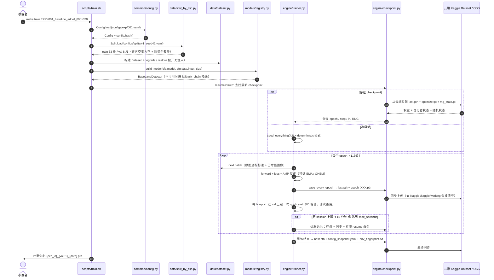
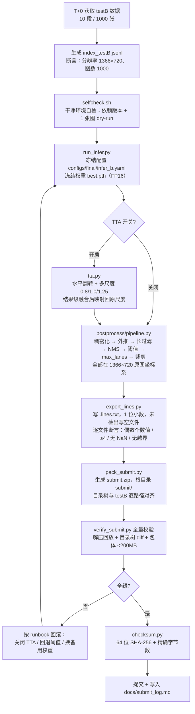
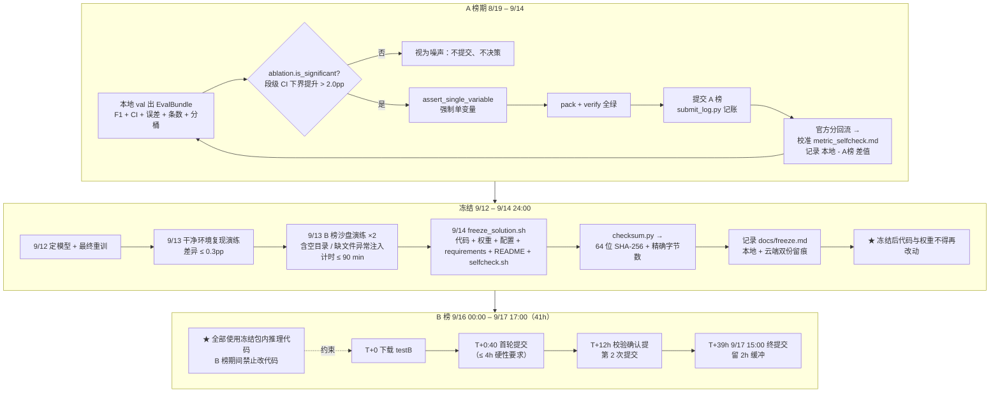
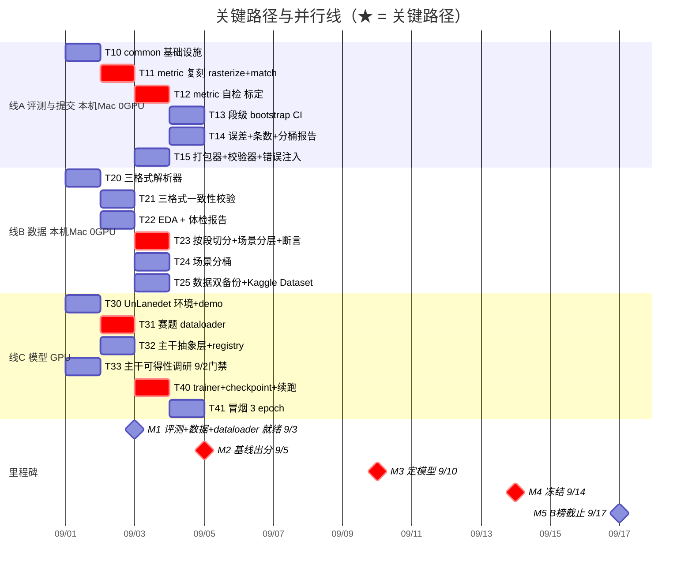

# 恶劣场景下的车道线检测挑战赛 · 系统架构设计（ARCHITECTURE）

| 项 | 内容 |
|---|---|
| 文档版本 | **v1.1** |
| 状态 | **active**（现行架构基线） |
| 版本链 | v1.0（1146 行，5 层，W0–W7 编号）→ **v1.1**（重写为 6 层 + T00–T72 编号 + 推测→开关→证伪矩阵 + 三线并行 Gantt；随后落地 AR-1..AR-5 修正与 §6.5 单人版） |
| 撰写人 | 高见远（架构师） |
| 修订人 | 齐活林（交付总监）——在 v1.1 上落地 AR-1..AR-5 五处修正 + W/T 编号衔接说明（§6.2）+ §6.5 单人版重排 |
| 汇报对象 | 齐活林（交付总监） |
| 上游输入 | `docs/PRD.md`（v2，15 条 P0）、`docs/PRD_v1_目标84.md`（v1，19 条 P0）；目标/预算/范围以 `docs/DECISIONS.md`（§1/§12/§13）为准，常量唯一取值点 `configs/default.yaml` |
| 下游交付 | 全组开发实施 |
| 日期 | 2026-09-01（v1.0 撰写）｜2026-09-01（v1.1 修订落盘） |
| 赛事 | 2026 iFLYTEK AI 开发者大赛 · 恶劣场景下的车道线检测挑战赛 |

> **v1.1 变更记录**（相对 v1.0）：① 分层 5→6 层，任务编号 W0–W7 → T00–T72（45 任务）；② 新增「推测→开关→证伪」矩阵；③ 三线并行 Gantt 解决 W1/W2 串行拖到 9/7 的问题；④ 齐活林落地 5 处修正——AR-1 目标常量 0.84 不下调（头部导语 + §0 目标表）、AR-2 答辩模型「仅前三受邀、不翻盘」（§0 Q6 行 + §9.1 Q-B1）、AR-3 预算口径「100 覆盖/200 冗余/300 缓冲」（§9.1 Q-A2 + §9.3 建议#2）、AR-4 CPU 路径标注【未实测】（§5 推理预算表）、AR-5 检对价值 2.40×（§4.6）；⑤ 新增 §6.5 单人版范围重排（DECISIONS §13 拍板后）。
> **注**：本文曾顶着 v1.0 的版本头承载 v1.1 内容（2026-09-01 下午审计发现并修正，版本治理失效案例，见 DECISIONS §11/§14）。

> **本架构不裁决目标分数，但登记裁决结果。** 目标 83.0 / 84.0 之争已由 `docs/DECISIONS.md` §1 裁决为**双轨**：竞争门槛（top-down）**84.0** 为本项目工作性目标，能力预测中位 **82.2**，执行缺口 **1.8pp**。代码常量、台账、过程指标一律以 **0.84** 为基准，**不下调**（理由：目标会自我实现——按能力定 82 会砍掉集成/分辨率 ablation/付费算力，然后真的停在 82）。本架构的唯一使命是：
> **让两版 PRD 中的每一条【推测】都变成一个可被一次实验证伪或证实、且互不干扰的配置开关。**
> 因此本文档中「可配置 / 可开关 / 可单变量 A/B / 可回退」是最高设计约束，优先级高于任何单点性能。

---

## 0. 两版 PRD 的合并口径（架构师裁决部分）

两版 PRD 在**目标分数**上冲突，但在**工程事实**上高度互补。本架构采取「**并集吸收 + 冲突项取严**」策略。

### 0.1 v1 独有、v2 未覆盖的洞察（已全部纳入本架构）

| v1 独有洞察 | 架构落地位置 | 设计动作 |
|---|---|---|
| **D6 输入分辨率是隐性天花板**（800 宽下 10px 容差只剩 5.9px；320 高使纵向端点误差放大 2.25×） | `configs/default.yaml::data.input_size` + `configs/preset/res_*.yaml` | 分辨率升为**一等公民配置**，预置 4 档 preset；**后处理与输出一律在 1366×720 原图坐标系完成**，网络内部才用低分辨率（见 §4.5） |
| **§1.4 把目标翻译成「多少条线」**（+0.8pp = 多检对 24 条 + 少画 18 条） | `src/postprocess/`（少画）与 `src/data/degrade.py` + `src/data/sampler.py`（多检对） | 两个战场**拆成两条独立链路**，各自独立开关、各自独立度量（`count_report.py` 与 `scene_report.py` 分别读数） |
| **Q6 决赛答辩能否出席/形式（线下/线上）**（v2 Q2 / v1 Q6） | `docs/ablation.md` + `docs/runbook_b_phase.md` | 台账与答辩素材**同源自动化产出**，不额外投入人力 | *已核实赛题原文（DECISIONS.md §5）：只有 B 榜**作品分前三**受邀答辩，答辩 30% 只在前三内部排一二三等奖，**不构成翻盘通道**；故「出席与否」影响能否拿奖，而非能否进前三。* |
| **D7 A 榜提交节奏**（总 ≤12 次，每次只改 1 个变量） | `src/exp/ablation.py::assert_single_variable` + `src/submit/submit_log.py` | 单变量约束**代码级强制**，不止是纪律 |
| **过程指标体系**（F1@0.7 ≥ 62.0、平均横向误差 ≤ 6.0px、>10px 占比 ≤ 12%、条数正确率 ≥ 88%、最低桶 ≥ 72.0） | `src/eval/evaluate.py` 一次跑全，输出 `EvalBundle` | 全部指标**每次实验自动重算**，不靠手工 |
| **COMPUTE-P0-01/02**（算力台账、双环境灾备） | `src/exp/compute_ledger.py` + `scripts/autodl/` + `scripts/kaggle/` | 算力是硬约束，必须有账本 |
| **FINAL-P0-03 全流程 ≤ 90 分钟** | `scripts/drill/drill_b_phase.sh` | 比 v2 的 ≤6h 更严，**取严者**：内部演练按 90 分钟验收，对外承诺 6 小时 |
| **DATA-P0-04 数据双备份** | `scripts/kaggle/kaggle_sync_dataset.py` + `data/raw/RAW_SHA256.txt` | 数据丢失 = 比赛结束 |

### 0.2 v2 独有、v1 未覆盖的洞察

| v2 独有洞察 | 架构落地位置 |
|---|---|
| 每图多/漏 0.1 条 ≈ F1 掉 1.0pp | `src/postprocess/count_calib.py` 以 F1 为直接优化目标做阈值 / NMS / max_lanes 网格扫描 |
| P50 横向误差需 ≤ 5px | `src/eval/lateral_error.py` 输出 P50/P90/达标率（v1 的「平均 ≤6.0px」同时保留，两个都出） |
| 主干排序 α-SimADNet > RVLD > CLRNet-DLA34 | `src/models/registry.py` 三主干全部注册，按序 fallback |
| A 榜段级 bootstrap 标准误 1.67pp，差异 <2pp 视为噪声 | `src/eval/bootstrap.py` + `src/exp/ablation.py::is_significant`（CI 下界提升 > 2.0pp 才可提交 A 榜） |
| 跨帧时序收益 <1pp，明确放弃 | **架构上不提供该扩展点**（避免诱惑），仅在 `docs/decisions.md` 记录决策与理由 |

### 0.3 冲突项：取严者 / 双轨保留

| 冲突点 | v1 | v2 | 架构处置 |
|---|---|---|---|
| 起步框架 | UnLanedet（全家桶） | 论文原版 α-SimADNet/RVLD/ADNet | **双注册**：`src/models/` 同时桥接两者，配置一行切换。选型理由见 §1 |
| 验证集规模 | 固定 8 段 | 8–10 段 | 配置 `split.val_size: 8`，可改；断言区间 [8, 10] |
| 冻结截止 | 9/14 前 | 9/15 24:00 前 | **取严者：9/14 24:00 完成冻结**，9/15 全天做复现演练 |
| B 榜流程耗时 | ≤ 90 分钟 | ≤ 6 小时 | 内部验收 90 分钟，对外承诺 6 小时 |
| 目标分 | 84.0（工作性目标） | 83.0 | 双轨：目标 0.84（DECISIONS.md §1），能力预测 0.822，缺口 1.8pp；常量取 0.84 不下调 |

---

## 1. 实现方案与框架选型

### 1.1 我的倾向（明确表态）

> **以 UnLanedet 作为工程底座（Runner / Dataset / 后处理 / 评测复用），以 ADNet（HardLane 家族，UnLanedet 内置）作为「T0 冒烟主干」抢第一个数据点，同时并行桥接 α-SimADNet / RVLD 原版实现作为「T1 主力候选」；9/5 基线出分、9/10 前完成主干定档。**

即：**工程上用 UnLanedet，算法上追论文原版，二者通过 `BaseLaneDetector` 抽象层解耦。**

### 1.2 理由

| # | 理由 | 类型 |
|---|---|---|
| 1 | **赛程不允许「先完美选型再动手」。** 今天 9/1，9/3 要数据与评测就绪、9/5 要基线出分。UnLanedet 已内置 CLRNet / CLRerNet / ADNet / CondLaneNet / UFLD / RESA / GANet 且单卡验证过，**clone 到跑通 1 epoch 预计 6 小时内**，是唯一能在 9/4 前拿到真实数据点的路径 | 【事实】 |
| 2 | **UnLanedet 内置 ADNet，而 ADNet 正是 HardLane 家族（ADNet 80.5 → RVLD 82.0 → α-SimADNet 83.2）的第一级台阶。** 用它起步，后续升级主干时数据管线、评测管线、后处理、台账**全部可复用**，只有 `src/models/*.py` 一个文件要换 | 【事实】+【推测】 |
| 3 | **α-SimADNet / RVLD 的开源可得性未确认（v2 Q1，阻塞项）。** 在 9/2 调研结论出来前把全部筹码押在「可能拿不到代码」的主干上是项目级风险。架构必须先保证**有一条 100% 可跑通的下限路径**（CLRNet-DLA34 / ADNet via UnLanedet，CULane 80.47） | 【事实】 |
| 4 | **评测与后处理才是本赛题的主要增量来源，且与主干完全正交。** 零训练成本项合计 +1.5~3.5pp，主干从 CLRNet 换到 α-SimADNet 是 +2.7pp。**评测/后处理代码与主干无关** —— 选成熟工程底座不会损失任何主干升级空间 | 【测算】 |
| 5 | **复现要求（TOP3 必查）偏好成熟框架。** UnLanedet 有标准 `requirements.txt` 与社区验证；论文原版 repo 常有隐式依赖与脏提交。底座越标准，R3/R5 风险越低 | 【事实】 |
| 6 | **反对「纯论文原版起步」**：原版 repo 常绑定特定 torch 版本与自研 CUDA 算子，在 Kaggle T4 与 AutoDL 4090 双环境编译通过概率不高，调试时间不可控。我们只有 16 天，**不可控时间是最大的敌人** | 【推测】 |

### 1.3 主干可插拔设计（核心）

无论最终选哪个主干，训练 / 评测 / 后处理 / 提交代码**一行不改**，只改配置 `configs/exp/*.yaml::model.name`。

```python
# src/models/base.py
class BaseLaneDetector(Protocol):
    """主干统一契约。所有主干（CLRNet / ADNet / RVLD / α-SimADNet）必须满足。

    坐标约定：predict() 返回的 Lane 一律在【1366×720 原图绝对像素坐标系】，
    网络内部的下采样 / 归一化在主干实现内部闭环，不得外泄。
    """

    name: str                        # 注册名，用于 configs/model/*.yaml 索引

    def build(self, cfg: ModelConfig, input_size: tuple[int, int]) -> nn.Module:
        """构建网络。input_size=(W,H) 为可配置网络输入尺寸（D6 分辨率 ablation 入口）。"""

    def forward_train(self, batch: dict) -> dict[str, torch.Tensor]:
        """返回 {'loss': ..., 'loss_ce': ..., 'loss_iou': ...} 等，供 trainer 汇总。"""

    @torch.no_grad()
    def predict(self, images: torch.Tensor) -> list[list[Lane]]:
        """B×C×H×W → 每图 list[Lane]，坐标为【原图 1366×720】绝对像素，含 conf 分。"""

    def load_weights(self, ckpt_path: str) -> None:
        """权重加载（支持 FP16 / FP32 / 键名重映射）。"""

    def export_fp16(self, out_path: str) -> int:
        """导出 FP16 权重用于 solution.zip，返回字节数（用于 200MB 包体核算）。"""
```

```python
# src/models/registry.py
REGISTRY: dict[str, type[BaseLaneDetector]] = {}

def register_model(name: str):
    def _wrap(cls):
        assert name not in REGISTRY, f"重复注册: {name}"
        REGISTRY[name] = cls
        return cls
    return _wrap

def build_model(cfg: ModelConfig, input_size: tuple[int, int]) -> BaseLaneDetector:
    cls = REGISTRY.get(cfg.name)
    if cls is None:
        # ★ 降级链：配置里的主干不可用时按序 fallback，保证链路永不中断
        for fb in cfg.fallback_chain:      # e.g. ["alpha_simadnet", "rvld", "adnet", "clrnet_dla34"]
            if fb in REGISTRY:
                logger.warning(f"主干 {cfg.name} 不可用，降级为 {fb}")
                cfg = replace(cfg, name=fb)
                cls = REGISTRY[fb]
                break
    return cls(cfg).build(cfg, input_size)
```

| 主干 | 桥接方式 | 定位 | 论文水位 | 时间点 |
|---|---|---|---|---|
| `clrnet_dla34` | UnLanedet 内置 | **下限保底**（永远可用） | CULane 80.47 | T0，9/4 冒烟 |
| `adnet` | UnLanedet 内置 | HardLane 家族起点 | HardLane 80.5 | T0，9/5 基线 |
| `rvld` | 原版 repo 桥接，否则 UnLanedet 迁移 | 主力候选① | HardLane 82.0 | T1，9/8 前接入 |
| `alpha_simadnet` | 原版 repo 桥接，否则按论文复现 | **主力候选②（首选）** | HardLane **83.2** | T1，9/8 前接入 |

> **9/2 门禁（v2 Q1）**：若 α-SimADNet / RVLD 代码不可得或 4 小时内跑不通 → 立即锁定 `adnet` 为主力，把省下的时间投入后处理与退化增强（零训练成本项）。**此门禁不阻塞任何其他工作线。**

### 1.4 技术栈与版本锁定策略

**为什么必须锁死版本**：TOP3 需官方复核可复现（R3/R5，致命级）。版本漂移会导致「干净环境重跑差异 > 0.3pp」被判定复现失败、取消名次。

**锁定策略（三层）**

| 层 | 文件 | 用途 | 约束 |
|---|---|---|---|
| 精确锁 | `requirements.txt` | `pip freeze` 产出，**逐包 `==`**，进 `solution.zip` | 复现环境只用这个 |
| 范围锁 | `requirements-range.txt` | `>=x.y,<a.b` | 双环境搭建时的容错 |
| 环境指纹 | `outputs/runs/<exp_id>/env_fingerprint.txt` | 记录 python / torch / torch.version.cuda / cv2 / nvidia-smi / git commit | 每次实验自动落盘，进台账 |

**核心版本（三环境统一）**

| 包 | 锁定版本 | 理由 |
|---|---|---|
| Python | **3.10.13** | 本机与 AutoDL 用 conda 精确锁；Kaggle 若默认 3.11 则切 3.10 kernel，差异记入 fingerprint |
| PyTorch | **2.1.2+cu118** | Kaggle T4 与 AutoDL 4090（sm_89）均支持；deterministic 路径稳定 |
| torchvision | **0.16.2+cu118** | 与 torch 严格配套 |
| CUDA runtime | **11.8** | T4 与 4090 双兼容的最大公约数 |
| numpy | **1.26.4** | 支持 Py3.10 且避开 2.0 ABI 破坏 |
| opencv-python-headless | **4.9.0.80** | `cv2.line(lineType=8)` 无抗锯齿是所有 IoU 的地基，**必须锁死** |
| scipy | **1.11.4** | B 样条实现；**评测端与后处理端必须同版本**，消除系统性偏差 |
| albumentations | **1.4.0** | 几何变换与标注（keypoints）同步 |
| 其余 | 见 §7 | |

**跨环境一致性硬要求**

- 环境变量：`CUBLAS_WORKSPACE_CONFIG=:4096:8`
- 代码：`torch.use_deterministic_algorithms(True)`、`cudnn.benchmark = False`、`cudnn.deterministic = True`
- 最终产出推理时强制 `DataLoader(num_workers=0)`（消除多线程顺序不确定性）；训练期可设 4，但必须 `worker_init_fn` 固定种子
- `src/exp/repro_check.py` 对同一权重连跑两次推理并逐字节比对，不一致即红灯

---

## 2. 系统分层架构

```mermaid
flowchart TB
    subgraph DATA["1. 数据层 DATA —— 原始数据 到 可训练样本"]
        direction TB
        D1["data/raw/<br/>官方包只读 + SHA-256 存证"]
        D2["parse_labels.py<br/>三格式统一解析"]
        D3["check_label_consistency.py<br/>7100 张全量一致性校验"]
        D4["split_by_clip.py<br/>按段 hold-out + 场景分层 + 交集断言"]
        D5["scene_bucket.py<br/>9 类场景分桶"]
        D6["dataset.py + transforms.py<br/>坐标同步的几何与光度变换"]
        D7["degrade.py 退化增强<br/>restore.py 复原前置<br/>sampler.py 短板桶过采样"]
        D1 --> D2 --> D3 --> D4 --> D6
        D4 --> D5 --> D6
        D6 --> D7
    end

    subgraph MODEL["2. 模型层 MODEL —— 可插拔主干 + 训练引擎"]
        direction TB
        M1["models/registry.py<br/>主干注册表 + 降级链"]
        M2["clrnet_dla34 / adnet / rvld / alpha_simadnet"]
        M3["engine/trainer.py<br/>AMP + EMA + 梯度累积"]
        M4["engine/checkpoint.py<br/>每 epoch 存盘 + 云端同步 + 续跑"]
        M1 --> M2 --> M3 --> M4
    end

    subgraph POST["3. 后处理层 POST —— 几何质量 + 条数准确（零训练成本主战场）"]
        direction TB
        P1["postprocess/pipeline.py<br/>各步骤独立开关编排"]
        P2["resample 稠密化 / extrapolate 端点外推<br/>filter 长过滤+裁剪 / nms 横向去重"]
        P3["count_calib.py<br/>阈值 与 max_lanes 与 NMS 网格扫描<br/>直接以 F1 为优化目标"]
        P4["infer/tta.py<br/>水平翻转 + 多尺度结果级融合"]
        P1 --> P2 --> P3
        P4 --> P1
    end

    subgraph EVAL["4. 评测层 EVAL —— 唯一事实来源，所有决策的地基"]
        direction TB
        E1["eval/rasterize.py<br/>B样条稠密化 + 30px 无抗锯齿绘制"]
        E2["eval/match.py<br/>IoU 矩阵 + 匈牙利一对一"]
        E3["eval/official_metric.py<br/>compute_f1 一比一复刻"]
        E4["bootstrap 段级CI / lateral_error 横向误差<br/>count_report 条数 / scene_report 分桶F1"]
        E5["eval/selfcheck.py<br/>GT对GT + 横移 5 10 15px 标定"]
        E1 --> E2 --> E3 --> E4
        E5 -.->|每次改动后必跑| E3
    end

    subgraph EXP["5. 实验管理层 EXP —— 单变量纪律 + 可复现存证"]
        direction TB
        X1["exp/ablation.py<br/>单变量断言 + 配置 diff"]
        X2["exp/ledger.py 实验台账<br/>exp/compute_ledger.py 算力台账"]
        X3["exp/repro_check.py<br/>两次推理逐字节一致"]
        X4["common/config.py<br/>配置 hash / diff / 快照"]
        X4 --> X1 --> X2
        X3 --> X2
    end

    subgraph DELIV["6. 交付层 DELIV —— 把预测变成合法且不可逆的提交"]
        direction TB
        V1["submit/pack_submit.py<br/>submit.zip + 根目录 submit/"]
        V2["submit/verify_submit.py<br/>全量断言 + 解包回放 + 错误注入"]
        V3["submit/submit_log.py<br/>A 榜额度账本"]
        V4["scripts/freeze_solution.sh<br/>冻结 + SHA-256 + 字节数"]
        V5["common/checksum.py<br/>64 位 SHA-256 + 精确字节数"]
        V1 --> V2 --> V4 --> V5
        V3 --> V4
    end

    DATA -->|batch 原图坐标| MODEL
    MODEL -->|list of Lane 1366x720 原图坐标| POST
    POST -->|outputs/preds/exp_id/split/| EVAL
    POST -->|导出 lines.txt| DELIV
    EVAL -->|F1 与 CI 与 误差 与 条数 与 分桶| EXP
    EXP -->|闸门：CI 下界提升 大于 2.0pp| DELIV
    DELIV -.->|A 榜分回流校准| EVAL

    style EVAL fill:#ffe8e8
    style EXP fill:#e8f0ff
    style DELIV fill:#fff4e0
```



### 2.1 各层职责与边界（严格单向依赖，禁止反向引用）

| 层 | 职责 | **不负责** | 对外唯一出口 | 允许依赖 |
|---|---|---|---|---|
| ① 数据层 | 解析、切分、分桶、增强、复原；**保证坐标始终是 1366×720 原图绝对像素** | 不做评测、不写提交 | `torch Dataset` + `index_*.jsonl` | common |
| ② 模型层 | 可插拔主干构建、训练循环、checkpoint 续跑 | 不做后处理、不打包 | `list[list[Lane]]`（原图坐标）+ ckpt | common, data |
| ③ 后处理层 | 几何质量（重采样/外推/去重）与条数准确（阈值/NMS/max_lanes）—— **两个独立战场** | 不训练、不评测 | `outputs/preds/**/*.lines.txt` | common, models |
| ④ 评测层 | **唯一事实来源**：F1、段级 CI、横向误差、条数准确率、分桶 F1 | 不做任何决策（只出数） | `EvalBundle` | common |
| ⑤ 实验管理层 | 单变量纪律强制、台账、算力账、复现验证 | 不改模型 | `experiments.csv` / `ablation.md` | common |
| ⑥ 交付层 | 打包、全量校验、冻结、哈希存证 | 不做任何算法决策 | `submit.zip` + `freeze.md` | common |

**边界铁律**

1. **评测层不得 import 模型层或后处理层** —— 防止「我的评测配合我的后处理」的自证循环。
2. **后处理层不得 import 评测层** —— 阈值标定是唯一例外，必须显式走 `count_calib.py` 接口，并在台账中标注「该参数在 val 上标定」。
3. **所有层共用 `common/types.py::Lane`**，禁止任何层自定义折线表示。

---

## 3. 完整文件清单

### 3.1 目录树

```
lane-competition/
├── README.md                                # 从原始数据到 submit.zip 的完整命令序列（TOP3 复核入口）
├── requirements.txt                         # pip freeze 精确版本（复现唯一来源）
├── requirements-range.txt                   # 宽松范围，供环境搭建容错
├── Makefile                                 # make data/train/infer/eval/pack/submit/freeze/drill
├── .gitignore                               # 禁止提交数据与权重
│
├── data/                                    # 【不入 git】
│   ├── raw/                                 # 官方原始包，只读
│   │   ├── train/  testA/  testB/
│   │   └── RAW_SHA256.txt                   # 原始包哈希存证
│   ├── interim/                             # 中间产物
│   │   ├── labels_cache/                    # 三格式解析缓存
│   │   └── consistency_badlist.txt          # 三格式不一致样本清单
│   └── processed/                           # 切分与索引产物
│       ├── index_train.jsonl
│       ├── index_val.jsonl
│       ├── index_testA.jsonl
│       ├── index_testB.jsonl
│       ├── scene_of_clip.json               # 段 ID -> 场景类别
│       └── data_report.md                   # 体检报告（由 eda.py 生成）
│
├── src/
│   ├── common/
│   │   ├── types.py                         # Lane / ImagePrediction / EvalBundle —— 全项目唯一表示
│   │   ├── geo.py                           # 重采样 / B样条 / 端点外推 / 裁剪 / 横向误差
│   │   ├── io_utils.py                      # .lines.txt / .json / 实例 .png 读写，统一 1 位小数
│   │   ├── seed.py                          # 全种子固定 + deterministic 开关
│   │   ├── paths.py                         # 三环境（本机 / Kaggle / AutoDL）路径自动探测
│   │   ├── config.py                        # 配置 dataclass + load/dump/hash/diff/单变量断言
│   │   ├── logging_setup.py                 # 统一日志格式（含 exp_id 前缀）
│   │   └── checksum.py                      # 64 位 SHA-256 + 精确字节数
│   │
│   ├── data/
│   │   ├── parse_labels.py                  # 三格式统一解析器 -> list[Lane]
│   │   ├── check_label_consistency.py       # 7100 张全量三格式线数一致性校验
│   │   ├── eda.py                           # EDA + 分布体检报告
│   │   ├── split_by_clip.py                 # 按段 hold-out + 场景分层 + 段 ID 交集断言
│   │   ├── scene_bucket.py                  # 9 类场景分桶（规则优先 + 人工标注兜底）
│   │   ├── dataset.py                       # torch Dataset，输出原图坐标标注
│   │   ├── transforms.py                    # 几何 / 光度变换，标注同步
│   │   ├── degrade.py                       # 退化增强各算子（独立开关）
│   │   ├── restore.py                       # 复原前置 CLAHE / 自适应gamma / 暗通道去雾（独立开关）
│   │   └── sampler.py                       # 短板桶定向过采样
│   │
│   ├── models/
│   │   ├── base.py                          # BaseLaneDetector 抽象契约
│   │   ├── registry.py                      # 主干注册表 + 自动降级链
│   │   ├── clrnet_dla34.py                  # 下限保底主干（UnLanedet 桥接）
│   │   ├── adnet.py                         # HardLane 家族起点（UnLanedet 桥接）
│   │   ├── rvld.py                          # 主力候选 1（原版 repo 桥接）
│   │   └── alpha_simadnet.py                # 主力候选 2 · 首选（原版 repo 桥接 / 论文复现）
│   │
│   ├── engine/
│   │   ├── trainer.py                       # 训练循环：AMP + EMA + 梯度累积 + 定时优雅退出
│   │   ├── checkpoint.py                    # 每 epoch 存盘 + 云端同步 + 自动续跑
│   │   ├── schedulers.py                    # LR 策略
│   │   ├── ema.py                           # EMA 权重
│   │   └── metrics_logger.py                # 训练期指标落盘（jsonl）
│   │
│   ├── postprocess/
│   │   ├── pipeline.py                      # 后处理编排，每步独立开关
│   │   ├── resample.py                      # B样条稠密化 + 等距重采样（间距 ≤10px）
│   │   ├── extrapolate.py                   # 端点外推到图像底边
│   │   ├── filter.py                        # 线长过滤（<图高20%）+ 坐标裁剪
│   │   ├── nms.py                           # 横向 NMS 去重（横距<15px 且纵重叠>50%）
│   │   └── count_calib.py                   # 阈值 / NMS / max_lanes 网格扫描，直接以 F1 为目标
│   │
│   ├── infer/
│   │   ├── predictor.py                     # 单图推理 -> list[Lane]（原图坐标），GPU / CPU 双路径
│   │   ├── tta.py                           # 水平翻转 + 多尺度 0.8/1.0/1.25 结果级融合
│   │   ├── run_infer.py                     # 批量推理入口（B 榜主入口）
│   │   └── export_lines.py                  # list[Lane] -> .lines.txt（1 位小数 + 全量断言）
│   │
│   ├── eval/
│   │   ├── rasterize.py                     # B样条(k<=3)稠密化 -> 1366x720 画布 -> cv2.line(thickness=30, lineType=8)
│   │   ├── match.py                         # IoU 矩阵 + 匈牙利一对一 + IoU>0.5 判 TP
│   │   ├── official_metric.py               # compute_f1() 一比一复刻官方指标
│   │   ├── bootstrap.py                     # 段级 bootstrap（1000 次）95% CI
│   │   ├── lateral_error.py                 # 单线平均横向误差 P50 / P90 / 大于10px 占比
│   │   ├── count_report.py                  # 预测条数等于真值条数 的图占比
│   │   ├── scene_report.py                  # 9 类场景分桶 F1
│   │   ├── selfcheck.py                     # metric 自检：GT对GT / 横移 5 10 15px 理论值标定
│   │   └── evaluate.py                      # 一次跑全 -> EvalBundle
│   │
│   ├── submit/
│   │   ├── pack_submit.py                   # 生成 submit.zip（根目录 submit/）
│   │   ├── verify_submit.py                 # 全量断言 + 解包回放 + 5 类错误注入拦截
│   │   └── submit_log.py                    # A 榜提交额度账本
│   │
│   └── exp/
│       ├── ledger.py                        # experiments.csv 台账自动写入
│       ├── ablation.py                      # 单变量断言 + 配置 diff + 显著性闸门
│       ├── compute_ledger.py                # GPU 小时台账 + Kaggle 周配额追踪
│       └── repro_check.py                   # 同一权重两次推理逐字节一致验证
│
├── configs/
│   ├── default.yaml                         # 全量默认值（唯一事实源）
│   ├── model/{clrnet_dla34,adnet,rvld,alpha_simadnet}.yaml
│   ├── split/v1_seed42.yaml                 # 8 段验证集的显式段 ID 列表
│   ├── preset/
│   │   ├── res_800x320.yaml                 # D6 基线档
│   │   ├── res_960x480.yaml                 # D6 推荐折中档（宽>=960、高>=480）
│   │   ├── res_1366x720.yaml                # D6 全分辨率档（显存上限测试）
│   │   └── res_1600x320.yaml                # CLRNet 常规档，作对照
│   ├── exp/
│   │   ├── 000_smoke_clrnet_800x320.yaml    # T0 冒烟
│   │   ├── 001_baseline_adnet_800x320.yaml  # 基线（所有 ablation 的对照组）
│   │   ├── 002_res_960x480.yaml             # 证伪：分辨率是隐性天花板？
│   │   ├── 003_restore_clahe.yaml           # 证伪：CLAHE 有效？（分桶判定）
│   │   ├── 004_degrade_rain_fog.yaml        # 证伪：退化增强 +0.5~1.5pp？
│   │   ├── 005_post_resample.yaml           # 证伪：B样条稠密化收益？
│   │   ├── 006_post_extrapolate.yaml        # 证伪：端点外推收益？
│   │   ├── 007_post_nms.yaml                # 证伪：横向 NMS 收益？
│   │   ├── 008_tta_flip.yaml                # 证伪：水平翻转 TTA 有益还是有害？
│   │   ├── 009_main_rvld.yaml               # 主干升级 1
│   │   ├── 010_main_alpha_simadnet.yaml     # 主干升级 2（首选）
│   │   └── 0xx_*.yaml                       # 后续按序追加
│   └── final/infer_b.yaml                   # B 榜冻结推理配置（冻结后只读）
│
├── outputs/
│   ├── runs/<exp_id>/                       # 权重 / 日志 / env_fingerprint / config_snapshot.yaml
│   ├── preds/<exp_id>/<split>/              # 预测 .lines.txt（与测试集目录树同构）
│   ├── reports/<exp_id>/                    # EvalBundle 全量报告
│   └── submits/submit_<ts>.zip
│
├── scripts/
│   ├── setup_env.sh                         # 三环境一键建环境（含 cu118 索引）
│   ├── prep_data.sh                         # 解析 -> 校验 -> EDA -> 切分 -> 索引
│   ├── train.sh                             # 训练入口（--resume 自动续跑）
│   ├── infer.sh                             # 推理入口（GPU / --cpu 降级）
│   ├── eval.sh                              # 评测 + 全量诊断报告
│   ├── pack_submit.sh                       # 打包 + 校验 + 哈希
│   ├── freeze_solution.sh                   # 冻结 solution.zip + SHA-256 + 字节数
│   ├── selfcheck.sh                         # 干净环境自检（进 solution.zip）
│   ├── kaggle/
│   │   ├── kaggle_train.ipynb               # GPU session 模板（9h 上限自动续跑）
│   │   ├── kaggle_cpu_eval.ipynb            # CPU notebook：评测/EDA/打包全链路，0 GPU 配额
│   │   └── kaggle_sync_dataset.py           # /kaggle/working -> Kaggle Dataset 持久化
│   ├── autodl/autodl_setup.sh               # 4090 环境 + 数据盘挂载
│   └── drill/drill_b_phase.sh               # B 榜沙盘演练（含空目录/缺文件异常注入）
│
├── docs/
│   ├── ARCHITECTURE.md                      # 本文档
│   ├── PRD.md / PRD_v1_目标84.md / PRD_双版对照.md
│   ├── conventions.md                       # 共享约定（坐标系/种子/命名/路径）——开发前必读
│   ├── decisions.md                         # 决策记录（目标分最终结果、主干定档）
│   ├── eda.md                               # EDA 与数据体检报告
│   ├── metric_selfcheck.md                  # metric 自检 + 与 A 榜差值校准序列
│   ├── ablation.md                          # 【P0-D12】消融台账（可直贴答辩 PPT）
│   ├── experiments.csv                      # 实验台账机读版
│   ├── compute_ledger.md                    # 算力台账
│   ├── submit_log.md                        # A 榜提交账本
│   ├── runbook_b_phase.md                   # B 榜 41 小时作战手册
│   └── freeze.md                            # 冻结记录：SHA-256 + 精确字节数（双份留痕）
│
└── tests/
    ├── test_metric_selfcheck.py             # GT对GT=1.000 / 横移 5 10 15px 理论值误差<0.02
    ├── test_submit_inject_errors.py         # 5 类注入错误拦截率 100%
    ├── test_split_assert.py                 # 训练/验证段 ID 交集为空
    ├── test_geo_roundtrip.py                # 重采样/外推/裁剪 无 NaN、幂等性
    └── test_config_diff.py                  # 单变量断言与 diff 正确性
```

**文件总数：约 90 个**（Python 源码约 42 个、配置 19 个、脚本 13 个、文档 12 个、其他 4 个）。

### 3.2 P0 需求 → 落地位置覆盖表（两版并集）

| v1 编号 | v2 编号 | 需求 | 落地文件 | 验收产物 |
|---|---|---|---|---|
| EVAL-P0-01 | P0-A01 | 一比一复刻官方 metric | `src/eval/{rasterize,match,official_metric,selfcheck}.py` | `docs/metric_selfcheck.md` |
| — | P0-A02 | 段级 bootstrap CI | `src/eval/bootstrap.py` | `outputs/reports/<exp>/ci.json` |
| EVAL-P0-02 | P0-A03 | submit.zip 打包器 | `src/submit/pack_submit.py` | `outputs/submits/*.zip` |
| EVAL-P0-02 | P0-A04 | 提交校验器 + 解包回放 | `src/submit/verify_submit.py` | `outputs/reports/verify_<ts>.md` |
| FINAL-P0-03 | P0-A05 | B 榜沙盘演练 | `scripts/drill/drill_b_phase.sh` | `docs/runbook_b_phase.md` |
| EVAL-P0-03 | P0-C10 | 后处理套件（稠密化/外推/过滤/NMS/裁剪） | `src/postprocess/{pipeline,resample,extrapolate,filter,nms}.py` | `outputs/reports/<exp>/eval.md` |
| DATA-P0-03 | P0-B06 | 三格式解析 + 一致性校验 | `src/data/{parse_labels,check_label_consistency}.py` | `data/interim/consistency_badlist.txt` |
| DATA-P0-01 | P0-B07 | 按段 hold-out + 场景分层 + 断言 | `src/data/{split_by_clip,scene_bucket}.py` + `tests/test_split_assert.py` | `configs/splits/v1_seed42.yaml` |
| DATA-P0-02 | P0-B08 | EDA / 数据体检报告 | `src/data/eda.py` | `docs/eda.md` |
| DATA-P0-04 | — | 数据双备份 + 哈希存证 | `scripts/kaggle/kaggle_sync_dataset.py` + `data/raw/RAW_SHA256.txt` | 云端 Dataset + 本地副本 |
| MODEL-P0-01 | P0-C09 | 基线模型跑通 | `src/models/{registry,adnet,alpha_simadnet}.py` | `outputs/runs/<exp>/best.pth` |
| MODEL-P0-02 | P0-C09② | 赛题 dataloader（原图坐标） | `src/data/dataset.py` + `src/common/geo.py` | 1 epoch 日志 |
| MODEL-P0-03 | P1-C18 | 恶劣场景专项（退化增强可开关） | `src/data/degrade.py` | `configs/exp/004_*.yaml` |
| MODEL-P0-04 | P0-C10② | 条数预测校准 | `src/postprocess/count_calib.py` | 阈值扫描曲线 + 条数准确率 |
| — | P0-C11 | 横向误差诊断报告 | `src/eval/lateral_error.py` | `outputs/reports/<exp>/lateral_error.md` |
| EVAL-P1-01 | P1-D23 | 分场景 F1 看板 | `src/eval/scene_report.py` | `outputs/reports/<exp>/scene_f1.csv` |
| EXP-P0-01 | P0-D12 | 消融台账 | `src/exp/{ledger,ablation}.py` | `docs/ablation.md` + `docs/experiments.csv` |
| EXP-P0-02 | P0-D13 | 可复现三件套 | `requirements.txt` + `scripts/{train,infer}.sh` + `README.md` + `src/exp/repro_check.py` | `docs/freeze.md` |
| EXP-P0-03 | — | 权重与产物归档 | `src/engine/checkpoint.py` | `{exp_id}_{valF1}_{date}.pth` |
| COMPUTE-P0-01 | — | 算力预算台账 | `src/exp/compute_ledger.py` | `docs/compute_ledger.md` |
| COMPUTE-P0-02 | US-09/10 | 双 GPU 环境灾备 | `scripts/kaggle/*` + `scripts/autodl/*` | 两环境各跑通 1 epoch mini-train |
| FINAL-P0-01 | P0-E15 | B 榜 41 小时作战手册 | `docs/runbook_b_phase.md` | 按小时排布时间表 |
| FINAL-P0-02 | P0-E14 | solution.zip 冻结 + SHA-256 + 字节数 | `scripts/freeze_solution.sh` + `src/common/checksum.py` | `docs/freeze.md` |
| D6 | Q4 | 分辨率可配置 | `configs/preset/res_*.yaml` + `default.yaml::data.input_size` | `configs/exp/002_*.yaml` |

---

## 4. 核心数据结构与接口定义

### 4.1 车道线折线的内存表示

```python
# src/common/types.py
from __future__ import annotations
from dataclasses import dataclass, field
import numpy as np

# ────────────────────────────────────────────────────────────────────
# 坐标系铁律（全项目唯一约定，见 docs/conventions.md）
#   画布   : 1366 × 720（W × H），左上原点
#   x 向右为正 ∈ [0, 1365]；y 向下为正 ∈ [0, 719]
#   单位   : 原图绝对像素，禁止任何归一化值流出 IO 边界
#   存储   : float32；写文件保留 1 位小数
#   排序   : Lane.points 一律按 y 升序（行 anchor 顺序）
# ────────────────────────────────────────────────────────────────────

CANVAS_W, CANVAS_H = 1366, 720
LINE_WIDTH       = 30      # 评测绘制线宽（官方固定）
IOU_TP_THRESH    = 0.5     # IoU > 0.5 才计 TP（官方固定）
NORTH_STAR_PX    = 10.0    # IoU=(30-d)/(30+d)=0.5 → d=10px（北极星）

@dataclass
class Lane:
    """单条车道线。points 形状 (N, 2)，每行为 [x, y]，按 y 升序。"""
    points: np.ndarray                 # (N,2) float32，原图绝对像素
    conf: float = 1.0                  # 置信度（真值 Lane 为 1.0）
    scene: str | None = None           # 所属场景桶（仅用于分桶统计）

    def __post_init__(self):
        self.points = np.asarray(self.points, dtype=np.float32).reshape(-1, 2)
        assert self.points.shape[0] >= 2, "Lane 至少 2 个点"
        assert np.isfinite(self.points).all(), "Lane 含 NaN/Inf"

    # ── 几何操作（全部返回新对象，不原地修改）────────────────────
    def resample(self, *, n_points: int | None = None,
                 step_px: float = 10.0) -> "Lane":
        """等距重采样。step_px 优先；n_points 给定时按弧长均匀取点。
        硬约束：采样间距 ≤ 10px（与评测端稠密化一致，P0-C10①）。"""

    def bspline_smooth(self, k: int = 3,
                       densify_step_px: float = 5.0) -> "Lane":
        """B 样条（阶数 k ≤ 3）平滑 + 稠密化。
        ★ 与 src/eval/rasterize.py 共用同一个 scipy.interpolate 实现，
          保证「训练输出的稠密化」与「评测端的稠密化」完全一致。"""

    def extrapolate_to_bottom(self, img_h: int = CANVAS_H,
                              extend_px: float = 60.0) -> "Lane":
        """端点外推：用末端两点方向线性外推至 y = img_h - 1（越界部分随后裁剪）。"""

    def clip(self, w: int = CANVAS_W, h: int = CANVAS_H) -> "Lane":
        """线段级裁剪到 [0, w-1] × [0, h-1]（不是逐点 clamp，避免折线变形）。"""

    def length_px(self) -> float:
        """折线弧长（像素）。用于线长过滤：< 图高 20% 丢弃。"""

    def scale(self, sx: float, sy: float) -> "Lane":
        """坐标系缩放。★ 唯一合法用途：网络输入坐标系 → 原图坐标系回映射。"""

    # ── IO ──────────────────────────────────────────────────────────
    def to_txt_line(self, ndigits: int = 1) -> str:
        """"x1 y1 x2 y2 ..."，1 位小数，数值个数为偶数且 ≥ 4。"""

    @classmethod
    def from_txt_line(cls, s: str, conf: float = 1.0) -> "Lane | None":
        """解析一行 .lines.txt；空行返回 None（未检出）。"""


@dataclass
class ImagePrediction:
    """单张图的预测 / 真值全集。image_id 为相对路径（不含扩展名）。"""
    image_id: str                       # e.g. "testA/clip_0007/00042"
    clip_id: str                        # e.g. "clip_0007" —— 段级 bootstrap 的分组键
    lanes: list[Lane] = field(default_factory=list)
    scene: str | None = None

    def to_lines_txt(self) -> str:
        """每张图一个 .lines.txt，一行一条线；无检出时返回空字符串（文件仍要写）。"""
```

### 4.2 数据集切分表示（按视频段，带交集断言）

```python
# src/data/split_by_clip.py
from dataclasses import dataclass, field

SCENES = ("low_light", "rain", "snow", "fog", "backlight",
          "glare", "shadow", "curve", "crossroad")     # 9 类恶劣场景

@dataclass(frozen=True)
class Split:
    """按【视频段】切分。禁止按图随机切（会虚高 3–8pp，P0-B07 ④）。"""
    name: str                                    # e.g. "v1_seed42"
    train_clips: tuple[str, ...]
    val_clips: tuple[str, ...]
    test_clips: tuple[str, ...] = ()
    scene_of_clip: dict[str, str] = field(default_factory=dict)
    seed: int = 42

    def __post_init__(self):
        tr, va, te = set(self.train_clips), set(self.val_clips), set(self.test_clips)
        # ★ 硬断言：任意两部分之间不得有段 ID 交集
        assert not (tr & va), f"训练/验证段 ID 交集非空: {tr & va}"
        assert not (tr & te), f"训练/测试段 ID 交集非空: {tr & te}"
        assert not (va & te), f"验证/测试段 ID 交集非空: {va & te}"
        # 验证集规模：v1 定 8 段，v2 允许 8–10 段
        assert 8 <= len(self.val_clips) <= 10, f"验证集段数越界: {len(self.val_clips)}"
        # 场景分层：每类场景在验证集中至少 1 段（P0-B07 ②）
        if self.scene_of_clip:
            val_scenes = {self.scene_of_clip[c] for c in self.val_clips
                          if c in self.scene_of_clip}
            missing = set(SCENES) - val_scenes
            assert not missing, f"验证集缺失场景: {missing}"

    def image_ids(self, part: str) -> list[str]:
        """返回该部分全部 image_id，按 (clip_id, frame_no) 稳定排序（确定性必需）。"""

    def save(self, path: str) -> None:
        """落盘为 configs/splits/<name>.yaml，含显式段 ID 列表（人工可审）。"""

    @classmethod
    def load(cls, path: str) -> "Split": ...
```

切分算法要点：
- 输入 71 个训练段 + 场景标签；用**场景分层抽样**（每类场景按占比分配 val 名额，同类内按 `seed` 随机取段）
- 若某类场景只有 1 段且被划入 val，则该段不得进 train（断言保证）
- 切分结果**一次性固化**到 `configs/splits/v1_seed42.yaml`，后续所有实验复用同一 split（否则 ablation 不可比）

### 4.3 评测接口 `compute_f1`

```python
# src/eval/official_metric.py
from dataclasses import dataclass

@dataclass(frozen=True)
class ImageMetric:
    image_id: str
    clip_id: str
    tp: int; fp: int; fn: int
    lateral_errors: list[float]       # 每条 TP 线的平均横向误差（px），未匹配的记 None
    pred_count: int; gt_count: int

@dataclass(frozen=True)
class F1Result:
    f1: float; precision: float; recall: float
    tp: int; fp: int; fn: int
    n_images: int
    per_clip: dict[str, dict]         # clip_id -> {f1, p, r, tp, fp, fn, n}
    clip_std: float                   # 段级 F1 标准差（显式打印，P0-A02 ②）
    ci95: tuple[float, float] | None  # 段级 bootstrap 95% CI
    per_image: list[ImageMetric] | None

def compute_f1(
    pred_dir: str | Path,
    gt_dir: str | Path,
    img_list: Sequence[str] | None = None,
    *,
    iou_thresh: float = 0.5,
    canvas_size: tuple[int, int] = (CANVAS_W, CANVAS_H),
    line_width: int = LINE_WIDTH,
    line_type: int = cv2.LINE_8,        # ★ 无抗锯齿，官方固定
    bspline_k: int = 3,                 # ★ B 样条阶数 k ≤ 3（Q4 待标定）
    densify_step_px: float = 5.0,       # ★ 稠密化采样间距（Q4 待标定）
    match_by: str = "hungarian",        # 一对一匹配
    by_clip: bool = True,               # 段级分组，供 bootstrap
    return_per_image: bool = False,
) -> F1Result:
    """一比一复刻官方 F1。

    流程：读 pred/gt 的 .lines.txt → B 样条(k<=3)平滑与稠密化 →
    1366×720 全零画布 cv2.line(thickness=30, lineType=8) →
    逐图 IoU 矩阵 → 匈牙利一对一 → IoU > iou_thresh 计 TP → 全集汇总。

    ★ FP = 该图预测线总数 − TP；FN = 该图真值线总数 − TP（官方定义，与条数强相关）
    ★ 匈牙利只看几何 IoU，车道线 ID 不参与评分
    """
```

**一次跑全的聚合接口（每次实验必调）**

```python
# src/eval/evaluate.py
@dataclass(frozen=True)
class EvalBundle:
    exp_id: str
    split: str
    # ── 主指标 ──────────────────────────────────────────
    f1: float; precision: float; recall: float
    f1_at_07: float                       # v1 过程指标：F1@0.7 ≥ 62.0
    ci95: tuple[float, float]             # 段级 bootstrap 95% CI（决策用下界）
    clip_std: float
    # ── 北极星：横向误差 ────────────────────────────────
    lateral_p50: float                    # 目标 ≤ 5.0px（v2）
    lateral_mean: float                   # 目标 ≤ 6.0px（v1）
    lateral_p90: float
    ratio_over_10px: float                # 目标 ≤ 12%（v1）
    ratio_under_10px: float               # 目标 ≥ 83%（v2）
    # ── 第二战场：条数 ──────────────────────────────────
    count_exact_ratio: float              # 目标 ≥ 88%
    mean_count_delta: float               # 每图平均多/漏条数（0.1 条 ≈ 1.0pp）
    # ── 长尾：分场景 ────────────────────────────────────
    scene_f1: dict[str, float]            # 9 类
    worst_scenes: list[tuple[str, float]] # 最差 3 类
    min_scene_f1: float                   # 目标 ≥ 72.0（v1）

def evaluate(pred_dir: str, gt_dir: str, split: Split, part: str,
             exp_id: str, *, iou_thresh: float = 0.5,
             bootstrap_n: int = 1000, seed: int = 42,
             out_dir: str | None = None) -> EvalBundle:
    """一次调用产出全部过程指标，并自动落盘到 outputs/reports/<exp_id>/。"""
```

### 4.4 后处理管线接口

```python
# src/postprocess/pipeline.py
@dataclass
class PostConfig:
    """★ 每一步都是独立开关，可单变量 A/B（PRD 硬要求）。"""
    enabled: bool = True

    # ① 几何质量（让检对的线更准 → 提高 TP 率）
    resample: bool = True
    resample_step_px: float = 10.0
    n_points_min: int = 10
    n_points_curve: int = 20              # 弯道段 ≥ 20 点
    bspline_smooth: bool = True
    bspline_k: int = 3
    extrapolate_bottom: bool = True
    clip_to_canvas: bool = True

    # ② 条数准确（少画错线 → 提高 Precision）
    min_len_ratio: float = 0.20           # 长度 < 图高 20% 丢弃
    nms: bool = True
    nms_lateral_px: float = 15.0          # 横向均距 < 15px
    nms_overlap_ratio: float = 0.50       # 且纵向重叠 > 50% 视为重复
    conf_thresh: float = 0.40             # ★ 在 val 上标定，禁止用 A 榜调
    max_lanes: int = 4

def run_postprocess(raw: list[list[Lane]], cfg: PostConfig) -> list[list[Lane]]:
    """按固定顺序执行：稠密化 → 外推 → 长过滤 → NMS → 阈值截断 → max_lanes → 裁剪。
    每一步前后都做 np.isfinite 断言，任何一步产出 NaN 立即抛错（不静默）。"""


# src/postprocess/count_calib.py
def sweep_count_params(
    raw_pred_dir: str, gt_dir: str, split: Split, part: str,
    conf_grid: Sequence[float] = tuple(np.arange(0.20, 0.76, 0.05)),
    max_lanes_grid: Sequence[int] = (3, 4, 5, 6),
    nms_grid: Sequence[float | None] = (None, 10.0, 15.0, 20.0),
) -> CountCalibResult:
    """三维网格扫描，直接以 F1 为优化目标（不是以 AP 或 loss）。
    输出：最优参数组 + 扫描曲线图 + 「条数完全正确」图占比曲面。
    ★ 阈值只在 val 上定；禁止用 A 榜调参（R3/R4）。"""
```

### 4.5 配置系统设计（分辨率可配置是硬要求）

```python
# src/common/config.py
@dataclass
class DataConfig:
    root: str
    img_size: tuple[int, int] = (1366, 720)     # (W,H) 原图，只读常量
    input_size: tuple[int, int] = (800, 320)    # ★ (W,H) 网络输入 —— D6 ablation 主开关
    keep_ratio: bool = False
    norm_mean: tuple[float, float, float] = (0.485, 0.456, 0.406)
    norm_std:  tuple[float, float, float] = (0.229, 0.224, 0.225)

@dataclass
class DegradeConfig:
    """退化增强：每个算子独立开关 + 独立概率（DATA-P1-03 / v1 MODEL-P0-03）"""
    enabled: bool = False
    gamma_dark:     float = 0.0     # 暗化
    gamma_over:     float = 0.0     # 过曝
    fog:            float = 0.0     # 大气散射加雾
    rain:           float = 0.0     # 雨条合成
    glare:          float = 0.0     # 路面反光斑块
    shadow:         float = 0.0     # 阴影块
    motion_blur:    float = 0.0     # 运动模糊
    gauss_noise:    float = 0.0     # 传感器噪声
    max_ops_per_image: int = 2      # 单图最多叠加几个算子（防过度破坏）

@dataclass
class RestoreConfig:
    """复原前置：训练与推理【必须同步开启/关闭】，否则分布不一致（P1-C17）"""
    enabled: bool = False
    clahe: bool = False
    clahe_clip: float = 2.0
    clahe_tile: tuple[int, int] = (8, 8)
    adaptive_gamma: bool = False
    dehaze: bool = False            # 暗通道去雾
    apply_on: str = "all"           # "all" | "scene_conditional"
    scene_whitelist: tuple[str, ...] = ()   # 条件化开启的场景（低照度/阴影）

@dataclass
class ModelConfig:
    name: str = "adnet"
    fallback_chain: tuple[str, ...] = ("alpha_simadnet", "rvld", "adnet", "clrnet_dla34")
    pretrained: str | None = None
    fp16: bool = False

@dataclass
class TrainConfig:
    epochs: int = 36
    batch_size: int = 8
    lr: float = 1e-3
    amp: bool = True
    ema: bool = False
    ema_decay: float = 0.999
    ohem: bool = False
    seed: int = 42
    max_seconds: int | None = 28800     # ★ Kaggle 9h session 保护：到点优雅退出+同步
    save_every_epoch: bool = True
    resume: str | None = "auto"         # "auto" = 自动找最新 checkpoint

@dataclass
class TTAConfig:
    enabled: bool = False
    hflip: bool = False                 # 左右车道几何不对称，必须实测（v1 MODEL-P1-02 ③）
    scales: tuple[float, ...] = ()      # e.g. (0.8, 1.0, 1.25)
    fusion: str = "nms"                 # "nms" | "wbf"

@dataclass
class Config:
    exp_id: str
    data: DataConfig
    model: ModelConfig
    train: TrainConfig
    degrade: DegradeConfig
    restore: RestoreConfig
    post: PostConfig
    tta: TTAConfig
    split: str = "v1_seed42"
    notes: str = ""

    # ── 配置系统的三个核心能力 ──────────────────────────
    def to_yaml(self, path: str) -> None: ...
    @classmethod
    def load(cls, path: str) -> "Config":
        """基于 configs/default.yaml 做增量覆盖，未指定字段一律取默认值。"""
    def hash(self) -> str:
        """对【规范化后的配置字典】算 8 位 SHA-256 前缀。
        ★ 规范化：排序键、剔除 exp_id 与 notes、剔除路径类字段（跨环境可比）。"""

def config_diff(a: Config, b: Config) -> list[tuple[str, object, object]]:
    """递归对比两个配置的叶子字段，返回 [(field_path, a_val, b_val), ...]。
    ★ 单变量 A/B 的判定基础：len(config_diff(a,b)) == 1 才允许做 ablation 结论。"""

def assert_single_variable(a: Config, b: Config) -> None:
    d = config_diff(a, b)
    assert len(d) == 1, (
        f"单变量纪律违反：{a.exp_id} 与 {b.exp_id} 之间有 {len(d)} 处差异 -> {d}"
    )
```

**分辨率 preset 与坐标回映射（D6 关键设计）**


> **设计要点**：后处理与输出**一律在 1366×720 原图坐标系**完成。这样分辨率只在「网络内部」影响精度，**不会因为坐标系压缩而二次损失容差**。若把后处理放在 800×320 空间做，15px 的 NMS 横距在原图等效于 25.6px，参数语义会随分辨率漂移 —— 这是 D6 陷阱的隐藏变体。

**分辨率 preset 对照表（D6 证伪实验，configs/exp/002 系列）**

| preset | 输入尺寸 | 10px 容差在输入坐标系的等效值 | 纵向压缩比 | 预估 epoch 时长（T4×2） | 用途 |
|---|---|---|---|---|---|
| `res_800x320` | 800×320 | 5.9 px | 2.25× | 45.4 min（基准） | 对照组 |
| `res_1600x320` | 1600×320 | 11.7 px | 2.25× | ~60 min | CLRNet 常规档对照 |
| `res_960x480` | 960×480 | 7.1 px | 1.50× | ~68 min | **推荐折中档** |
| `res_1366x720` | 1366×720 | 10.0 px | 1.00× | ~82 min | 上限档（需测显存） |

### 4.6 「推测 → 开关 → 证伪实验」矩阵（架构核心使命）

PRD 附录指出 8 项结论属于【推测】。下表把每一项绑定到一个配置开关与一个实验 ID，使其可被一次实验证伪。

| # | 推测内容 | 配置开关 | 证伪实验 | 判定闸门（可回退） |
|---|---|---|---|---|
| S1 | 退化增强 +0.5~1.5pp | `degrade.enabled` + 各算子概率 | `004_degrade_rain_fog` | val F1 段级 CI 下界 > +1.0pp 才保留 |
| S2 | 折线重采样/端点外推 +0.5~1.0pp | `post.resample` / `post.extrapolate_bottom` | `005_post_resample` / `006_post_extrapolate` | CI 下界 > +0.5pp 才保留 |
| S3 | 阈值以 F1 为目标扫描 +0.3~0.8pp | `post.conf_thresh` / `post.max_lanes` / `post.nms_lateral_px` | `count_calib.sweep_count_params` | 条数正确率 ≥ 88% 且 F1 不降 |
| S4 | 集成 / TTA +0.5~1.5pp | `tta.enabled` / `tta.hflip` / `tta.scales` | `008_tta_flip` | CI 下界 > +0.5pp 才保留；**左右不对称可能有害，必须实测** |
| S5 | 本地 val 比测试集高 1~2pp | —（观测项） | 每次 A 榜提交回流 | 差值稳定在 ±0.5pp 内才算 metric 复刻正确 |
| S6 | CLAHE 对低照度有效、对逆光/反光有害 | `restore.clahe` / `restore.apply_on` / `scene_whitelist` | `003_restore_clahe` | **分桶 F1 判定**，全集 CI 下界 > +1.0pp 才保留；回退纪律：<1.0pp 立即回退 |
| S7 | 分辨率是隐性天花板 | `data.input_size` + `configs/preset/res_*.yaml` | `002_res_960x480` | CI 下界 > +1.0pp 且 epoch 时长增幅 ≤ 80% |
| S8 | TOP3 门槛 83–87（竞争强度） | —（观测项） | A 榜对手分数每日快照 | 9/10 前基于实际分布修订目标（PM 职责） |

> **纪律**：S1–S4、S6、S7 全部是**单变量实验**，实验前必须调用 `assert_single_variable(baseline_cfg, exp_cfg)` 通过；否则台账拒绝写入。
>
> **战略权重（来自 DECISIONS.md §9 脚本实测）**：`多检对 1 条线 = +0.0254pp`，`少画 1 条废线 = +0.0106pp`，**检对的边际价值是抑制 FP 的 2.40 倍**；从 83.2 冲 84.0 的实测路径中，仅靠「少画废线」只能到 0.8365（不达标），必须靠**提升召回**（退化增强 S1、分辨率 S7）。故 **S1（退化增强）与 S7（分辨率）是主战场，S3（后处理阈值）只是收尾**——资源冲突时优先前者（见 §6.1 并行策略）。

---

## 5. 三条主链路

### 5.1 链路①：训练



**训练链路的关键工程点**

| 点 | 设计 |
|---|---|
| Kaggle 9h session 中断 | `train.max_seconds=28800`（8h），到点优雅退出；`train.sh --resume auto` 自动续跑 |
| `/kaggle/working` 清空 | `checkpoint.py` 每 epoch 调用 `kaggle_sync_dataset.py` 上传到私有 Dataset；session 启动先从 Dataset 拉回 |
| 双环境路径 | `common/paths.py` 自动探测：Kaggle `/kaggle/working`、AutoDL `/root/autodl-tmp`、本机项目根 |
| 断点续训完整性 | checkpoint 内含：`model_state` / `optimizer_state` / `scheduler_state` / `epoch` / `rng_state`（python+numpy+torch+cuda）/ `config_snapshot` |
| 算力记账 | trainer 启动时写入 `docs/compute_ledger.md`：环境、起止时间、GPU 小时 |

### 5.2 链路②：推理（★ B 榜全流程必须 ≤ 90 分钟）



**B 榜 90 分钟预算表（内部验收口径，对外承诺 6 小时）**

| 步骤 | 预算 | 说明 |
|---|---|---|
| 下载 testB（约 1.5GB）+ 解包 | 10 min | 提前测试带宽；失败则换镜像源 |
| 生成索引 + 分辨率/图数断言 | 3 min | 结构与 A 榜不同时走异常预案（Q5） |
| `selfcheck.sh` 干净环境自检 | 5 min | 冻结包内自带，防止 R2 |
| 推理 1000 张（T4×2 / 4090） | 15 min | 单图约 30–80ms；**CPU 降级路径【未实测】，见下方备注** |
| TTA（若开启，3×） | +15 min | 可选，默认关闭 |
| 后处理 + 导出 .lines.txt | 5 min | 纯 CPU，1000 张 |
| 打包 + 校验 + 解压回放 | 10 min | 5 类错误注入自检一并跑 |
| SHA-256 + 人工确认 + 上传 | 15 min | 人工复核不可压缩 |
| **合计（TTA 关闭）** | **≈ 63 min** | 留 27 min 缓冲 |
| **合计（TTA 开启）** | **≈ 78 min** | 仍 ≤ 90 min |

> **CPU 降级路径**（US-09 / R1）：本机 Mac M4 无 CUDA，`infer.sh --cpu` 走 `predictor.py` 的 CPU 分支，batch_size=1、FP32。**【未实测】**：1000 张 CPU 推理耗时尚未实测（原估算「约 60 分钟 / 总流程 ≈110 分钟」是作者未验证的推测，已删除，违反【事实】/【测算】/【推测】标注纪律）。这是 GPU 全挂时的兜底，**必须在 T63 沙盘演练中实测一次并写入 `docs/runbook_b_phase.md`**；在实测数据入账前，不得把 CPU 路径写入 B 榜 90 分钟预算表。

### 5.3 链路③：提交与冻结



---

## 6. 任务分解（WBS）

### 6.1 并行方案总览 ——  answering「W1 评测管线与 W2 基线模型串行会拖到 9/7」

**问题确认**：若串行（评测 4 天 → 基线 3 天），基线要到 9/7 才出分，只剩 7 天，不可接受。

**解法：9/1–9/3 三条工作线并行启动，9/4 基线开跑，9/5 出分。**



**为什么能并行**

| 依据 | 说明 |
|---|---|
| 线 A/B 完全不占 GPU | 评测、打包、EDA、切分、解析全部是 CPU 任务，**本机 Mac M4 即可完成**，同时 Kaggle CPU notebook 无周配额限制可作第二执行位（COMPUTE-P1-01） |
| 线 C 只依赖 `common/types.py` | dataloader 只依赖 `Lane` 数据结构与 `index_*.jsonl`，不依赖评测层是否完工；T10 完成（1 天）后 T31 即可开工 |
| 主干调研（T33）零依赖 | 9/2 门禁可独立推进，不阻塞任何代码 |
| 人力可分时复用 | 线 A/B 是白天写代码的活，线 C 的训练是「提交后等待」的活，时间片天然错开 |

### 6.2 任务清单（编号 / 工时 / 依赖 / 并行 / 关键路径）

工时单位为**人时**（h）。"并行"列：✔ = 可与其他任务同期进行。*编号体系说明：本表 T00–T72 为**详细任务层**，与 `TASKS.md` 的 W0–W6 **工作流层**是上下位关系（W = 阶段/工作流，T = 具体任务）；实施阶段以本表的 T 编号为准，TASKS.md 的 W 用于阶段汇报。*

| ID | 任务 | 工时 | 依赖 | 并行 | 关键路径 | 交付物 | 时间窗 |
|---|---|---:|---|---|:---:|---|---|
| **T00** | 仓库骨架 + Makefile + .gitignore + 目录树初始化 | 4 | — | ✔ | | 仓库可 clone | 9/1 |
| **T01** | 三环境依赖锁定（`requirements.txt` + `setup_env.sh`） | 6 | T00 | ✔ | | 三环境可建 | 9/1–9/2 |
| **T02** | `docs/conventions.md`（坐标系/种子/命名/路径，开发前必读） | 2 | T00 | ✔ | | 约定文档 | 9/1 |
| **T10** | `common/` 全量：types / geo / io_utils / seed / paths / config / checksum | 10 | T00 | ✔ | ★ | 基础设施可用 | 9/1–9/2 |
| **T11** | 评测核心：`rasterize.py` + `match.py` + `official_metric.py` | 12 | T10 | ✔ | ★ | `compute_f1` 可用 | 9/2 |
| **T12** | `selfcheck.py` + `tests/test_metric_selfcheck.py`（GT对GT=1.000、横移 5/10/15px 误差<0.02） | 6 | T11 | ✔ | ★ | `docs/metric_selfcheck.md` | 9/2–9/3 |
| **T13** | 段级 bootstrap CI | 4 | T11 | ✔ | | CI 可出 | 9/3 |
| **T14** | 横向误差 + 条数准确率 + 分场景报告 + `evaluate.py` 聚合 | 10 | T11, T23 | ✔ | | `EvalBundle` | 9/3–9/4 |
| **T15** | `pack_submit.py` + `verify_submit.py` + 5 类错误注入测试 | 10 | T11 | ✔ | | 打包校验全绿 | 9/3–9/4 |
| **T16** | `submit_log.py` A 榜额度账本 | 2 | T15 | ✔ | | `docs/submit_log.md` | 9/4 |
| **T20** | 三格式解析器 `parse_labels.py` | 8 | T10 | ✔ | | 标签可用 | 9/1–9/2 |
| **T21** | 三格式一致性全量校验（7100 张，不一致率 <0.1%） | 4 | T20 | ✔ | | badlist | 9/2 |
| **T22** | EDA + 数据体检报告（`eda.py` + `docs/eda.md`） | 8 | T20 | ✔ | | `docs/eda.md` | 9/2–9/3 |
| **T23** | 按段切分 + 场景分层 + 段 ID 交集断言 | 6 | T21, T22 | ✔ | ★ | `configs/splits/v1_seed42.yaml` | 9/3 |
| **T24** | 9 类场景分桶 `scene_bucket.py` | 6 | T22 | ✔ | | `scene_of_clip.json` | 9/3–9/4 |
| **T25** | 数据双备份 + Kaggle Dataset 上传 + RAW_SHA256 | 5 | T21 | ✔ | | 云端副本 | 9/3 |
| **T30** | UnLanedet 环境搭建 + demo 推理可视化 | 8 | T01 | ✔ | | demo 通过 | 9/1–9/2 |
| **T31** | 赛题 dataloader（读 `.lines.txt`，标注映射回 1366×720） | 10 | T10, T20, T30 | ✔ | ★ | 1 epoch 跑通 | 9/2–9/3 |
| **T32** | `BaseLaneDetector` 抽象层 + registry + 降级链 | 8 | T30 | ✔ | | 主干可插拔 | 9/2–9/3 |
| **T33** | α-SimADNet / RVLD 开源可得性调研（**9/2 门禁**） | 4 | — | ✔ | | `docs/decisions.md` | 9/1–9/2 |
| **T40** | `trainer.py` + `checkpoint.py`（每 epoch 存盘 + 云端同步 + 续跑）+ EMA/AMP | 14 | T31, T32 | | ★ | 训练可断点续跑 | 9/3–9/4 |
| **T41** | 冒烟训练：CLRNet-DLA34 3 epoch | 3（GPU 2h） | T40 | | ★ | 第一个 loss 曲线 | 9/4 |
| **T42** | 基线正式训练：36 epoch，主干 = 双路 15ep 筛选赢家（CLRNet-R50 vs ADNet-R34，DECISIONS §15.2；CULane 预训练起步，禁 from-scratch）（4090 ≈ 9–12h / T4×2 ≈ 35.7h） | 6（GPU 12h） | T41, T23 | | ★ | `best.pth` | 9/4–9/5 |
| **T43** | 基线首评：全量 `EvalBundle` + 横向误差分布报告 | 4 | T42, T14 | | ★ | M2 出分 | **9/5** |
| **T50** | 后处理套件（resample / extrapolate / filter / nms，各独立开关） | 14 | T43 | ✔ | | 后处理可 A/B | 9/5–9/7 |
| **T51** | 阈值 / max_lanes / NMS 网格扫描（直接以 F1 为目标） | 6 | T50, T14 | ✔ | | 阈值扫描曲线 | 9/6–9/7 |
| **T52** | 主力候选接入：RVLD + α-SimADNet（T33 结论驱动） | 20 | T32, T33 | ✔ | | 主干升级可用 | 9/5–9/8 |
| **T53** | 退化增强各算子（gamma/雾/雨/反光/阴影/模糊/噪声） | 12 | T31 | ✔ | | `degrade.py` | 9/5–9/7 |
| **T54** | 复原前置 CLAHE / 自适应 gamma / 暗通道去雾 | 5 | T31 | ✔ | | `restore.py` | 9/6 |
| **T55** | 分辨率 ablation（960×480 vs 800×320，各 15 epoch） | 4（GPU 30h） | T42 | | | D6 证伪 | 9/6–9/9 |
| **T56** | 短板桶定向过采样 `sampler.py` | 5 | T24, T14 | ✔ | | 长尾改善 | 9/8–9/9 |
| **T57** | TTA（水平翻转 + 多尺度结果级融合） | 6 | T50 | ✔ | | TTA 开关 | 9/8 |
| **T58** | 台账自动化（ledger / ablation 单变量断言 / compute_ledger） | 8 | T43 | ✔ | | `docs/experiments.csv` | 9/5–9/6 |
| **T60** | **定模型**（基于 ≥4 次有效实验的 CI 下界对比） | 4 | T50–T57 | | ★ | `docs/decisions.md` | **9/10** |
| **T61** | 最终重训（更长训练 + EMA，或 2 折交叉确认） | 6（GPU 12h） | T60 | | ★ | 最终权重 | 9/10–9/12 |
| **T62** | 可复现性套件：README + 干净环境复现演练（差异 ≤0.3pp）+ 逐字节一致 | 10 | T61 | ✔ | | `README.md` | 9/12–9/13 |
| **T63** | B 榜沙盘演练 ×2（含空目录/缺文件异常注入，计时 ≤90min） | 8 | T15, T62 | | ★ | `docs/runbook_b_phase.md` | 9/13–9/14 |
| **T64** | A 榜终投 + 作战手册定稿 | 4 | T63 | | ★ | `docs/submit_log.md` | 9/14 |
| **T65** | **solution.zip 冻结** + SHA-256 + 字节数 + selfcheck.sh | 6 | T64 | | ★ | `docs/freeze.md` | **9/14 24:00** |
| **T70** | B 榜首提（下载→推理→打包→校验→提交，≤4h） | 4 | T65 | | ★ | 提交回执 | 9/16 00:00–04:00 |
| **T71** | B 榜校验确认提（第 2 次） | 2 | T70 | | ★ | 提交回执 | 9/16 T+12h |
| **T72** | B 榜终提交（留 2h 缓冲） | 2 | T71 | | ★ | 提交回执 | 9/17 15:00 |
| **T80** | 消融矩阵可视化（≥5 组，可贴 PPT） | 8 | T65 | ✔ | | `docs/ablation.md` | 9/18–9/20 |
| **T81** | 答辩 PPT 骨架 + 2 次计时彩排 | 20 | T80 | ✔ | | PPT | 9/20–10/18 |

**合计人时 ≈ 320h**（其中 GPU 机时约 60h，需落在 Kaggle 68.6h 配额 + 4090 预算内）。

> ⚠️ **单人版重排见 §6.5**：用户已拍板「单人 + 200 元」（DECISIONS.md §12–§13）。原 45 任务 / 320h 对单人不可行，已按裁剪方案重排为 ≈100h 的单人关键路径，砍掉多主干对比 / 2 折交叉 / 过采样 / TTA（降级）。

### 6.3 关键路径（★）

```
T00 → T10 → T11 → T12 ┐
T00 → T10 → T20 → T21 → T23 ┼→ T31 → T40 → T41 → T42 → T43 → T50/T52 → T60
T00 → T01 → T30 ────────────┘                                          ↓
                                          T61 → T62 → T63 → T64 → T65 → T70 → T71 → T72
```

**关键路径上的四个不可压缩节点**

| 节点 | 日期 | 为什么不可压缩 |
|---|---|---|
| **M1** 评测 + 数据 + dataloader 就绪 | **9/3** | 没有 metric 就没有决策依据；没有 dataloader 就不能训练。两者缺一，后续全部空转 |
| **M2** 基线出分 | **9/5** | 36 epoch 训练在 4090 上约 9–12h，物理时间不可压缩；且这是所有 ablation 的对照组 |
| **M3** 定模型 | **9/10** | 需要 ≥4 次有效实验的 CI 下界对比；每次实验含训练 + 评测，最快 1 天 1 轮 |
| **M4** 冻结 | **9/14** | 冻结前必须完成复现演练 + 2 次沙盘演练（T62/T63 各需 1 天） |

**关键路径上的最大单点风险是 T11→T12（metric 复刻）**。若 metric 与官方偏差 > 2pp，M1 之后的每一个决策都是错的，且无法在过程中察觉。**缓解：T12 的理论值自检（横移 5/10/15px → IoU 0.714/0.500/0.333，误差 <0.02）必须在 9/2 内全绿，否则立即启动 Q4 反演标定（用 1–2 次 A 榜额度）。**

### 6.4 与赛程对齐检查

| 赛程节点 | 本架构对应里程碑 | 缓冲 |
|---|---|---|
| 9/2 主干方案锁定（v2 Q1） | T33 门禁 | 0 天（硬门禁，逾期即降级 adnet） |
| 9/3 数据与评测就绪 | M1（T12 + T23 + T31） | 0 天 |
| 9/5 基线出分 | M2（T43） | 0 天 |
| 9/5–9/12 迭代期 | T50–T57（≥4 次有效实验） | 2 天 |
| 9/12–9/14 定稿与 A 榜终投 | T60–T64 | 0 天 |
| **9/14 24:00 冻结** | T65 | **比 v2 要求的 9/15 24:00 提前 24h** |
| 9/16 00:00 B 榜发布 | T70（≤4h） | 37h |
| 9/17 17:00 B 榜截止 | T72（15:00 终提交） | 2h |
| 10/24 决赛答辩 | T80/T81 | 6 天 |

---

### 6.5 单人版范围重排（2026-09-01 拍板）

用户拍板 **单人 + 200 元预算**（DECISIONS.md §12–§13）。原 45 任务 / ≈320h 人工对单人不可行，按裁剪方案重排。

**单人下的"并行"修正**：原 §6.1「三线并行」在单人下**不是真并行编码**，而是——CPU 任务（评测/数据/后处理/打包）在 Mac 上跑、GPU 训练提交后后台等待，时间片天然错开。单人核心约束是**人工编码小时数**，不是 GPU。

**单人版关键路径（保留项，按时间序）**

```
T00 骨架(9/1) → T10 基础设施 → T11 metric复刻 → T12 三组自检(9/2全绿)
  → T20 三格式解析 → T21 一致性 → T22 EDA → T23 按段切分(9/3 M1)
  → T31 dataloader → T40 trainer+续跑 → T42 baseline 36ep(9/5 M2出分)
  → T50 后处理套件 → T51 阈值/NMS/max_lanes扫描 → T55 分辨率2档(960×480 vs 800×320)
  → T53 退化增强(雾+雨一组) → T43 全量首评
  → T60 定模型(9/10) → T61 最终重训(单折) → T62 复现演练 → T63 沙盘×2 → T65 冻结(9/14 24:00)
  → T70 B榜首提(9/16) → T72 终提交(9/17 15:00)
```

**单人版人工 ≈ 100h**（CPU 任务与 GPU 等待重叠后可压到 ~7h/天，16 天窗口勉强容下）。

**明确砍掉的项（写入台账，记为风险）**

| 砍项 | 原编号 | 理由 |
|---|---|---|
| 多主干横向对比 | T52（20h） | 单人只跑一个主干（双路 15ep 筛选定：CLRNet-R50 vs ADNet-R34，DECISIONS §15.2）；~~α-SimADNet/RVLD 原版接入~~ **分支已关闭**（2026-09-01 weight-scout 核实 UnLanedet 未收录两者，接入原版 = 本表已砍的 20h 任务） |
| 短板桶过采样 | T56（5h） | 长尾改善但人工高、边际低 |
| 2 折交叉确认（第二折） | T61 第二折 | 记为风险，理由写入台账；B 榜前不做 |
| TTA 结果级融合 | T57（6h+1GPU·h） | 降级为「时间允许才做」，不进关键路径 |
| 答辩 PPT 彩排 | T80/T81 | 后移至 B 榜后（9/18 起），不占用 9/1–9/17 窗口 |

**与多线版本的差异**：分辨率 ablation（T55）与退化增强（T53）从「可选」升为「关键路径必做」——因为单人砍掉了多主干对比，模型结构上的增益来源就只剩这两类（召回侧主战场，见 DECISIONS.md §9 的 2.40× 测算）。

---

## 7. 依赖包列表

### 7.1 核心依赖（`requirements.txt`，精确锁定）

```
# ── 运行时 ──
python==3.10.13

# ── 深度学习（CUDA 11.8，Kaggle T4 与 AutoDL 4090 通用）──
--index-url https://download.pytorch.org/whl/cu118
torch==2.1.2+cu118
torchvision==0.16.2+cu118

# ── 数值与图像（★ 版本敏感，禁止漂移）──
numpy==1.26.4
scipy==1.11.4                       # B 样条：评测端与后处理端必须同版本
opencv-python-headless==4.9.0.80    # cv2.line(lineType=8) 无抗锯齿，IoU 地基
Pillow==10.2.0

# ── 数据与增强 ──
albumentations==1.4.0               # 几何变换与标注同步
pandas==2.1.4
pyyaml==6.0.1
tqdm==4.66.2
shapely==2.0.3                      # 线段裁剪几何运算（可选，建议保留）

# ── 可视化（仅本机/报告用，不进 solution.zip 的推理依赖）──
matplotlib==3.8.3
seaborn==0.13.2
```

### 7.2 训练框架依赖（按主干加载，仅在需要时安装）

```
# UnLanedet 底座（T0/T1）
# 以 git submodule 或 vendored 方式固定到具体 commit，禁止跟随 main 分支
#   git+https://github.com/zkyseu/UnLanedet@<commit-sha>
#   或 vendored/third_party/UnLanedet（推荐，进 solution.zip 更可控）

# 可选：若 α-SimADNet / RVLD 原版 repo 可得，同样 vendored 固定 commit
```

### 7.3 工具链

```
# ── 打包与校验 ──
# 仅用 Python 标准库 zipfile / hashlib，不引入第三方，降低复现风险

# ── 可选观测（不影响复现，可缺失）──
tensorboard==2.15.2        # 或 wandb==0.16.3（需联网，建议禁用）
```

### 7.4 版本约束说明

| 约束 | 理由 |
|---|---|
| `opencv-python-headless` 而非 `opencv-python` | 云环境无 GUI，headless 避免 `libGL.so.1` 缺失导致 import 失败（Kaggle / AutoDL 常见坑） |
| scipy 锁定 1.11.4 | B 样条实现在 1.12+ 有数值细节变化；**评测端与后处理端同版本**是 P0-A01 复刻精度的前提 |
| torch 固定 `+cu118` | 不带 CUDA 后缀的 wheel 在 Kaggle T4 上可能拉到 CPU 版，导致训练静默跑在 CPU |
| 禁止 `pip install -U` | 升级会破坏 `requirements.txt` 的精确锁；`setup_env.sh` 中一律 `pip install -r requirements.txt --no-deps` 后校验 fingerprint |
| 第三方 repo 一律 vendored + 固定 commit | 防止上游提交破坏复现链路（R3/R5） |
| 权重 FP16 导出 | `export_fp16()` 返回字节数，用于 200MB 包体核算（P1-C21 / R12） |

---

## 8. 共享知识与跨文件约定

> 完整版见 `docs/conventions.md`，本节为强制摘要。**任何违反以下约定的代码，评审一律打回。**

### 8.1 坐标系（最高优先级约定）

| 项 | 约定 |
|---|---|
| 画布 | **1366 × 720**（W × H），左上原点 |
| x | 向右为正，整数域 `[0, 1365]` |
| y | 向下为正，整数域 `[0, 719]` |
| 单位 | **原图绝对像素，禁止归一化**；`export_lines.py` 出口断言：必须存在 > 1.0 的坐标值 |
| dtype | 内存 `float32`；写文件 **1 位小数** |
| 点序 | `Lane.points` 按 **y 升序** |
| 后处理坐标系 | **一律在 1366×720 原图坐标系**（见 §4.5），防止 NMS 阈值语义随分辨率漂移 |
| 越界处理 | `Lane.clip()` 做**线段级裁剪**，禁止逐点 clamp（后者会让折线在边界堆积、变形） |

### 8.2 随机种子

```python
# src/common/seed.py —— 全项目唯一入口，禁止任何文件自行设种子
def seed_everything(seed: int = 42, deterministic: bool = True) -> None:
    random.seed(seed)
    np.random.seed(seed)
    torch.manual_seed(seed)
    torch.cuda.manual_seed_all(seed)
    os.environ["PYTHONHASHSEED"] = str(seed)
    if deterministic:
        os.environ["CUBLAS_WORKSPACE_CONFIG"] = ":4096:8"
        torch.use_deterministic_algorithms(True)
        torch.backends.cudnn.deterministic = True
        torch.backends.cudnn.benchmark = False      # ★ 关闭自动调优，换取确定性
```

| 用途 | 固定值 |
|---|---|
| 全局主种子 | **42** |
| 数据切分 | 42（切分一次固化，不再改） |
| 段级 bootstrap | 42（1000 次重采样） |
| 训练 | `train.seed = 42`；多变种子对比实验用 `{101, 202, 303}` 并在台账标注 |
| DataLoader | 训练 `num_workers=4` + `worker_init_fn` 派生种子；**最终推理强制 `num_workers=0`** |

### 8.3 路径约定（三环境自动适配）

```python
# src/common/paths.py
ENV_KAGGLE   = Path("/kaggle/working")      # session 结束清空 → 必须同步到 /kaggle/input 或 Dataset
ENV_KAGGLE_IN= Path("/kaggle/input")        # 只读，挂载数据
ENV_AUTODL   = Path("/root/autodl-tmp")     # AutoDL 数据盘，持久
ENV_LOCAL    = Path(__file__).resolve().parents[2]   # 项目根

DATA_ROOT   # data/
RUN_ROOT    # outputs/runs/
PRED_ROOT   # outputs/preds/
REPORT_ROOT # outputs/reports/
SUBMIT_ROOT # outputs/submits/
```

| 规则 | 说明 |
|---|---|
| 禁止硬编码绝对路径 | 一律走 `paths.py` |
| Kaggle 唯一可写目录 | `/kaggle/working`；**每个 epoch 结束必须同步到 Kaggle Dataset** |
| 数据只读 | `data/raw/` 在任何环境下只读，修改产物一律写 `data/processed/` |
| 本机定位 | 仅做数据准备、评测脚本开发、可视化、打包校验；**不用于训练** |

### 8.4 命名约定

| 对象 | 格式 | 示例 |
|---|---|---|
| 实验 ID | `NNN_<主题>_<关键变量>` | `003_restore_clahe`、`010_main_alpha_simadnet` |
| 权重文件 | `{exp_id}_{valF1}_{date}.pth` | `003_restore_clahe_82.41_20260906.pth` |
| 最佳权重（软链） | `best.pth` → 指向最优 epoch | |
| 预测目录 | `outputs/preds/<exp_id>/<split>/` | `outputs/preds/001_baseline/val/` |
| 报告目录 | `outputs/reports/<exp_id>/` | |
| 提交包 | `outputs/submits/submit_<YYYYmmdd_HHMM>.zip` | `submit_20260916_0342.zip` |
| 图像 ID | `<相对路径不含扩展名>` | `testA/clip_0007/00042` |
| 段 ID | `clip_XXXX`（与官方目录名一致） | `clip_0007` |
| 场景名 | 全小写下划线，取自 `SCENES` 常量 | `low_light` |

### 8.5 日志与台账格式

**日志**（`common/logging_setup.py`，每行前缀 `[<ISO时间>][<exp_id>][<LEVEL>]`）：

```
2026-09-05T14:23:10 [001_baseline_adnet_800x320][INFO] epoch 12/36 loss=0.4312 lr=6.2e-4 12.3s/it
2026-09-05T14:23:10 [001_baseline_adnet_800x320][WARN] 主干 alpha_simadnet 不可用，降级为 adnet
```

**实验台账** `docs/experiments.csv`（机读，`src/exp/ledger.py` 自动追加；≥15 行）：

```csv
exp_id,config_file,config_hash,git_commit,seed,val_f1,val_f1_ci_low,val_f1_ci_high,val_f1_at_07,
lateral_p50,lateral_over10px_ratio,count_exact_ratio,min_scene_f1,a_board_f1,train_hours,
gpu_source,changed_variable,delta_vs_baseline,conclusion,submit_time
001_baseline_adnet_800x320,configs/exp/001.yaml,7a3f9c21,abc1234,42,80.12,78.4,81.8,58.3,
4.9,0.171,0.842,71.4,,11.9,autodl4090,-,-,对照组,
003_restore_clahe,configs/exp/003.yaml,5b1e7742,def5678,42,81.55,79.9,83.1,60.1,
4.6,0.158,0.861,73.2,81.2,11.9,autodl4090,restore.clahe=False->True,+1.43,保留,
```

**字段强制规则**

| 规则 | 强制方式 |
|---|---|
| 每次实验只改一个变量 | `assert_single_variable()` 不通过则 `ledger.py` 拒绝写入 |
| 结论必须附 CI 下界 | `val_f1_ci_low` 为空则该行标记为 `INVALID` |
| `delta_vs_baseline` < 2.0pp | 自动标注 `NOISE`，禁止据此提交 A 榜 |
| 未入台账的训练 | 视作无效实验，其权重不得进入冻结流程 |

**算力台账** `docs/compute_ledger.md`（每周一核对 Kaggle 30h 重置）：

```markdown
| 日期 | 环境 | 用途 | 起止 | GPU小时 | 周余额 | 备注 |
| 9/1 | Kaggle T4x2 | 环境搭建+吞吐实测 | 10:00-11:00 | 1.0 | 29.0/30 | 实测 1 epoch = 47.2min |
```

**A 榜提交账本** `docs/submit_log.md`（总额度 ≤12 次，v1 D7）：

```markdown
| # | 时间 | exp_id | 唯一改动变量 | 本地val F1 | A榜 F1 | 差值 | 结论 |
```

---

## 9. 待明确事项

### 9.1 阻塞架构落地（需 9/2–9/3 前拍板）

| # | 问题 | 阻塞什么 | 建议动作与截止 | 责任人 |
|---|---|---|---|---|
| **Q-A1** | α-SimADNet / RVLD 开源代码是否可得且 4h 内跑通？（v2 Q1） | T52 主干接入、T60 定模型 | **9/2 门禁**；不可得即降级 `adnet` 为主力，省下时间投后处理与退化增强 | 架构师 |
| **Q-A2** | 算力预算（100 / 200 / 300 元 4090）（v2 Q7 / v1 Q1） | T42 基线训练时长（12h vs 35.7h）、实验次数 | **9/2 前拍板**；按 DECISIONS.md §10 测算：先用满 Kaggle 免费 68.5 T4×2-h，剩余只需补购 4090 ≈27h = **67~80 元即覆盖全部计划**；**200 元含约一倍冗余**；300 元为 2× 安全缓冲（针对吞吐测算不确定 R10）。未批则砍全部 P1，只保 P0，目标下调至 80 | 用户 |
| **Q-A3** | 官方 metric 的 B 样条细节：阶数 k、稠密化采样间距、按弧长还是按参数采样、端点处理（v2 Q4） | **T12 能否全绿，进而决定全部后续决策是否可信** | 9/3 前查官方 baseline 代码；无则用 1–2 次 A 榜额度做反演标定 | 架构师 + PM |
| **Q-A4** | 官方是否提供每段场景标签？（v2 Q3） | T24 场景分桶、T23 场景分层、S6 条件化 CLAHE | 9/3 前确认；不可得则人工标注 90 段（1 人 2h 内可完成） | PM |
| **Q-A5** | B 榜数据目录结构是否与 A 榜一致？是否给场景信息？（v2 Q5） | T63 沙盘演练的异常注入设计、T70 首提路径 | 9/14 前查官方说明；**T63 必须覆盖「结构与 A 榜不同」的异常分支** | PM |

### 9.2 影响优先级但不阻塞开工

| # | 问题 | 影响 | 截止 |
|---|---|---|---|
| Q-B1 | 决赛答辩能否出席、形式（线下/线上）（v2 Q2 / v1 Q6） | 目标分是否需上修 | 9/3 | *注：答辩 30% 是否构成「翻盘」路径——已核实赛题原文（DECISIONS.md §5）：仅 B 榜作品分前三受邀答辩，答辩只在已进前三内部排序，**不构成翻盘通道**。「拿前三」≡ B 榜 F1 进前三。* |
| Q-B2 | solution.zip 是否有大小上限？是否必须含权重？（v2 Q6） | P1-C21 双模型集成可行性、权重 FP32/FP16 选择 | 9/10 |
| Q-B3 | 是否单人参赛？每周可投入小时数？（v1 Q2 / v2 Q8） | 排期并行度、W3 迭代期实验次数 | 9/3 |
| Q-B4 | 报名是否已完成（截止 9/14）？（v1 Q8） | 全局前置条件 | 立即 |
| Q-B5 | Kaggle 免费额度实际有效速率、4090 是否确为 T4×2 的 3×？（v2 Q9） | 全表排期重算 | 9/3（1 小时实测） |

### 9.3 架构师向交付总监提出的三个建议

1. **把 metric 复刻当作独立的、最先验收的「第 0 号实验」。** 它不是准备工作，它是**整个项目的测量仪器**。仪器不准，16 天全部白干。建议在 9/2 结束前对 `T12` 做一次独立验收（GT对GT = 1.000 + 横移标定误差 < 0.02），不通过不进入下一阶段。

2. **算力预算请按 ≥200 元批准（100 元为计划下限，300 元为 2× 安全缓冲）。** 经 DECISIONS.md §10 重算：先用满 Kaggle 免费额度后，补购 4090 仅需 ≈27h（67~80 元）即可覆盖**全部计划**（含 2 折交叉确认）；200 元提供约一倍冗余。工程主张不变——**多出一次实验 = 多一个「某改动到底有没有用」的确定答案**，而这个答案在答辩（占 30%）里必然被问到。原「150 元」估算未先扣 Kaggle 免费额度，已修正。

3. **B 榜作战请预留「双人复核」而非单人操作。** 41 小时窗口 + 跨夜 + 一票否决的 SHA-256 上报，是典型的高压易错场景。建议 `docs/runbook_b_phase.md` 中每一个关键时点都标注操作人与复核人，即使复核人只是在边上看着。**R1/R2 的风险等级是「致命」，值得这点人力成本。**

---

## 附录：设计约束自检表

| 约束（来自任务要求） | 是否满足 | 落地位置 |
|---|---|---|
| 起步框架给出明确倾向 + 理由 | ✅ | §1.1–1.2（UnLanedet 工程底座 + 论文原版主干双注册） |
| 主干可插拔 | ✅ | §1.3 `BaseLaneDetector` + `registry.py` + 降级链 |
| 版本锁定策略（TOP3 复现） | ✅ | §1.4 三层锁定 + env_fingerprint + deterministic |
| 五层架构 + Mermaid | ✅ | §2（数据 / 模型 / 后处理 / 评测 / 实验管理 / 交付） |
| 完整文件清单 + 一句话职责 | ✅ | §3.1（约 90 个文件） |
| 覆盖两版 PRD 全部 P0 | ✅ | §3.2 覆盖表（24 行） |
| 车道线折线内存表示（重采样/外推/裁剪） | ✅ | §4.1 `Lane` |
| 数据集切分表示 + 交集断言 | ✅ | §4.2 `Split.__post_init__` |
| `compute_f1(pred_dir, gt_dir, img_list)` | ✅ | §4.3 |
| 配置系统 + 分辨率可配置 | ✅ | §4.4–4.5（`data.input_size` + 4 档 preset + 坐标回映射图） |
| 退化增强各算子独立开关 | ✅ | §4.4 `DegradeConfig`（8 个独立概率） |
| 图像复原前置可切换（CLAHE/gamma/去雾） | ✅ | §4.4 `RestoreConfig` + `scene_whitelist` 条件化 |
| 后处理各步骤可开关 | ✅ | §4.4 `PostConfig` |
| 置信度阈值与 NMS、max_lanes | ✅ | §4.4 + `count_calib.sweep_count_params` |
| 支持单变量 A/B + 配置 diff | ✅ | §4.4 `config_diff` / `assert_single_variable` |
| 模块化可插拔（主干/数据集/增强/后处理） | ✅ | §1.3 + §2.1 边界铁律 |
| 双环境可移植 + checkpoint 持久化 | ✅ | §5.1（续跑 + Kaggle Dataset 同步）+ §8.3 `paths.py` |
| 三条主链路 Mermaid | ✅ | §5.1 训练 / §5.2 推理 / §5.3 提交 |
| 推理全流程 ≤ 90 分钟 | ✅ | §5.2 预算表（63–78 min，含 CPU 降级 110 min） |
| 任务分解：编号+工时+依赖+并行+关键路径 | ✅ | §6.2（45 个任务）+ §6.3 |
| 并行方案（解决 9/7 才出分问题） | ✅ | §6.1 三线并行 Gantt + 可行性论证 |
| 与赛程对齐（9/3 基线就绪 / 9/10 定模型 / 9/14 冻结 / 9/16–17 B榜） | ✅ | §6.4 |
| 依赖包列表（含版本约束） | ✅ | §7 |
| 共享约定（坐标系/种子/路径/命名/日志/台账） | ✅ | §8 |
| 待明确事项 | ✅ | §9 |

