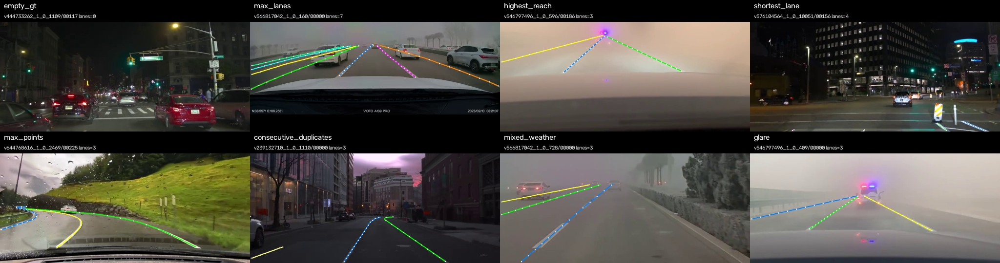

# 训练集 EDA 与数据体检（2026-09-02）

## 结论

训练集 71 段、7100 图、24435 条线、1,158,352 个点均按官方 manifest 顺序完成统计。标签坐标全部有限且位于 1366×720 画布内；原始线均至少 2 点，按官方连续去重语义处理后也没有塌缩线。数据可进入 dataloader/trainer。

EDA 同时发现并关闭了一个验证集风险：第一版 scene-only split 的 800 张 val 恰好没有空 GT。切分主目标不变，只在 scene 分数完全相同的候选之间以逐图车道条数直方图作次级 tie-break；重固化后 val 有 35 张空 GT（4.375%），接近全量 3.690%，且场景目标值与最大偏差仍逐位保持 0.0237614 / 0.0633803。



上图由 `src/data/eda.py` 固定选择规则生成：空 GT、最多车道、最高延伸、最短线、最多点、连续重复点、mixed weather、glare。每次重跑选中相同 image_id；白点仅用于显示原始标注采样密度。

## 标签规模与分布

- 每图车道数：min/mean/median/P95/max = 0 / 3.442 / 3 / 6 / 7；直方图 0–7 条依次为 262、58、524、3740、1281、652、356、227 张。`max_gt_lanes=8` 覆盖真实最大值并留 1 条余量。
- 空 GT：262/7100 = 3.690%。这些不是坏样本；训练和验证都必须保留，以约束无车道图上的 FP。
- 每线点数：min/mean/median/P95/max = 2 / 47.405 / 47 / 73 / 103；仅 5 条为二点线。
- 所有 24435 条线均为 bottom-to-top 点序。任何插值、横向误差或 y 采样代码都不能假设输入 y 已递增；T20 已在公共几何函数中处理方向。
- 226 条线（198 图）含连续重复点，共移除 227 点；连续去重后仍全部至少 2 点。真实几何证明导出层和提交校验层的退化防线不是纯合成边界，但当前 GT 本身不会触发官方崩溃。

## 几何范围与预处理含义

- 全部点范围：x=3.4–1365.0，y=192.8–719.0；非有限点 0，画布外点 0。
- 每线最上端 y：min/P1/P5/median/P95/max = 192.8 / 210.8 / 253.7 / 431.1 / 572.2 / 711.2。
- y 跨度：min/median/P95/max = 1.2 / 182.3 / 322.8 / 463.5px；弧长 min/median/P95/max = 5.73 / 444.96 / 705.57 / 973.71px。极短线确实存在，dataloader 不得按长度静默丢弃。
- `cut_height=180` 不截断任何 GT 点；旧先验 `cut_height=330` 会触及 3929/24435=16.08% 的线、1043/7100=14.69% 的图。故旧值继续作废；T55 仍按已裁决的整套方案比较 `cut=180 + 800×320` 与 `cut=0 + 960×480 letterbox`。

## clip 与场景结构

每段恰有 100 图，但标签密度差异很大：clip 平均车道数范围 1.24–6.82 条/图；单段空标注率范围 0–56%。空图最集中的三段为 `v576104564_1_0_17161`（56%）、`v576104564_1_0_11718`（54%）、`v576104564_1_0_10398`（51%）。这进一步证明必须按 clip hold-out，不能按图随机切分。

人工场景标签的 clip 计数为：weather clear/fog/mixed/rain = 31/18/1/21；illumination low_light/normal = 31/40；glare/none = 5/66；geometry curve/crossroad/none = 22/36/18（geometry 可重叠）。数据中 weather 与 illumination 完全混杂：31 个 clear 全是 low_light，fog/mixed/rain 全是 normal。因此后续分桶可以描述组合场景差异，但**不能把 weather 与 illumination 的单因素因果效应拆开解释**。

## 固化 split 的 EDA 复核

重固化后的 train/val 分别为 6300/800 图、21780/2655 条线，空 GT 为 227/35 张（3.603%/4.375%），平均车道数为 3.457/3.319。val 对全量逐图车道条数直方图的最大占比偏差为 2.697pp；同时保持原有 scene 分层计数、singleton `weather:mixed` 留 train、段 ID 零交集和原 manifest 内顺序。

该次修正只改变同 scene 目标分数候选间的 tie-break，不使用图像内容或测试信息，也不根据未来模型结果选 split。后续所有实验必须复用当前 `configs/splits/v1_seed42.yaml`，不得再根据 val 分数改切分。

## 可复现证据

结构化报告为 `outputs/reports/eda_train_20260902.json`（可再生产物，不入库）；静态 overlay 的 SHA-256 为 `88c6e81f1ca174392a539d7516dc29a005f98e70d66addc1dde1bb2ef48fa4d4`。输入 SHA-256：manifest `a57067e263f97abe56bd385a419c33d415b32ac93f4b3392e26ef55d511a8c59`，scene labels `0ed561e42167a0fa20c3ec5c35df646d59dc5c790e7272188dafedd84c5ff948`，车道条数直方图 `d05d855adabbd89739a9750c1d2c6ea7e64b987895a0e767dedc8df5a6afed06`，修正后 split `715eb8a0f695f4f26ef2d889176dc47f1a5d0aeb91aa25f26405062f3c1fd4ab`。

```bash
PYTHONPATH=src <lane-python> -m data.eda \
  --manifest data/processed/manifest_train.jsonl \
  --lane-root data/raw/dataset/_extract/train_full/Lane \
  --scene-labels data/processed/scene_labels.json \
  --split-config configs/splits/v1_seed42.yaml \
  --report outputs/reports/eda_train_20260902.json \
  --overlay docs/assets/eda_overlay_contact_sheet.jpg
```
